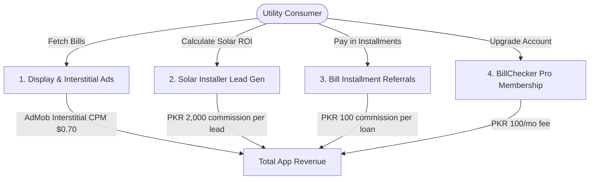

# All Bill Checker Pakistan — Expected Revenue Model & Projections

This document outlines the detailed expected revenue model, monetization vectors, financial assumptions, and projection scenarios for **All Bill Checker Pakistan**, a unified utility bill dashboard, tariff slab auditor, and billing manager application designed for consumers in **Pakistan**.

---

## 1. Target Market & Demographics

Utility bill checking and tracking is a universal recurring task in Pakistan:

*   **Primary Target**: Residential electricity, gas, and water bill payers across urban metropolitans (e.g. LESCO, K-Electric, IESCO, MEPCO regions) seeking to track historical unit consumption, calculate time-of-use rates, and bypass portal Captchas.
*   **Market Size**: Tens of millions of households face volatile power tariffs and strict NEPRA slab limits. A single unit overconsumption (e.g., crossing from 200 to 201 units) can double baseline tariffs.
*   **Unique Pain Point**: Checking bills online requires navigating slow, non-mobile-friendly government portals, often protected by outdated Captchas.
*   **Value Proposition**: All Bill Checker saves reference numbers, monitors properties under custom labels, caches duplicate bills, solves Captchas, and alerts users before they cross tariff slabs.

---

## 2. Monetization Vectors

Due to its high-frequency mass-market usage, the application focuses on high-volume ad placements, solar dealer lead generation, and micro-loan BNPL referrals.

### A. High-Volume Display & Interstitial Ads (Primary Stream)
*   **Format**: Banner ads on search results, and high-yield full-screen interstitial ads shown immediately after a bill is successfully scraped and rendered.
*   **Monetization Mechanism**: Google AdMob network display ads.
*   **Metrics & Assumptions**:
    *   **Pakistan Ad CPM**: Projected at $0.70 USD (approx. 195 PKR) due to the incorporation of high-engagement full-screen interstitial ad breaks.
    *   **User Impressions**: Users check bills multiple times monthly (separate billing dates for electricity, gas, water, internet). Free users average 5 sessions/month, viewing 6 pages/bills = 30 ad impressions per free user/month.

### B. Solar Installation Lead Generation
*   **Format**: Inside the app's Smart Solar ROI Advisor, users can request verified installer quotes.
*   **Monetization Mechanism**: Referral bounty paid by solar companies for delivering verified homeowner consultation leads.
*   **Metrics & Assumptions**:
    *   **Lead Bounty**: 2,000 PKR commission per lead.
    *   **Conversion Rate**: Projected at 0.10% of MAU per month.

### C. Bill Financing / BNPL Installment Referrals
*   **Format**: Affiliate referral buttons ("Pay in Installments") showing microfinance and BNPL options (e.g., Abhi, Easypaisa, NayaPay).
*   **Monetization Mechanism**: Lead commission paid by the lending partner per approved installment loan setup.
*   **Metrics & Assumptions**:
    *   **Referral Commission**: 100 PKR bounty.
    *   **Conversion Rate**: Projected at 0.80% of MAU per month.

### D. BillChecker Pro (Auto-Check & Ad-Free)
*   **Format**: Premium subscription tier offering automatic background checking.
*   **Pro Features**:
    *   **Silent Background Fetch**: Scrapes new bills at night; sends a push notification immediately.
    *   **Slab Warning Alarms**: Push or WhatsApp notifications alerting users when they are close to crossing NEPRA unit thresholds.
    *   **Ad-free experience**.
*   **Pricing**: 100 PKR / month (approx. $0.36 USD) or 800 PKR / year.
*   **Conversion Rate**: Projected at 0.50% of MAU.

---

## 3. Financial Projections (Year 1)

These projections are based on three scenarios of **Monthly Active Users (MAU)** reached by Month 12.
*(Exchange rate used: 1 USD = 278 PKR)*

### Scenario Comparison Table

| Metric | Conservative (Low Growth) | Base Case (Target Growth) | Optimistic (High Growth) |
| :--- | :--- | :--- | :--- |
| **Year 1 Target MAU** | 50,000 | 250,000 | 750,000 |
| **Premium Pro Users (0.5% - 0.8%)**| 250 (0.5%) | 1,250 (0.5%) | 6,000 (0.8%) |
| **Solar Lead Inquiries (0.08% - 0.12%)**| 40 (0.08%) | 250 (0.10%) | 900 (0.12%) |
| **Financing Referrals (0.6% - 1.0%)** | 300 (0.6%) | 2,000 (0.8%) | 7,500 (1.0%) |
| **Monthly Ad Revenue** | $895.50 (248,949 PKR) | $5,223.75 (1,452,203 PKR) | $17,856.00 (4,963,968 PKR) |
| **Monthly Solar Referral Rev** | $287.77 (80,000 PKR) | $1,798.56 (500,000 PKR) | $6,474.82 (1,800,000 PKR) |
| **Monthly Financing Referral Rev**| $107.91 (30,000 PKR) | $719.42 (200,000 PKR) | $2,697.84 (750,000 PKR) |
| **Monthly Pro Subscription Rev** | $89.93 (25,000 PKR) | $449.64 (125,000 PKR) | $2,158.27 (600,000 PKR) |
| **Total Expected MRR (PKR)** | **383,949 PKR** | **2,277,203 PKR** | **8,113,968 PKR** |
| **Total Expected MRR (USD equivalent)** | **$1,381.11** | **$8,191.37** | **$29,186.93** |
| **Total Projected ARR (PKR)** | **4,607,388 PKR** | **27,326,436 PKR** | **97,367,616 PKR** |
| **Total Projected ARR (USD equivalent)** | **$16,573.32** | **$98,296.44** | **$350,243.16** |

---

## 4. Key Financial Formulas

$$\text{Total Monthly Revenue (PKR)} = R_{ad} + R_{solar} + R_{loans} + R_{pro}$$

Where:

1.  **Free Ad Revenue ($R_{ad}$)**:
    $$R_{ad} = \left( \text{MAU} \times (1 - \text{ProConv}) \times \frac{\text{ImpressionsPerUser}}{1000} \right) \times \text{CPM}_{USD} \times \text{Rate}_{PKR/USD}$$
2.  **Solar Lead Referral Revenue ($R_{solar}$)**:
    $$R_{solar} = \text{MAU} \times \text{LeadRate} \times \text{LeadBounty}_{PKR}$$
3.  **Bill Financing Lead Revenue ($R_{loans}$)**:
    $$R_{loans} = \text{MAU} \times \text{LoanRate} \times \text{Bounty}_{PKR}$$
4.  **Pro Subscription Revenue ($R_{pro}$)**:
    $$R_{pro} = \text{MAU} \times \text{ProConv} \times \text{Price}_{PKR}$$

---

## 5. Dynamic Revenue Calculator

To modify these variables, run custom scenarios, or perform real-time sensitivity analysis, open the interactive browser-based dashboard calculator:

👉 **[revenue_calculator.html](file:///c:/Essentials/SmartFarms/AndroidApps/Revenue/revenue_calculator.html)**

*Open the file in any web browser to adjust parameters (e.g. MAU size, ad CPMs, solar lead payouts) and view updated revenue breakdowns instantly.*
