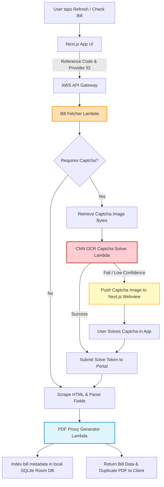

# Technical Details Document: All Bill Checker Pakistan

This document outlines the technical specifications, scraping frameworks, OCR Captcha-solving pipelines, billing algorithms, and client-server integration protocols for the **All Bill Checker Pakistan** application. The system uses a **Next.js Web UI** inside an **Android WebView Wrapper** shell, backed by serverless **AWS Lambda** microservices, **PostgreSQL**, **Elasticsearch**, and a custom **CNN-based Captcha Solver**.

---

## 1. System Architecture & Captcha Bypassing Pipeline

Utility bills are fetched by scraping government distribution company (DISCO) and gas portals. When a portal requires a Captcha, the system uses an automated CNN solver or requests a manual solve from the user.



---

## 2. Database Schema & Data Models

### A. Client-Side SQLite Database Schema (Room DB)
Because the app prioritizes privacy, all account numbers, nicknames, and historical unit logs are stored strictly on the user's device.

```sql
-- Saved Utility Accounts
CREATE TABLE saved_accounts (
    account_id INTEGER PRIMARY KEY AUTOINCREMENT,
    provider_id VARCHAR(50) NOT NULL, -- e.g. 'lesco', 'kelectric', 'sngpl', 'ssgc', 'wasa_lh'
    reference_number VARCHAR(100) UNIQUE NOT NULL,
    account_nickname VARCHAR(100) NOT NULL, -- e.g. 'Home Electricity', 'Rent Shop Gas'
    consumer_name VARCHAR(255), -- Cached from last successful bill fetch
    last_fetched_date TIMESTAMP
);

-- Historical Bill Logs (for slab alerts and Protected Status tracking)
CREATE TABLE billing_logs (
    log_id INTEGER PRIMARY KEY AUTOINCREMENT,
    reference_number VARCHAR(100) NOT NULL,
    billing_month VARCHAR(7) NOT NULL, -- Format: YYYY-MM (e.g. '2026-08')
    units_consumed INT NOT NULL,
    amount_payable NUMERIC(10, 2) NOT NULL,
    due_date DATE NOT NULL,
    payment_status VARCHAR(50) DEFAULT 'unpaid', -- 'unpaid', 'paid'
    fpa_amount NUMERIC(8, 2) DEFAULT 0.00,
    raw_html_cache TEXT, -- Cached HTML content for duplicate PDF loading offline
    FOREIGN KEY(reference_number) REFERENCES saved_accounts(reference_number) ON DELETE CASCADE
);
```

### B. Cloud PostgreSQL Schema (Relational Store)
Tracks active utility tariff slabs and Fuel Price Adjustments (FPA) across different DISCOs.

```sql
-- Utility Provider Slab Tariffs
CREATE TABLE utility_tariffs (
    tariff_id UUID PRIMARY KEY DEFAULT gen_random_uuid(),
    provider_id VARCHAR(50) NOT NULL,
    slab_start INT NOT NULL,
    slab_end INT NOT NULL,
    unit_rate NUMERIC(6, 2) NOT NULL,
    is_protected_tariff BOOLEAN DEFAULT FALSE,
    valid_from DATE NOT NULL,
    valid_to DATE NOT NULL
);
```

---

## 3. Scraping & Captcha Interception Architecture

Utility portals in Pakistan run on legacy ASP/PHP frameworks. The **Bill Fetcher Lambda** manages cookie sessions to parse these target tables.

### A. Python SNGPL Bill Scraper
```python
import requests
from bs4 import BeautifulSoup

def fetch_sngpl_bill(consumer_id):
    # SNGPL Bill Inquiry Portal
    url = "https://www.sngpl.com.pk/login.jsp"
    session = requests.Session()
    
    # SNGPL requires a consumer account verification post
    payload = {
        'consumer_id': consumer_id,
        'submit': 'Submit'
    }
    
    response = session.post("https://www.sngpl.com.pk/webbill.jsp", data=payload)
    soup = BeautifulSoup(response.content, 'html.parser')
    
    # Parse bill table fields
    bill_data = {}
    table = soup.find('table', class_='bill-table')
    if table:
        rows = table.find_all('tr')
        bill_data['consumer_name'] = rows[1].find_all('td')[1].text.strip()
        bill_data['amount_payable'] = float(rows[2].find_all('td')[1].text.replace("Rs.", "").replace(",", "").strip())
        bill_data['units_consumed'] = int(rows[3].find_all('td')[1].text.strip())
        bill_data['due_date'] = rows[4].find_all('td')[1].text.strip()
        
    return bill_data
```

### B. Captcha Image Interception Workflow
When a portal (such as K-Electric) responds with a Captcha, the Lambda captures the image stream and forwards it:
```python
def retrieve_captcha_image(session, captcha_img_url):
    response = session.get(captcha_img_url, stream=True)
    if response.status_code == 200:
        return response.content # Return raw bytes of Captcha image
    return None
```

---

## 4. CNN-Based Captcha Solver Model

The **OCR Captcha Solver Lambda** uses a lightweight convolutional neural network (CNN) trained on government utility captcha datasets to automatically decode 4-6 digit numeric/alphanumeric sequences.

```python
import torch
import torch.nn as nn
import cv2
import numpy as np

class CaptchaCNN(nn.Module):
    def __init__(self):
        super(CaptchaCNN, self).__init__()
        self.conv = nn.Sequential(
            nn.Conv2d(1, 32, kernel_size=3, padding=1),
            nn.BatchNorm2d(32),
            nn.ReLU(),
            nn.MaxPool2d(2, 2),
            
            nn.Conv2d(32, 64, kernel_size=3, padding=1),
            nn.BatchNorm2d(64),
            nn.ReLU(),
            nn.MaxPool2d(2, 2)
        )
        # Assuming fixed input size (60px height x 180px width)
        self.fc = nn.Linear(64 * 15 * 45, 512)
        self.out = nn.Linear(512, 6 * 36) # 6 characters max, 36 classes (alphanumeric)

    def forward(self, x):
        x = self.conv(x)
        x = x.view(x.size(0), -1)
        x = torch.relu(self.fc(x))
        x = self.out(x)
        return x.view(-1, 6, 36) # Output logits for each of the 6 characters
```

---

## 5. NEPRA Protected Status Tracking Algorithm

Residential electricity customers in Pakistan receive a **"Protected"** consumer designation if they consume **under 200 units monthly for 6 consecutive months**. If they exceed 200 units in any month, they lose this status, and their tariff rate increases significantly.

### A. Protected Status Verification Engine
```typescript
interface BillingMonthRecord {
  billingMonth: string; // YYYY-MM
  unitsConsumed: number;
}

export class ProtectedStatusTracker {
  
  public static evaluateStatus(history: BillingMonthRecord[]): {
    isProtected: boolean;
    consecutiveUnder200Count: number;
    monthsToRegainProtectedStatus: number;
  } {
    // Sort history by month descending (newest first)
    const sorted = [...history].sort((a, b) => b.billingMonth.localeCompare(a.billingMonth));
    
    // Slice the last 6 months
    const last6Months = sorted.slice(0, 6);
    
    if (last6Months.length < 6) {
      // Not enough data, verify how many consecutive months are under 200
      let under200Count = 0;
      for (const record of sorted) {
        if (record.unitsConsumed <= 200) {
          under200Count++;
        } else {
          break;
        }
      }
      return {
        isProtected: false,
        consecutiveUnder200Count: under200Count,
        monthsToRegainProtectedStatus: 6 - under200Count
      };
    }

    const hasExceeded200 = last6Months.some(record => record.unitsConsumed > 200);

    if (hasExceeded200) {
      // Calculate how many months under 200 exist consecutively starting from latest month
      let consecutiveCount = 0;
      for (const record of last6Months) {
        if (record.unitsConsumed <= 200) {
          consecutiveCount++;
        } else {
          break;
        }
      }
      return {
        isProtected: false,
        consecutiveUnder200Count: consecutiveCount,
        monthsToRegainProtectedStatus: 6 - consecutiveCount
      };
    }

    return {
      isProtected: true,
      consecutiveUnder200Count: 6,
      monthsToRegainProtectedStatus: 0
    };
  }
}
```

### B. Slab Limit Warning System
If a user is approaching the 200-unit threshold, the app triggers a warning calculation:
```typescript
export function checkSlabAlert(
  currentDayOfMonth: number,
  unitsConsumedSoFar: number
): { triggerWarning: boolean; limitRemaining: number; maximumDailyBudget: number } {
  
  const daysInMonth = 30; // standard base
  const remainingDays = daysInMonth - currentDayOfMonth;
  const limitRemaining = 200 - unitsConsumedSoFar;
  
  // Calculate average daily limit to avoid crossing the 200 units slab threshold
  const maximumDailyBudget = remainingDays > 0 ? limitRemaining / remainingDays : 0;
  
  // Trigger alert if remaining buffer is small
  const triggerWarning = limitRemaining <= 30 && limitRemaining > 0;

  return {
    triggerWarning,
    limitRemaining,
    maximumDailyBudget
  };
}
```

---

## 6. Duplicate PDF Bill Proxy Rendering

The app bypasses distribution-company firewalls to download official duplicate bills. The **PDF Proxy Generator Lambda** fetches the print page from government servers, patches the style elements, and outputs a print-ready PDF template.

```python
import pdfkit

def proxy_disco_duplicate_bill(disco_id, html_bill_content):
    """
    Renders print-ready utility PDF bills that are accepted by payment banks
    """
    # Replace relative CSS/image URLs with absolute paths targeting PITC servers
    adjusted_html = html_bill_content.replace(
        'src="images/', 'src="http://www.lesco.gov.pk/images/'
    ).replace(
        'href="css/', 'href="http://www.lesco.gov.pk/css/'
    )
    
    options = {
        'page-size': 'A4',
        'margin-top': '0mm',
        'margin-right': '0mm',
        'margin-bottom': '0mm',
        'margin-left': '0mm',
        'encoding': "UTF-8",
        'no-outline': None
    }
    
    output_path = f"/tmp/duplicate_{disco_id}.pdf"
    pdfkit.from_string(adjusted_html, output_path, options=options)
    return output_path
```

---

## 7. API Reference Specification

### A. Retrieve Utility Bill Details
`GET /api/bill/fetch`

#### Query Parameters:
*   `provider_id`: Distribution identifier (e.g. `lesco`)
*   `reference_number`: Customer reference number (e.g. `14115152039200`)
*   `captcha_solved_value`: Optional string (if manual fallback required)

#### Response Payload (200 OK):
```json
{
  "reference_number": "14115152039200",
  "provider_id": "lesco",
  "consumer_name": "MUHAMMAD ASLAM",
  "billing_month": "2026-08",
  "units_consumed": 182,
  "amount_payable_within_due_date": 4120.00,
  "due_date": "2026-08-18",
  "amount_payable_after_due_date": 4480.00,
  "fpa_amount": 340.00,
  "taxes": {
    "sales_tax": 612.00,
    "excise_duty": 61.80
  },
  "protected_status": {
    "is_protected": true,
    "months_under_200": 6
  },
  "pdf_duplicate_url": "https://api.allbillchecker.pk/duplicate/lesco/14115152039200.pdf"
}
```

### B. Solve Captcha via Server CNN
`POST /api/captcha/solve`

#### Request Payload:
```json
{
  "provider_id": "ssgc",
  "captcha_image_base64": "iVBORw0KGgoAAAANSUhEUgAAAGQ..."
}
```

#### Response Payload (200 OK):
```json
{
  "captcha_solved": true,
  "solved_text": "56921",
  "confidence_score": 0.94
}
```
