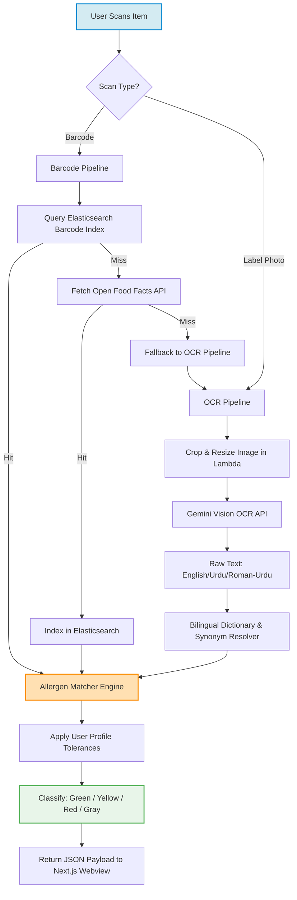
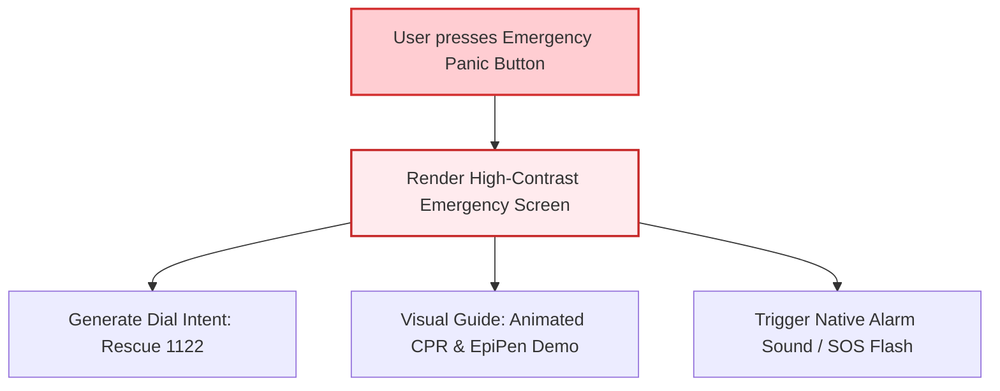

# Technical Details Document: AllergyGuard (الرجی گارڈ)

This document provides the technical specifications, data pipelines, database schemas, and client-server integration protocols for **AllergyGuard (الرجی گارڈ)**. It is aligned with the global technical architecture utilizing a **Next.js Web UI** inside an **Android WebView Wrapper**, powered by serverless **AWS Lambda** microservices, **PostgreSQL**, **Elasticsearch**, **Serp API**, and **Gemini Vision OCR**.

---

## 1. System Architecture & Processing Pipeline

AllergyGuard utilizes a dual-mode entry pipeline (Barcode Scanning and Camera OCR) to resolve food and pharmaceutical ingredients against a personalized user allergen profile.



---

## 2. Database Schema & Data Models

### A. Local SQLite Cache (Android Room / IndexedDB)
Since network connectivity can be unreliable in local Pakistani markets, the client caches allergen profiles, local allergen dictionaries, and active E-number directories.

```sql
-- Local cache of allergen profiles (stores user tolerances)
CREATE TABLE local_allergen_profile (
    allergen_id VARCHAR(50) PRIMARY KEY, -- e.g., 'milk', 'egg', 'wheat'
    sensitivity_level VARCHAR(30) NOT NULL, -- 'severe' (anaphylactic), 'intolerance', 'none'
    custom_keywords TEXT -- JSON array of custom user-defined text filters (e.g. ["sulfite", "tartrazine"])
);

-- Cached scan history for quick offline lookup of previously analyzed items
CREATE TABLE cached_scan_history (
    barcode VARCHAR(50) PRIMARY KEY,
    product_name TEXT NOT NULL,
    brand TEXT,
    safety_classification VARCHAR(20) NOT NULL, -- 'SAFE', 'CAUTION', 'UNSAFE', 'UNKNOWN'
    ingredients_raw TEXT,
    detected_allergens TEXT, -- Commas separated or JSON string
    reasoning_en TEXT,
    reasoning_ur TEXT,
    scraped_at TIMESTAMP DEFAULT CURRENT_TIMESTAMP
);
```

### B. Cloud PostgreSQL Schema (Transactional Data)
Tracks user records, custom products submitted via crowdsourcing, and system audit logs.

```sql
-- Crowdsourced product registrations submitted by parents
CREATE TABLE crowdsourced_products (
    id UUID PRIMARY KEY DEFAULT gen_random_uuid(),
    submitted_by UUID REFERENCES users(user_id) ON DELETE SET NULL,
    barcode VARCHAR(50),
    product_name VARCHAR(255) NOT NULL,
    brand VARCHAR(255),
    raw_ingredients_text TEXT,
    image_url_ingredients VARCHAR(512),
    image_url_front VARCHAR(512),
    is_verified BOOLEAN DEFAULT FALSE,
    verified_by UUID,
    created_at TIMESTAMP WITH TIME ZONE DEFAULT CURRENT_TIMESTAMP
);

-- Custom brand alternatives mapping
CREATE TABLE safe_alternatives (
    id UUID PRIMARY KEY DEFAULT gen_random_uuid(),
    product_category VARCHAR(100) NOT NULL, -- e.g., 'gluten_free_flour', 'dairy_free_milk'
    product_name VARCHAR(255) NOT NULL,
    brand VARCHAR(255) NOT NULL,
    purchase_link_url VARCHAR(512),
    image_url VARCHAR(512),
    excluded_allergens VARCHAR[] NOT NULL -- array of allergens this alternative is safe from (e.g., ['milk', 'soy'])
);
```

---

## 3. Bilingual Allergen Dictionary & Translation Engine

Food labeling in Pakistan is rarely standardized. Ingredients are listed in English, Urdu (Nastaliq script), or transliterated Roman-Urdu. The backend maintains a master resolver JSON map loaded in the **LLM Decision Engine / Dictionary Lambda**.

### Master Translation Map Example
```json
{
  "allergens": {
    "wheat": {
      "english_synonyms": ["wheat", "wheat flour", "semolina", "gluten", "spelt", "durum"],
      "urdu_synonyms": ["گندم", "میدہ", "سوجی", "نشاستہ"],
      "roman_urdu_synonyms": ["gandum", "maida", "sooji", "suji", "atta", "ata"]
    },
    "milk": {
      "english_synonyms": ["milk", "butter", "cheese", "cream", "whey", "casein", "lactose", "curd", "yogurt"],
      "urdu_synonyms": ["دودھ", "مکھن", "پنیر", "ملائی", "کھویا", "ماوا", "دہی"],
      "roman_urdu_synonyms": ["doodh", "makhan", "paneer", "malai", "khoya", "mawa", "dahi", "lactose"]
    },
    "egg": {
      "english_synonyms": ["egg", "egg whites", "yolk", "albumin", "lecithin (egg)"],
      "urdu_synonyms": ["انڈہ", "سفیدی", "زردی"],
      "roman_urdu_synonyms": ["anda", "anday", "zardi", "safedi"]
    },
    "peanut": {
      "english_synonyms": ["peanut", "arachis oil", "groundnut"],
      "urdu_synonyms": ["مونگ پھلی"],
      "roman_urdu_synonyms": ["moongphali", "mungphali"]
    }
  }
}
```

### E-Number Additive Classifier Schema
Emulsifiers and preservatives (E-numbers) are analyzed for allergen derivatives (e.g., E322 Soy Lecithin) and Halal/Haram classification status (e.g., animal fats or alcohol solvents).

```json
{
  "e_numbers": {
    "E322": {
      "name": "Lecithin",
      "allergen_derivatives": ["soy", "egg"],
      "is_halal": true,
      "notes": "Vegetable or egg source; must be cross-checked with active allergen profile settings."
    },
    "E120": {
      "name": "Cochineal / Carmine",
      "allergen_derivatives": [],
      "is_halal": false,
      "notes": "Insect-derived coloring agent. Categorized as Haram by major local certification bodies."
    },
    "E471": {
      "name": "Mono- and diglycerides of fatty acids",
      "allergen_derivatives": [],
      "is_halal": null,
      "notes": "Doubtful (Mushbooh). Can be animal or plant source. Requires brand query or search lookup verification."
    }
  }
}
```

---

## 4. UI Color-Coding & Decision Logic

AllergyGuard matches a product's analyzed ingredients against the user's active sensitivity profile using the following algorithmic steps:

```python
def classify_product_safety(product_ingredients, user_profile):
    """
    product_ingredients: List of dicts: [{"ingredient": "Maida", "allergen": "wheat", "is_trace": False}]
    user_profile: Dict mapping allergen -> sensitivity ('severe', 'intolerance', 'none')
    """
    has_direct_allergen = False
    has_trace_allergen = False
    is_unknown = len(product_ingredients) == 0

    if is_unknown:
        return "UNKNOWN" # Gray UI Classification

    for item in product_ingredients:
        allergen = item.get("allergen")
        if not allergen or allergen not in user_profile:
            continue
            
        user_sensitivity = user_profile[allergen]
        if user_sensitivity == "none":
            continue
            
        if item.get("is_trace"):
            # Precautionary statement like "May contain traces of..."
            if user_sensitivity == "severe":
                has_trace_allergen = True
        else:
            # Direct ingredient (e.g. "Maida")
            has_direct_allergen = True

    if has_direct_allergen:
        return "UNSAFE"    # Red UI Classification
    elif has_trace_allergen:
        return "CAUTION"   # Yellow UI Classification (Safe for sensitivities, risk for severe allergies)
    
    return "SAFE"          # Green UI Classification
```

| UI Classification | Color | Criteria | Action |
|---|---|---|---|
| **SAFE** | Green | Product contains zero matched user allergens, either direct or trace. | Display "Allergy Free" message. Allow ingestion. |
| **CAUTION** | Yellow | Product has no direct allergens, but triggers facility warning tags (for "severe" profiles only). | Display warning: "Processed in a facility that handles [Allergen]". |
| **UNSAFE** | Red | Contains direct user allergen, related derivative, or triggered user word filters. | Block display. List alternative items available locally. |
| **UNKNOWN** | Gray | Missing label data, highly blurred OCR text, or product unregistered. | Prompt user to upload a clear packaging photo. |

---

## 5. API Reference Specification

### A. Process Scan Endpoint
`POST /api/scan`

Sends a base64-encoded image or scanned barcode payload to the AWS orchestrator.

#### Request Headers:
```http
Authorization: Bearer <JWT_TOKEN>
Content-Type: application/json
```

#### Request Body Payload:
```json
{
  "barcode": "896101412039",
  "image_base64": "/9j/4AAQSkZJRgABAQE...", 
  "image_type": "image/jpeg",
  "user_profile": {
    "allergens": {
      "wheat": "severe",
      "milk": "intolerance"
    },
    "custom_filters": ["tartrazine"]
  }
}
```

#### Response Payload (200 OK):
```json
{
  "barcode": "896101412039",
  "product_name": "Sooper Biscuits",
  "brand": "Peek Freans",
  "safety_classification": "UNSAFE",
  "detected_allergens": ["wheat", "milk"],
  "ingredients_analyzed": [
    { "name": "Wheat Flour", "allergen": "wheat", "is_trace": false },
    { "name": "Skimmed Milk Powder", "allergen": "milk", "is_trace": false },
    { "name": "Artificial Flavoring", "allergen": null, "is_trace": false }
  ],
  "reasoning_en": "This product is unsafe for you because it contains wheat flour and skimmed milk powder, which match your allergen profile rules.",
  "reasoning_ur": "یہ پروڈکٹ آپ کے لیے غیر محفوظ ہے کیونکہ اس میں گندم کا آٹا اور خشک دودھ شامل ہیں، جو آپ کی الرجی پروفائل کے مطابق ہیں۔",
  "safe_alternatives": [
    {
      "product_name": "Gluten-Free Digestive",
      "brand": "SastaSauda Health",
      "purchase_url": "https://sastasauda.pk/gluten-free-digestive"
    }
  ]
}
```

---

## 6. Client Interface Integration Details

### A. Android Wrapper Permissions config (`AndroidManifest.xml`)
The wrapper shell must declare hardware permissions to enable native camera scanner callbacks.

```xml
<manifest xmlns:android="http://schemas.android.com/apk/res/android"
    package="com.allergyguard.app">

    <!-- Access camera for OCR captures and barcode scans -->
    <uses-permission android:name="android.permission.CAMERA" />
    <uses-feature android:name="android.hardware.camera" android:required="true" />
    
    <!-- Local Caching and offline access -->
    <uses-permission android:name="android.permission.INTERNET" />
    <uses-permission android:name="android.permission.WRITE_EXTERNAL_STORAGE" android:maxSdkVersion="28" />
</manifest>
```

### B. JavaScript Native Capture Call (WebView Bridge)
The Next.js front-end triggers the Android capture activity using standard message callbacks:

```javascript
// Next.js client-side scan trigger function
export function triggerNativeCamera() {
  if (window.AndroidInterface && typeof window.AndroidInterface.captureIngredientLabel === 'function') {
    // Invoke native camera handler
    window.AndroidInterface.captureIngredientLabel();
  } else {
    // Browser fallback
    console.warn("Native bridge not found. Fallback to file picker.");
    document.getElementById('fallback-file-input').click();
  }
}

// Global callback listener loaded in Next.js useEffect hooks
useEffect(() => {
  window.onImageCaptured = (base64Image) => {
    // Send base64 image data to the processing API pipeline
    processLabelImage(base64Image);
  };
}, []);
```

---

## 7. Emergency Response Integration (Anaphylaxis Protocol)

To assist users during severe celiac or anaphylaxis events, the app contains an offline-first **Emergency Mode** module.



1.  **Direct Dial Integration**:
    The WebView uses a custom URL scheme mapping:
    ```javascript
    window.location.href = "tel:1122";
    ```
    The Android WebView client intercepts `tel:` URLs to trigger native dialer intents:
    ```kotlin
    webView.webViewClient = object : WebViewClient() {
        override fun shouldOverrideUrlLoading(view: WebView, url: String): Boolean {
            if (url.startsWith("tel:")) {
                val intent = Intent(Intent.ACTION_DIAL, Uri.parse(url))
                view.context.startActivity(intent)
                return true
            }
            return false
        }
    }
    ```
2.  **Bilingual Guide Display**:
    Provides step-by-step instructions in Urdu and English on holding, positioning, and pressing an epinephrine auto-injector against the thigh, rendered using locally saved SVG vector animations.
