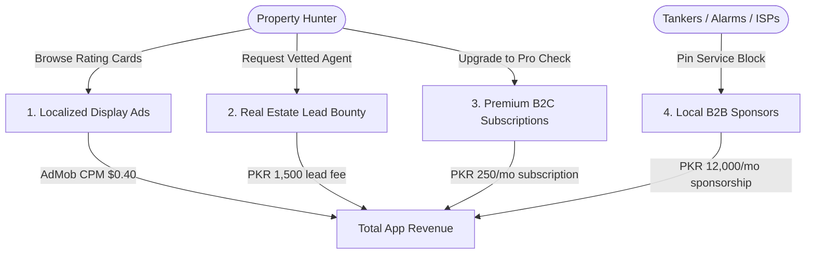

# BastiCheck (بستی چیک) — Expected Revenue Model & Projections

This document outlines the detailed expected revenue model, monetization vectors, financial assumptions, and projection scenarios for **BastiCheck**, an independent, hyper-local neighborhood intelligence, rating directory, and infrastructure audit application designed for home hunters and property investors in **Pakistan**.

---

## 1. Target Market & Demographics

The urban residential rental and buying market in major cities (Karachi, Lahore, Islamabad, Rawalpindi) is highly active but lacks transparent public data:

*   **Primary Target**: Active house hunters, apartment tenants, and real-estate investors looking to purchase or rent properties in prime urban blocks (e.g. DHA, Clifton, Johar Town, Bahria Town, Gulshan, G-Sectors).
*   **Infrastructure Pain Points**: Local property dealers systematically conceal critical block-level risks, such as high water tanker reliance (Rs. 5,000 - 15,000/mo), monsoon flooding history, winter gas shortages, high street crime rates, and commercial zoning encroachments.
*   **Value Proposition**: BastiCheck analyzes social forums, scrapes reviews, and verifies resident reports to provide a 4-block "Reality Scorecard" before buyers or tenants commit to long-term contracts.

---

## 2. Monetization Vectors

BastiCheck operates on an ad-supported freemium model. Free users generate localized display ad impressions, with paid upgrades for B2B real-estate lead routing, local brand sponsorships, and premium address check subscriptions.

### A. Ad-Supported Model (Free Tier)
*   **Format**: Location-specific display banners shown on scorecards. Pro subscribers do not see ads.
*   **Metrics & Assumptions**:
    *   **Pakistan Average CPM**: $0.40 USD (approx. 111 PKR at 278 PKR/USD).
    *   **User Sessions**: Users actively looking for homes check listings intensely. Free users average 4 sessions/month, viewing 8 pages per visit = 32 ad impressions per free user/month.

### B. Real Estate Agent Lead Generation (B2B Transactions)
*   **Format**: When users review a block's scorecard and search for available listings, the app connects them to pre-vetted, reliable real-estate agents active in that sector.
*   **Monetization Mechanism**: Referral bounty paid by the agent for connecting them with a pre-qualified buyer or tenant ready to view properties.
*   **Pricing**: 1,500 PKR flat lead bounty.
*   **Conversion Rate**: Projected at 0.40% of Monthly Active Users (MAU) per month.

### C. BastiCheck Pro (Premium B2C Subscription)
*   **Format**: Premium subscription unlocking detailed property due-diligence data.
*   **Pro Features**:
    *   **Monsoon Flooding Heatmap**: Full street-by-street waterlogging depth history overlays.
    *   **Water Tanker Calculator**: Monthly average tanker spending averages by block.
    *   **Zoning Permit Trackers**: Municipal zoning alert pings warning users if commercial developments (marriage halls, schools) are approved next door.
    *   **Property Investor PDFs**: Unlimited block rating reports.
*   **Pricing**: 250 PKR / month (approx. $0.90 USD) or 1,500 PKR / year.
*   **Conversion Rate**: Projected at 1.0% of Monthly Active Users (MAU).

### D. B2B Localized Infrastructure Sponsors
*   **Format**: Local services servicing that specific block pay to be pinned inside rating cards. Examples: private water tankers, home security monitoring services, or high-speed fiber internet providers (Nayatel, StormFiber) looking to attract residents in that block.
*   **Monetization Mechanism**: Monthly sponsorship placement fee per localized block slot.
*   **Pricing**: 12,000 PKR / month per partner slot.
*   **Target Partners**: 20 active sponsors in Year 1.

---

## 3. Financial Projections (Year 1)

These projections are based on three scenarios of **Monthly Active Users (MAU)** reached by Month 12.
*(Exchange rate used: 1 USD = 278 PKR)*

### Scenario Comparison Table

| Metric | Conservative (Low Growth) | Base Case (Target Growth) | Optimistic (High Growth) |
| :--- | :--- | :--- | :--- |
| **Year 1 Target MAU** | 10,000 | 40,000 | 120,000 |
| **Pro Subscribers (1.0% - 1.2%)**| 100 (1.0%) | 400 (1.0%) | 1,440 (1.2%) |
| **Agent Lead Referrals (0.3% - 0.5%)**| 30 (0.30%) | 160 (0.40%) | 600 (0.50%) |
| **Local Infrastructure Sponsors**| 5 | 20 | 50 |
| **Monthly Ad Revenue** | $126.72 (35,228 PKR) | $506.88 (140,913 PKR) | $1,896.96 (527,355 PKR) |
| **Monthly Real-Estate Lead Rev**| $161.87 (45,000 PKR) | $863.31 (240,000 PKR)  | $3,237.41 (900,000 PKR)  |
| **Monthly Local Sponsor Rev** | $215.83 (60,000 PKR)  | $863.31 (240,000 PKR)  | $2,158.27 (600,000 PKR)  |
| **Monthly Pro Subscription Rev** | $89.93 (25,000 PKR)   | $359.71 (100,000 PKR)  | $1,294.96 (360,000 PKR)  |
| **Total Expected MRR (PKR)** | **165,228 PKR** | **720,913 PKR** | **2,387,355 PKR** |
| **Total Expected MRR (USD equivalent)** | **$594.35** | **$2,593.21** | **$8,587.60** |
| **Total Projected ARR (PKR)** | **1,982,736 PKR** | **8,650,956 PKR** | **28,648,260 PKR** |
| **Total Projected ARR (USD equivalent)** | **$7,132.20** | **$31,118.52** | **$103,051.20** |

---

## 4. Key Financial Formulas

$$\text{Total Monthly Revenue (PKR)} = R_{ad} + R_{leads} + R_{sponsors} + R_{pro}$$

Where:

1.  **Free Ad Revenue ($R_{ad}$)**:
    $$R_{ad} = \left( \text{MAU} \times (1 - \text{ProConv}) \times \frac{\text{ImpressionsPerUser}}{1000} \right) \times \text{CPM}_{USD} \times \text{Rate}_{PKR/USD}$$
2.  **Real-Estate Agent Lead Referral Revenue ($R_{leads}$)**:
    $$R_{leads} = \text{MAU} \times \text{LeadRate} \times \text{LeadBounty}_{PKR}$$
3.  **Local Infrastructure Sponsors ($R_{sponsors}$)**:
    $$R_{sponsors} = \text{SponsorCount} \times \text{MonthlySponsorship}_{PKR}$$
4.  **BastiCheck Pro Subscriptions ($R_{pro}$)**:
    $$R_{pro} = \text{MAU} \times \text{ProConv} \times \text{Price}_{PKR}$$

---

## 5. Dynamic Revenue Calculator

To modify these variables, run custom scenarios, or perform real-time sensitivity analysis, open the interactive browser-based dashboard calculator:

👉 **[revenue_calculator.html](file:///c:/Essentials/SmartFarms/AndroidApps/Revenue/revenue_calculator.html)**

*Open the file in any web browser to adjust parameters (e.g. MAU size, lead rates, local sponsor counts) and view updated revenue breakdowns instantly.*
