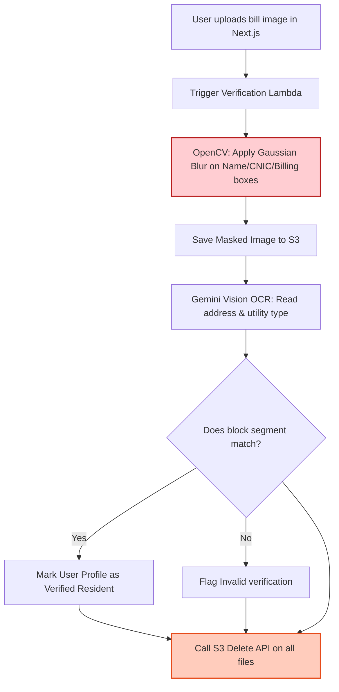

# Technical Details Document: BastiCheck (بستی چیک)

This document details the technical specifications, geospatial architectures, verification pipelines, database models, and scraper designs for **BastiCheck (بستی چیک)**. The system is designed using a **Next.js Web UI** inside an **Android WebView Wrapper** shell, communicating with serverless **AWS Lambda** microservices, **PostgreSQL** (with **PostGIS**), **Elasticsearch**, and **Gemini Vision OCR**.

---

## 1. System Architecture & Data Aggregation Pipeline

BastiCheck compiles local neighborhood intelligence using scheduled social media web crawlers, municipal notices, CPLC crime feeds, and crowdsourced resident infrastructure pings.

```mermaid
graph TD
    %% Scraper Cluster
    subgraph Data Gathering Crawlers (AWS Lambda)
        RedditCrawler[Reddit Scraper Lambda] -->|Scrape r/karachi, r/lahore| RedditData[Reddit Discussions]
        FacebookCrawler[Facebook Scraper Lambda] -->|Scrape Welfare Group Feeds| FBData[Facebook Complaints]
        ZameenCrawler[Zameen Forum Scraper] -->|Harvest Q&A Threads| ZameenData[Zameen QA Logs]
        CPLCCrawler[CPLC Scraper Lambda] -->|Parse Crime Incident PDFs| CrimeData[CPLC Records]
    end

    %% Processing & Analysis
    RedditData & FBData & ZameenData & CrimeData --> LLMParser[LLM Locality Parser Lambda]
    LLMParser --> Postgres[(PostgreSQL DB<br/>PostGIS Spatial)]
    LLMParser --> Elasticsearch[(Elasticsearch Sector Index)]

    %% Verification Pipeline
    UserBill[Resident Uploads Utility Bill] --> BillProcessor[Utility Bill Verification Lambda]
    BillProcessor -->|Mask Name & CNIC via OpenCV| S3Bucket[Temporary Secure S3]
    S3Bucket --> GeminiOCR[Gemini Address Verifier]
    GeminiOCR -->|Verify Address Match| Postgres
    GeminiOCR -->|Trigger Instant Deletion| DeleteS3[Delete Image S3]

    %% Client Layer
    Client[Next.js Client WebView] <-->|Query Block Info / Map Layers| APIGateway[AWS API Gateway]
    APIGateway <--> DiscoveryAPI[Locality Lookup Lambda]
    DiscoveryAPI --> Postgres
    DiscoveryAPI --> Elasticsearch

    style LLMParser fill:#ffe0b2,stroke:#fb8c00,stroke-width:2px
    style BillProcessor fill:#ffcdd2,stroke:#b71c1c,stroke-width:2px
    style Postgres fill:#ede7f6,stroke:#5e35b1,stroke-width:2px
    style Elasticsearch fill:#e0f2f1,stroke:#00695c,stroke-width:2px
```

---

## 2. Database Schema & Data Models

### A. PostgreSQL Schema (Spatial Relational Store)
Tracks geofenced blocks/sectors, crowdsourced reviews, utility verifications, crime incidents, and live infrastructure pings.

```sql
-- Enable PostGIS extension for spatial queries
CREATE EXTENSION IF NOT EXISTS postgis;

-- Cities in Pakistan
CREATE TABLE cities (
    city_id INT PRIMARY KEY,
    city_name VARCHAR(100) UNIQUE NOT NULL -- 'Karachi', 'Lahore', 'Islamabad'
);

-- Geofenced Neighborhood Blocks / Sectors (e.g. DHA Phase 6 Block C, Johar Town G3 Block)
CREATE TABLE neighborhood_blocks (
    block_id UUID PRIMARY KEY DEFAULT gen_random_uuid(),
    city_id INT REFERENCES cities(city_id),
    name VARCHAR(255) NOT NULL, -- e.g., 'Block C, DHA Phase 6'
    normalized_name VARCHAR(255) NOT NULL, -- 'block_c_dha_phase_6'
    boundary GEOMETRY(Polygon, 4326) NOT NULL, -- Spatial boundary polygon
    center_latitude NUMERIC(10, 8) NOT NULL,
    center_longitude NUMERIC(11, 8) NOT NULL,
    created_at TIMESTAMP WITH TIME ZONE DEFAULT CURRENT_TIMESTAMP
);

-- Consolidated Locality Rating Scorecard
CREATE TABLE block_scorecards (
    scorecard_id UUID PRIMARY KEY DEFAULT gen_random_uuid(),
    block_id UUID REFERENCES neighborhood_blocks(block_id) ON DELETE CASCADE,
    water_reliability NUMERIC(3, 2) DEFAULT 0.00, -- Scale of 1.0 to 5.0
    flooding_risk NUMERIC(3, 2) DEFAULT 0.00,
    gas_pressure NUMERIC(3, 2) DEFAULT 0.00,
    security_rating NUMERIC(3, 2) DEFAULT 0.00,
    isp_rating NUMERIC(3, 2) DEFAULT 0.00,
    noise_rating NUMERIC(3, 2) DEFAULT 0.00,
    total_reviews_count INTEGER DEFAULT 0,
    updated_at TIMESTAMP WITH TIME ZONE DEFAULT CURRENT_TIMESTAMP
);

-- User Reviews (Bilingual)
CREATE TABLE block_reviews (
    review_id UUID PRIMARY KEY DEFAULT gen_random_uuid(),
    block_id UUID REFERENCES neighborhood_blocks(block_id) ON DELETE CASCADE,
    user_id UUID, -- NULL if anonymous submission
    is_verified_resident BOOLEAN DEFAULT FALSE,
    water_score INT CHECK (water_score BETWEEN 1 AND 5),
    flooding_score INT CHECK (flooding_score BETWEEN 1 AND 5),
    gas_score INT CHECK (gas_score BETWEEN 1 AND 5),
    security_score INT CHECK (security_score BETWEEN 1 AND 5),
    comment_en TEXT,
    comment_ur TEXT,
    created_at TIMESTAMP WITH TIME ZONE DEFAULT CURRENT_TIMESTAMP
);

-- Verified ISPs available in the sector
CREATE TABLE block_isps (
    block_id UUID REFERENCES neighborhood_blocks(block_id) ON DELETE CASCADE,
    isp_name VARCHAR(100) NOT NULL, -- 'Nayatel', 'StormFiber', 'Transworld', 'PTCL Flash'
    verified_users_count INT DEFAULT 1,
    PRIMARY KEY (block_id, isp_name)
);

-- Live Infrastructure Pings (Real-time events)
CREATE TABLE live_pings (
    ping_id UUID PRIMARY KEY DEFAULT gen_random_uuid(),
    block_id UUID REFERENCES neighborhood_blocks(block_id) ON DELETE CASCADE,
    ping_type VARCHAR(100) NOT NULL, -- 'gas_outage', 'water_shortage', 'sewage_leakage', 'crime_alert'
    description TEXT,
    reported_at TIMESTAMP WITH TIME ZONE DEFAULT CURRENT_TIMESTAMP
);

-- Crime Incidents (from CPLC and crowdsourced reports)
CREATE TABLE crime_incidents (
    incident_id UUID PRIMARY KEY DEFAULT gen_random_uuid(),
    block_id UUID REFERENCES neighborhood_blocks(block_id) ON DELETE SET NULL,
    latitude NUMERIC(10, 8) NOT NULL,
    longitude NUMERIC(11, 8) NOT NULL,
    geom GEOMETRY(Point, 4326),
    crime_type VARCHAR(100) NOT NULL, -- 'mobile_snatching', 'car_theft', 'burglary'
    incident_date DATE NOT NULL,
    reported_at TIMESTAMP WITH TIME ZONE DEFAULT CURRENT_TIMESTAMP
);
```

---

## 3. Social Media & Forum Scraping Pipeline

A weekly Python worker harvests posts discussing local neighborhoods in major cities, feeding them to an LLM parser to extract structured infrastructure logs.

### A. Reddit Discussion Scraper
```python
import praw
import psycopg2

def scrape_reddit_neighborhoods(city_name):
    # Initialize Reddit API
    reddit = praw.Reddit(
        client_id="REDDIT_CLIENT_ID",
        client_secret="REDDIT_CLIENT_SECRET",
        user_agent="BastiCheck v1.0"
    )
    
    subreddit = reddit.subreddit(city_name)
    conn = psycopg2.connect("dbname=basticheck user=postgres password=secret host=localhost")
    cursor = conn.cursor()
    
    # Search for keywords discussing utilities and blocks
    query_keywords = "water OR gas OR stormfiber OR nayatel OR flooding OR DHA OR Johar"
    for submission in subreddit.search(query_keywords, limit=100, time_filter="month"):
        title = submission.title
        body = submission.selftext
        score = submission.score
        url = submission.url
        
        # Save raw post data for LLM translation and synthesis
        cursor.execute("""
            INSERT INTO scraped_social_posts (source_platform, city, post_title, post_body, post_url, upvotes, scraped_at)
            VALUES ('reddit', %s, %s, %s, %s, %s, CURRENT_TIMESTAMP)
            ON CONFLICT (post_url) DO NOTHING;
        """, (city_name, title, body, url, score))
        
    conn.commit()
    cursor.close()
    conn.close()
```

### B. LLM Ingestion & Sentiment Extraction
The raw text is parsed via the LLM Ingestion Lambda to identify target sectors and classify mentioned complaints.

#### System Prompt Template:
```text
Analyze the following social post text regarding city infrastructure in Pakistan. Extract targeted neighborhood block names and classify mentioned topics.

Post Text: {POST_TEXT}

RULES:
1. Locate specific sectors or block coordinates mentioned in Pakistan (e.g. DHA Phase 6 Block C, Johar Town Block G).
2. Classify complaints into: "water", "gas", "flooding", "security", "isp", "noise".
3. Determine sentiment: "negative" (utility issue), "positive" (utility working well), "neutral".
4. Output MUST conform strictly to the JSON schema.

JSON Output Schema:
{
  "city": "Karachi | Lahore | Islamabad",
  "block_name": "Standard Block Name",
  "detected_utilities": [
    {
      "utility": "water | gas | flooding | security | isp | noise",
      "sentiment": "positive | negative | neutral",
      "raw_quote": "Snippet text"
    }
  ]
}
```

---

## 4. Resident Utility Bill Verification Pipeline

To ensure reviews are accurate, BastiCheck verifies local residents by checking copies of their utility bills (e.g., K-Electric, LESCO, SSGC, Nayatel). The verification system enforces a strict privacy framework that scrubs personal identifier records before address matching.



### A. AWS Lambda Privacy Scrubber & Address Matcher (Python)
```python
import cv2
import numpy as np
import boto3
import google.generativeai as genai
import os

def verify_utility_bill(event, context):
    s3_client = boto3.client('s3')
    bucket_name = "basticheck-verifications"
    file_key = event['file_key']
    user_id = event['user_id']
    target_block_id = event['block_id']
    
    # 1. Download file from S3
    file_obj = s3_client.get_object(Bucket=bucket_name, Key=file_key)
    file_bytes = file_obj['Body'].read()
    
    # 2. Decode image and perform OpenCV masking
    nparr = np.frombuffer(file_bytes, np.uint8)
    image = cv2.imdecode(nparr, cv2.IMREAD_COLOR)
    
    # Apply blur to top-right/center quadrants where Name, Account numbers, and billing totals reside
    # Exact coordinates vary by provider (K-Electric, LESCO, SSGC templates)
    height, width, _ = image.shape
    # Masking out account info blocks
    image = cv2.rectangle(image, (int(width*0.5), 0), (width, int(height*0.35)), (0, 0, 0), -1)
    
    # Save the blurred image to bytes
    _, encoded_img = cv2.imencode('.jpg', image)
    masked_bytes = encoded_img.tobytes()
    
    # 3. Call Gemini Vision API to verify address match
    genai.configure(api_key=os.environ['GEMINI_API_KEY'])
    model = genai.GenerativeModel('gemini-1.5-flash')
    
    prompt = """
    Analyze the utility bill image. Extract the billing address and verify if it matches the target block.
    Extract the provider type (e.g. K-Electric, LESCO, Nayatel, SSGC).
    Output format must be JSON.
    """
    
    response = model.generate_content([
        prompt, 
        {"mime_type": "image/jpeg", "data": masked_bytes}
    ])
    
    # Parse Gemini response address & match against Postgres target_block_id geofence boundary
    # If match, update user profile...
    
    # 4. CRITICAL: Delete both original and masked files from S3 instantly
    s3_client.delete_object(Bucket=bucket_name, Key=file_key)
    
    return {"status": "completed", "verified": True}
```

---

## 5. Water Tanker Expense Estimator

The Water Tanker Calculator estimates the monthly cost of water delivery based on local prices in major neighborhoods (e.g., Karachi DHA tanker rates).

$$\text{Monthly Cost} = \left( \frac{\text{Household Size} \times \text{Daily Consumption (Gallons)}}{\text{Tanker Capacity (Gallons)}} \right) \times \text{Tanker Rate (PKR)} \times 30 \text{ Days}$$

### Calculator Implementation (Next.js / TypeScript)
```typescript
interface TankerEstimate {
  gallonsNeededMonthly: number;
  tankersRequiredMonthly: number;
  estimatedMonthlyCost: number;
  tankerCartelRateApplied: number;
}

export class WaterTankerEstimator {
  // Average tanker pricing index in PKR based on local sector (DHA vs Johar Town)
  private static localRates: Record<string, { rate: number; capacity: number }> = {
    'dha_karachi_phase_6': { rate: 6500, capacity: 1000 }, -- Premium pricing due to tanker reliance
    'clifton_karachi_block_5': { rate: 5500, capacity: 1000 },
    'johar_town_lahore_g': { rate: 2500, capacity: 1000 }, -- Lower pricing due to local tubewells
    'g_11_islamabad': { rate: 4500, capacity: 1000 }
  };

  public static estimate(
    householdSize: number, 
    dailyUsagePerPerson: number = 50, // default 50 gallons
    blockKey: string
  ): TankerEstimate {
    const config = this.localRates[blockKey] || { rate: 3500, capacity: 1000 };
    
    const gallonsNeededMonthly = householdSize * dailyUsagePerPerson * 30;
    const tankersRequiredMonthly = Math.ceil(gallonsNeededMonthly / config.capacity);
    const estimatedMonthlyCost = tankersRequiredMonthly * config.rate;

    return {
      gallonsNeededMonthly,
      tankersRequiredMonthly,
      estimatedMonthlyCost,
      tankerCartelRateApplied: config.rate
    };
  }
}
```

---

## 6. Geospatial Queries: Monsoon Flooding Heatmaps & CPLC Crime Radius

To render live heatmaps and localized safety index displays, the backend utilizes PostGIS queries.

### SQL CPLC Crime Incident Proximity Query (500m Radius)
```sql
-- Query crimes occurring within 500 meters of a searched coordinate point
SELECT 
    c.crime_type,
    c.incident_date,
    ST_Distance(c.geom::geography, ST_SetSRID(ST_MakePoint(:longitude, :latitude), 4326)::geography) AS distance_meters
FROM crime_incidents c
WHERE 
    ST_DWithin(
        c.geom::geography, 
        ST_SetSRID(ST_MakePoint(:longitude, :latitude), 4326)::geography, 
        500
    )
    AND c.incident_date >= CURRENT_DATE - INTERVAL '180 days'
ORDER BY c.incident_date DESC;
```

---

## 7. API Reference Specification

### A. Fetch Locality Scorecard
`GET /api/locality/scorecard`

#### Query Parameters:
*   `lat`: Latitude float (e.g. `24.8138`)
*   `lng`: Longitude float (e.g. `67.0284`)
*   `block_name`: Optional string (e.g. `Block C, DHA Phase 6`)

#### Response Payload (200 OK):
```json
{
  "block_id": "3c02d64c-b035-430c-ab22-588383827d01",
  "block_name": "Block C, DHA Phase 6",
  "city": "Karachi",
  "scorecard": {
    "water_reliability": 2.1,
    "flooding_risk": 1.5, -- low score = high flood risk
    "gas_pressure": 3.8,
    "security_rating": 4.1,
    "isp_rating": 4.6,
    "noise_rating": 3.2
  },
  "pros_cons": {
    "pros": [
      "High-speed fiber available (StormFiber, Nayatel)",
      "Excellent local security patrol (DHA Vigilance)"
    ],
    "cons": [
      "Severe water shortages; requires 4-5 private tankers monthly",
      "Street flooding of 1-2 feet during monsoon rains"
    ]
  },
  "verified_isps": ["StormFiber", "Transworld", "Nayatel"],
  "monthly_tanker_estimate": {
    "suggested_tankers": 4,
    "estimated_cost_pkr": 26000
  }
}
```

### B. Submit Infrastructure Ping
`POST /api/pings/create`

Allows verified residents to report real-time utilities disruptions (e.g., gas drops, sewerage leakage).

#### Request Body Payload:
```json
{
  "block_id": "3c02d64c-b035-430c-ab22-588383827d01",
  "ping_type": "gas_outage",
  "description": "Gas pressure dropped to zero at 7:00 AM on Street 4."
}
```

#### Response Payload (201 Created):
```json
{
  "ping_id": "d040827f-d112-4462-8b22-83b3b27bcfb9",
  "status": "published",
  "message": "Ping registered and shared with neighbors in Block C, DHA Phase 6."
}
```
