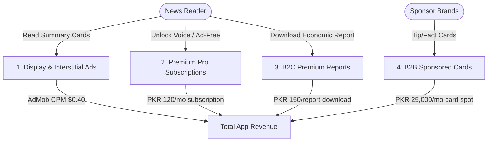

# UrduKhabrein (اردو خبریں) — Expected Revenue Model & Projections

This document outlines the detailed expected revenue model, monetization vectors, financial assumptions, and projection scenarios for **UrduKhabrein**, a swipeable, no-scroll 60-word news summary card directory, AI-powered de-biased aggregator, and bilingual audio news reader application designed for users in **Pakistan**.

---

## 1. Target Market & Demographics

Modern news consumption in Pakistan suffers from sensationalism, fake news, and endless clickbait feeds:

*   **Primary Target**: Urban professionals, students, and citizens looking for fast, factual, and de-biased news updates in clear legibile Nastaliq Urdu script.
*   **Key Value Proposition**: Clean news summary cards (max 60 words, 3-4 bullets), a daily economic widget (petrol, gold, currency exchange rates), natural Urdu Text-to-Speech (TTS) voice readers, and WhatsApp status card generators.
*   **Engagement Metrics**: News consumption is a high-frequency habit. Users open the app multiple times daily to check headlines or review currency fluctuations.

---

## 2. Monetization Vectors

UrduKhabrein monetizes through standard directory display ads, premium audio/ad-free subscriptions, sponsored brand cards, and specialized premium reports.

### A. Ad-Supported Model (Free Tier)
*   **Format**: Clean display banner and interstitial ads inserted between card swipes (never covering the text of a summary). Pro subscribers do not see ads.
*   **Metrics & Assumptions**:
    *   **Pakistan Average CPM**: $0.40 USD (approx. 111 PKR at 278 PKR/USD).
    *   **Engagement**: Free users average 15 sessions/month (checking updates morning/evening), viewing 12 news cards per session = 180 ad impressions per free user/month.

### B. UrduKhabrein Pro (Premium B2C Subscription)
*   **Format**: Premium subscription unlocking a clean, voice-powered news experience.
*   **Pro Features**:
    *   **100% Ad-Free**: Completely removes ads from the swipe deck and Economic sidebar.
    *   **Unlimited Urdu Text-to-Speech (TTS)**: Natural voice read-aloud for hands-free listening during commutes.
    *   **WhatsApp Status Theme Builder**: Custom backgrounds, colors, and branding options for sharing summary cards.
*   **Pricing**: 120 PKR / month (approx. $0.43 USD) or 800 PKR / year.
*   **Conversion Rate**: Projected at 1.0% of Monthly Active Users (MAU).

### C. B2B Brand Sponsored Cards (Native Placements)
*   **Format**: Companies (banks, insurance, utilities, FMCG) sponsor informational cards integrated natively into the swipe deck (e.g. "Save electricity during peak hours by KE" or "Guide to opening an digital bank account by HBL").
*   **Monetization**: Fixed monthly spot fee per brand.
*   **Pricing**: 25,000 PKR / month per brand placement.
*   **Target Partners**: 10 active partners in Year 1.

### D. Premium Financial/Market PDF Reports (B2C Transactions)
*   **Format**: Deep-dive weekly financial summaries, gold/currency historic price charts, or detailed import tariff summaries downloadable from the Economic Widget.
*   **Pricing**: 150 PKR per PDF report download.
*   **Conversion Rate**: Projected at 0.50% of MAU monthly.

---

## 3. Financial Projections (Year 1)

These projections are based on three scenarios of **Monthly Active Users (MAU)** reached by Month 12.
*(Exchange rate used: 1 USD = 278 PKR)*

### Scenario Comparison Table

| Metric | Conservative (Low Growth) | Base Case (Target Growth) | Optimistic (High Growth) |
| :--- | :--- | :--- | :--- |
| **Year 1 Target MAU** | 50,000 | 200,000 | 600,000 |
| **Pro Subscribers (1.0% - 1.2%)**| 500 (1.0%) | 2,000 (1.0%) | 7,200 (1.2%) |
| **B2C Premium PDF Downloads** | 250 sales (0.50%) | 1,000 sales (0.50%) | 4,200 sales (0.70%) |
| **B2B Sponsored Cards** | 3 | 10 | 25 |
| **Monthly Ad Revenue** | $3,564.00 (990,792 PKR) | $14,256.00 (3,963,168 PKR)| $48,016.80 (13,348,670 PKR)|
| **Monthly PDF Report Rev** | $80.94 (22,500 PKR)   | $539.57 (150,000 PKR)   | $2,266.19 (630,000 PKR)  |
| **Monthly Sponsored Card Rev**| $269.78 (75,000 PKR)  | $899.28 (250,000 PKR)   | $2,248.20 (625,000 PKR)  |
| **Monthly Pro Subscription Rev**| $215.83 (60,000 PKR)  | $863.31 (240,000 PKR)   | $3,107.91 (864,000 PKR)  |
| **Total Expected MRR (PKR)** | **1,148,292 PKR** | **4,603,168 PKR** | **15,467,670 PKR** |
| **Total Expected MRR (USD equivalent)** | **$4,130.55** | **$16,558.16** | **$55,639.10** |
| **Total Projected ARR (PKR)** | **13,779,504 PKR** | **55,238,016 PKR** | **185,612,040 PKR** |
| **Total Projected ARR (USD equivalent)** | **$49,566.60** | **$198,697.92** | **$667,669.20** |

---

## 4. Key Financial Formulas

$$\text{Total Monthly Revenue (PKR)} = R_{ad} + R_{subs} + R_{reports} + R_{sponsors}$$

Where:

1.  **Free Ad Revenue ($R_{ad}$)**:
    $$R_{ad} = \left( \text{MAU} \times (1 - \text{ProConv}) \times \frac{\text{ImpressionsPerUser}}{1000} \right) \times \text{CPM}_{USD} \times \text{Rate}_{PKR/USD}$$
2.  **Premium Pro Subscriptions ($R_{subs}$)**:
    $$R_{subs} = \text{MAU} \times \text{ProConv} \times \text{Price}_{PKR}$$
3.  **Premium PDF Downloads ($R_{reports}$)**:
    $$R_{reports} = \text{MAU} \times \text{DownloadRate} \times \text{ReportPrice}_{PKR}$$
4.  **B2B Sponsored Cards ($R_{sponsors}$)**:
    $$R_{sponsors} = \text{CardCount} \times \text{MonthlySponsorFee}_{PKR}$$

---

## 5. Dynamic Revenue Calculator

To modify these variables, run custom scenarios, or perform real-time sensitivity analysis, open the interactive browser-based dashboard calculator:

👉 **[revenue_calculator.html](file:///c:/Essentials/SmartFarms/AndroidApps/Revenue/revenue_calculator.html)**

*Open the file in any web browser to adjust parameters (e.g. MAU size, swipe session views, sponsor card counts) and view updated revenue breakdowns instantly.*
