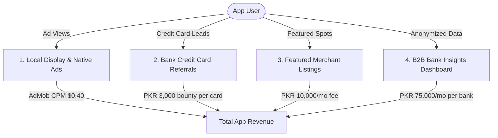

# CardPerks (کارڈ پرکس) — Expected Revenue Model & Projections (Pakistan Focus)

This document outlines the detailed expected revenue model, monetization vectors, financial assumptions, and projection scenarios for **CardPerks**, an independent credit and debit card discount discovery and card-payment tax optimization mobile application targeting consumers in **Pakistan**.

---

## 1. Target Market & Demographics

Pakistan's retail payment sector has modernized rapidly. As of 2026, the country has over 50 million active payment cards. However, high-value commercial credit card spend is concentrated in specific urban sectors:

*   **Primary Target**: Credit card holders in **Karachi, Lahore, and Islamabad/Rawalpindi** (representing approx. 1.8 to 2 million active credit cards).
*   **Retail Environment**: Large-scale supermarkets (Imtiaz, Metro, Carrefour, Al-Fatah, Jalal Sons), high-end restaurants, apparel malls, and digital commerce (Daraz, Foodpanda).
*   **Unique Pain Point**: Massive inflation has driven Pakistani consumers to actively seek card discounts (ranging from 10% to 50%). Finding active promotions is tedious due to complex card tiers and disorganized bank web pages.
*   **Tax Incentive**: Under provincial rules (PRA in Punjab, SRB in Sindh), paying by card at restaurants reduces GST from 16% to 5%. CardPerks calculates and verifies this discount, encouraging users to pay via card.

---

## 2. Monetization Vectors

CardPerks is primarily an ad-supported application. It monetizes through display and native ads, supplemented by bank credit card referrals, featured retail brand placements, and B2B bank analytics.

### A. Ad-Supported Model (Display & Native Ads)
*   **Format**: Native banner integrations on search directories and banner ads on specific merchant deal pages.
*   **Metrics & Assumptions**:
    *   **Pakistan Average CPM**: $0.40 USD (approx. 111 PKR at 278 PKR/USD).
    *   **User Sessions**: Average of 8 sessions/month (twice a week when dining out or shopping), viewing 5 merchant pages per session = 40 page/ad views per user/month.
    *   **Ads Displayed**: 1 impression per page view. Average of 40 impressions per user per month.

### B. Bank Credit Card Referrals (Lead Generation)
*   **Format**: When users browse deals on cards they do not hold (e.g. they see *"30% off UBL Signature Visa"* at their favorite restaurant), the app displays an integrated "Apply for this Card" lead capture button.
*   **Monetization Mechanism**: Commercial banks pay high referral commissions (bounties) for new verified credit card acquisitions. 
*   **Metrics & Assumptions**:
    *   **Average Bank Payout**: 3,000 PKR per approved credit card acquisition.
    *   **Conversion Rate**: Projected at 0.1% of Monthly Active Users (MAU) per month (e.g., 100 successful card approvals per month for 100,000 MAU).

### C. Featured Merchant Partnerships (App Sponsor Slots)
*   **Format**: Restaurants, fashion brands, and retail networks pay to pin their active promotions at the top of the "Nearby Deals" page or receive a "Featured Partner" banner on the home screen.
*   **Monetization Mechanism**: Flat monthly advertising fee per featured brand/branch slot.
*   **Metrics & Assumptions**:
    *   **Monthly Featured Fee**: 10,000 PKR / month.
    *   **Target Partners**: 20 active partner slots in Year 1.

### D. B2B Analytics & Insights Dashboard
*   **Format**: Anonymized market research reports sold to commercial banks and retail corporations.
*   **Value Proposition**: Giving banks insights on which competitor bank cards are most active in specific sectors, which restaurant categories drive the most inquiries, and customer tax audit reports.
*   **Pricing**: 75,000 PKR / month per bank.
*   **Target Clients**: 5 active commercial bank licenses by the end of Year 1.

---

## 3. Financial Projections (Year 1)

These projections are based on three scenarios of **Monthly Active Users (MAU)** reached by Month 12.
*(Calculations utilize a base exchange rate of 1 USD = 278 PKR)*

### Scenario Comparison Table

| Metric | Conservative (Low Growth) | Base Case (Target Growth) | Optimistic (High Growth) |
| :--- | :--- | :--- | :--- |
| **Year 1 Target MAU** | 20,000 | 100,000 | 300,000 |
| **New Approved Cards/mo (0.10% - 0.12%)** | 20 (0.10%) | 100 (0.10%) | 360 (0.12%) |
| **Featured Merchant Sponsors** | 5 | 20 | 50 |
| **Active Bank B2B Clients** | 2 | 5 | 10 |
| **Monthly Ad Revenue** | $240.00 (66,720 PKR) | $1,600.00 (444,800 PKR) | $6,000.00 (1,668,000 PKR) |
| **Monthly Card Referral Revenue** | $215.83 (60,000 PKR) | $1,079.14 (300,000 PKR) | $3,884.89 (1,080,000 PKR) |
| **Monthly Featured Brand Revenue** | $179.86 (50,000 PKR) | $719.42 (200,000 PKR) | $1,798.56 (500,000 PKR) |
| **Monthly B2B Revenue** | $539.57 (150,000 PKR) | $1,348.92 (375,000 PKR) | $2,697.84 (750,000 PKR) |
| **Total Expected MRR (PKR)** | **326,720 PKR** | **1,319,800 PKR** | **3,998,000 PKR** |
| **Total Expected MRR (USD equivalent)** | **$1,175.25** | **$4,747.48** | **$14,381.29** |
| **Total Projected ARR (PKR)** | **3,920,640 PKR** | **15,837,600 PKR** | **47,976,000 PKR** |
| **Total Projected ARR (USD equivalent)** | **$14,103.02** | **$56,969.76** | **$172,575.54** |

---

## 4. Key Financial Formulas

$$\text{Total Monthly Revenue (PKR)} = R_{ad} + R_{lead} + R_{featured} + R_{b2b}$$

Where:

1.  **Ad Revenue ($R_{ad}$)**:
    $$R_{ad} = \left( \text{MAU} \times \frac{\text{ImpressionsPerUser}}{1000} \right) \times \text{CPM}_{USD} \times \text{Rate}_{PKR/USD}$$
2.  **Card Referral Revenue ($R_{lead}$)**:
    $$R_{lead} = \text{MAU} \times \text{ReferralConvRate} \times \text{Bounty}_{PKR}$$
3.  **Featured Brand Revenue ($R_{featured}$)**:
    $$R_{featured} = \text{FeaturedMerchantCount} \times \text{MonthlyFee}_{PKR}$$
4.  **B2B Licensing Revenue ($R_{b2b}$)**:
    $$R_{b2b} = \text{BankClients} \times \text{MonthlyB2BFee}_{PKR}$$

---

## 5. Dynamic Revenue Calculator

To modify these variables, run custom scenarios, or perform real-time sensitivity analysis, open the interactive browser-based dashboard calculator:

👉 **[revenue_calculator.html](file:///c:/Essentials/SmartFarms/AndroidApps/Revenue/revenue_calculator.html)**

*Open the file in any web browser to adjust parameters (e.g. MAU size, bank referral bounties, featured merchant slots) and view updated revenue breakdowns instantly.*
