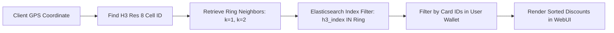

# Technical Details Document: CardPerks (کارڈ پرکس)

This document provides the technical specifications, geospatial querying design, data pipelines, database schemas, and client-server integration protocols for **CardPerks (کارڈ پرکس)**. The application uses a **Next.js Web UI** inside an **Android WebView Wrapper** shell, backed by serverless **AWS Lambda** microservices, **PostgreSQL** (with **PostGIS**), **Elasticsearch**, and **Uber H3** spatial indexes.

---

## 1. System Architecture & Scraper Pipeline

CardPerks relies on a weekly automation process that crawls commercial bank promotions, structures disorganized PDF/HTML tables, and maps them to physical merchant geo-locations in Pakistan.

```mermaid
graph TD
    %% Scraper Stage
    subgraph Scraper Worker (AWS Lambda / EventBridge)
        Cron[Weekly Trigger] --> ScrapeEngine[Scraper Lambda]
        ScrapeEngine -->|HTML Crawling| BankWebsites[Bank Promo Webpages]
        ScrapeEngine -->|PDF Parsing| PDFParser[Bank PDF Directories]
    end

    %% Data Processing Stage
    BankWebsites & PDFParser --> RawJSON[Raw Scraping JSON]
    RawJSON --> LLMNormalize[LLM Name Normalizer Lambda]
    LLMNormalize -->|Resolve Brand Aliases| NormalizedDB[(PostgreSQL DB)]

    %% Geospatial Layer
    NormalizedDB --> GeocodeWorker[Geo-coding Lambda]
    GeocodeWorker -->|Query Google Maps / Serp API| GeoCache[Elasticsearch Merchant Index]

    %% Client Delivery
    Client[Next.js App / Android Wrapper] <-->|Fetch Location & Cards| APIGateway[AWS API Gateway]
    APIGateway <--> DiscoveryLambda[Discount Discovery Lambda]
    DiscoveryLambda -->|H3 Radial Query| GeoCache
    DiscoveryLambda -->|Fetch Transactions / Audits| NormalizedDB

    style ScrapeEngine fill:#d4ebf2,stroke:#0288d1,stroke-width:2px
    style LLMNormalize fill:#ffe0b2,stroke:#fb8c00,stroke-width:2px
    style DiscoveryLambda fill:#e8f5e9,stroke:#4caf50,stroke-width:2px
```

---

## 2. Database Schema & Data Models

### A. PostgreSQL Schema (Relational Store)
Tracks commercial banks, card tiers, merchants, geofenced branches, discount structures, and user transaction records.

```sql
-- Commercial Banks in Pakistan
CREATE TABLE banks (
    bank_id VARCHAR(50) PRIMARY KEY, -- e.g., 'hbl', 'alfalah', 'meezan', 'scb'
    bank_name VARCHAR(100) NOT NULL,
    logo_url VARCHAR(512),
    created_at TIMESTAMP WITH TIME ZONE DEFAULT CURRENT_TIMESTAMP
);

-- Card Tiers and Brands
CREATE TABLE card_tiers (
    card_tier_id UUID PRIMARY KEY DEFAULT gen_random_uuid(),
    bank_id VARCHAR(50) REFERENCES banks(bank_id) ON DELETE CASCADE,
    card_network VARCHAR(50) NOT NULL, -- 'visa', 'mastercard', 'unionpay', 'paypak'
    card_name VARCHAR(100) NOT NULL, -- e.g., 'Platinum', 'Gold', 'Signature', 'Infinite', 'World'
    rank_level INTEGER DEFAULT 1, -- higher means higher tier (used for discount fallback calculations)
    created_at TIMESTAMP WITH TIME ZONE DEFAULT CURRENT_TIMESTAMP
);

-- Master Merchant Directory
CREATE TABLE merchants (
    merchant_id UUID PRIMARY KEY DEFAULT gen_random_uuid(),
    merchant_name VARCHAR(255) NOT NULL,
    normalized_name VARCHAR(255) UNIQUE NOT NULL, -- e.g., 'kolachi_restaurant', 'sapphire_apparel'
    category VARCHAR(100) NOT NULL, -- 'dining', 'grocery', 'apparel', 'fuel', 'other'
    created_at TIMESTAMP WITH TIME ZONE DEFAULT CURRENT_TIMESTAMP
);

-- Physical Merchant Branches with Geospatial Location
CREATE TABLE merchant_branches (
    branch_id UUID PRIMARY KEY DEFAULT gen_random_uuid(),
    merchant_id UUID REFERENCES merchants(merchant_id) ON DELETE CASCADE,
    branch_name VARCHAR(255) NOT NULL, -- e.g., 'Clifton Branch', 'Packages Mall Branch'
    address TEXT,
    city VARCHAR(100) NOT NULL, -- 'Karachi', 'Lahore', 'Islamabad', etc.
    latitude NUMERIC(10, 8) NOT NULL,
    longitude NUMERIC(11, 8) NOT NULL,
    h3_r8_index VARCHAR(15) NOT NULL, -- Uber H3 Resolution 8 Spatial Index Cell
    geom GEOMETRY(Point, 4326), -- PostGIS Point geometry
    created_at TIMESTAMP WITH TIME ZONE DEFAULT CURRENT_TIMESTAMP
);

-- Discount Structure Mapping
CREATE TABLE card_discounts (
    discount_id UUID PRIMARY KEY DEFAULT gen_random_uuid(),
    merchant_id UUID REFERENCES merchants(merchant_id) ON DELETE CASCADE,
    card_tier_id UUID REFERENCES card_tiers(card_tier_id) ON DELETE CASCADE,
    discount_percentage NUMERIC(5, 2) NOT NULL, -- e.g., 30.00 (representing 30%)
    max_cap NUMERIC(10, 2), -- maximum discount limit (PKR), NULL if uncapped
    valid_from DATE NOT NULL,
    valid_to DATE NOT NULL,
    weekly_validity JSONB, -- e.g., {"days": ["Friday", "Saturday", "Sunday"], "hours": "12pm-11pm"}
    terms_conditions TEXT,
    created_at TIMESTAMP WITH TIME ZONE DEFAULT CURRENT_TIMESTAMP
);
```

---

## 3. Web Scraping & Normalization Engine

Commercial bank websites publish discount promotions in complex formats: raw HTML tables, dynamically updated image galleries, or multi-page PDF catalogs. 

### A. Python BeautifulSoup & PDF Parser Worker
The Scraper Lambda executes scheduled routines to pull bank promotions, parsing unstructured tables into standardized formats.

```python
import pdfplumber
import requests
from bs4 import BeautifulSoup

def scrape_alfalah_dining_promo():
    url = "https://www.bankalfalah.com/personal-banking/cards/discounts/dining/"
    response = requests.get(url)
    soup = BeautifulSoup(response.content, 'html.parser')
    
    scraped_deals = []
    # Extract discount table rows
    for row in soup.find_all('tr')[1:]: # Skipping headers
        cols = row.find_all('td')
        if len(cols) >= 3:
            merchant_name = cols[0].text.strip()
            discount_text = cols[1].text.strip() # e.g., "30% Off on Platinum Cards"
            valid_cards = cols[2].text.strip()
            
            scraped_deals.append({
                "bank": "alfalah",
                "merchant": merchant_name,
                "discount": parse_discount_percentage(discount_text),
                "card_scope": valid_cards
            })
    return scraped_deals

def parse_pdf_promo_table(pdf_url):
    response = requests.get(pdf_url)
    with open("/tmp/temp_promo.pdf", "wb") as f:
        f.write(response.content)
        
    extracted_rows = []
    with pdfplumber.open("/tmp/temp_promo.pdf") as pdf:
        for page in pdf.pages:
            table = page.extract_table()
            if table:
                for row in table:
                    # Clean columns and append
                    cleaned_row = [cell.replace('\n', ' ').strip() for cell in row if cell]
                    extracted_rows.append(cleaned_row)
    return extracted_rows
```

### B. LLM Normalization Pipeline
Because bank data frequently lists variations of merchant names (e.g., `"Kolachi Clifton"`, `"Kolachi Restaurant"`, `"Kolachi - Karachi"`), an LLM normalizes raw strings into consolidated merchant IDs.

#### System Prompt for Normalization:
```text
Resolve the raw merchant name to the correct standardized profile name from our database. Return the matched standardized name, or generate a new normalized lowercase name if no matches exist.

Database Standard Names: {STANDARD_MERCHANT_NAMES}
Raw Scraped Merchant Name: {RAW_MERCHANT_NAME}
Category context: {CATEGORY}

JSON Output Schema:
{
  "matched": true | false,
  "normalized_name": "lowercase_standard_name",
  "confidence_score": 0.0 to 1.0
}
```

---

## 4. Geospatial Indexing & Uber H3 Querying

To scale queries across thousands of active discounts, CardPerks replaces heavy database geofence triggers with **Uber H3 Spatial Indexes** at **Resolution 8** (edge length of ~730 meters, area ~0.7 km²).



### H3 Discovery Logic (Python Lambda API)
```python
import h3

def get_nearby_discounts(lat, lng, user_wallet_card_ids, radius_km=2):
    # 1. Convert latitude & longitude to H3 Resolution 8 cell
    center_cell = h3.geo_to_h3(lat, lng, resolution=8)
    
    # 2. Get surrounding ring cells based on search radius
    # Resolution 8 cells are ~0.7 square km, k=2 ring covers adjacent regions (~2.2 km radius)
    k_ring = h3.k_ring(center_cell, k=2)
    
    # 3. Build Elasticsearch Boolean query using H3 indexes
    es_query = {
        "query": {
            "bool": {
                "must": [
                    { "terms": { "h3_index": list(k_ring) } },
                    { "terms": { "card_tier_id": user_wallet_card_ids } }
                ]
            }
        },
        "sort": [
            { "discount_percentage": { "order": "desc" } }
        ]
    }
    return es_query
```

---

## 5. Provincial Restaurant Card-Tax Audit Logic

In Pakistan, provincial tax bodies mandate lower Sales Tax (GST) rates on restaurant bills paid via cards compared to cash to encourage formal transactions.

### Provincial Rules Matrix (2026/2027)
| Region / Authority | Cash GST Rate | Card GST Rate | Savings Benefit |
|---|---|---|---|
| **Punjab (PRA)** | 16% | 5% | **11% Net Savings** |
| **Sindh (SRB)** | 13% | 8% | **5% Net Savings** |
| **Khyber Pakhtunkhwa (KPRA)** | 15% | 8% | **7% Net Savings** |
| **Federal / Islamabad (FBR)** | 15% | 5% | **10% Net Savings** |

### Calculator Calculation Class (Next.js TypeScript)
```typescript
interface TaxResult {
  baseAmount: number;
  cashTaxAmount: number;
  cardTaxAmount: number;
  netSavings: number;
  appliedCashRate: number;
  appliedCardRate: number;
}

export class CardTaxAuditor {
  private static rules: Record<string, { cash: number; card: number }> = {
    PRA: { cash: 0.16, card: 0.05 },
    SRB: { cash: 0.13, card: 0.08 },
    KPRA: { cash: 0.15, card: 0.08 },
    FBR: { cash: 0.15, card: 0.05 }
  };

  public static calculateSavings(baseAmount: number, province: 'PRA' | 'SRB' | 'KPRA' | 'FBR'): TaxResult {
    const rule = this.rules[province];
    const cashTaxAmount = baseAmount * rule.cash;
    const cardTaxAmount = baseAmount * rule.card;
    const netSavings = cashTaxAmount - cardTaxAmount;

    return {
      baseAmount,
      cashTaxAmount,
      cardTaxAmount,
      netSavings,
      appliedCashRate: rule.cash * 100,
      appliedCardRate: rule.card * 100
    };
  }
}
```

---

## 6. API Reference Specification

### A. Nearby Discounts Lookup
`GET /api/discounts/nearby`

Retrieves geocoded bank discounts based on location coordinates and the user's active wallet structure.

#### Query Parameters:
*   `lat`: Latitude float (e.g., `24.8138`)
*   `lng`: Longitude float (e.g., `67.0284`)
*   `wallet_tiers`: Comma-separated list of UUIDs (e.g., `d3b07384-d113-4464-9b22-48a803e62061`)
*   `category`: Optional category string (e.g., `dining`, `grocery`)

#### Response Payload (200 OK):
```json
{
  "current_h3_cell": "8851014125fffff",
  "discounts_count": 2,
  "results": [
    {
      "merchant_name": "Kolachi Restaurant",
      "branch_name": "Clifton Beach",
      "category": "dining",
      "distance_meters": 350.2,
      "discount_percentage": 30.00,
      "card_details": {
        "bank": "HBL",
        "card_name": "World Mastercard Platinum",
        "network": "mastercard"
      },
      "max_cap": 3000.00,
      "valid_days": ["Friday", "Saturday", "Sunday"],
      "provincial_tax_savings": {
        "authority": "SRB",
        "cash_tax_rate": "13%",
        "card_tax_rate": "8%",
        "card_payment_savings": "5%"
      }
    },
    {
      "merchant_name": "Imtiaz Super Market",
      "branch_name": "Defense Branch",
      "category": "grocery",
      "distance_meters": 820.5,
      "discount_percentage": 10.00,
      "card_details": {
        "bank": "Bank Alfalah",
        "card_name": "Visa Platinum",
        "network": "visa"
      },
      "max_cap": 1500.00,
      "valid_days": ["Monday", "Tuesday", "Wednesday"],
      "provincial_tax_savings": null
    }
  ]
}
```

---

## 7. Client & Native Wrapper Location Bridge

To support live geofenced updates, the Next.js UI queries the native device Fused Location Provider API through the custom Android Javascript Interface:

### A. Next.js Location Service Setup
```javascript
// Next.js location callback setup
export function requestDeviceLocation() {
  return new Promise((resolve, reject) => {
    if (window.AndroidInterface && typeof window.AndroidInterface.getCurrentGPSCoordinates === 'function') {
      // Trigger native Android location listener
      window.AndroidInterface.getCurrentGPSCoordinates();
      
      // Temporary global handler for Android callback
      window.onLocationUpdated = (lat, lng) => {
        resolve({ lat: parseFloat(lat), lng: parseFloat(lng) });
      };
      
      window.onLocationError = (errorMsg) => {
        reject(new Error(errorMsg));
      };
    } else {
      // Standard browser geolocator fallback
      navigator.geolocation.getCurrentPosition(
        (pos) => resolve({ lat: pos.coords.latitude, lng: pos.coords.longitude }),
        (err) => reject(err),
        { enableHighAccuracy: true, timeout: 5000 }
      );
    }
  });
}
```

### B. Android Native FusedLocationProvider Bridge (Kotlin)
Handles direct requests from the Next.js container, verifying device geolocation permissions.

```kotlin
class WebAppInterface(private val mContext: Context, private val webView: WebView) {

    private val fusedLocationClient: FusedLocationProviderClient = 
        LocationServices.getFusedLocationProviderClient(mContext)

    @JavascriptInterface
    fun getCurrentGPSCoordinates() {
        if (ActivityCompat.checkSelfPermission(
                mContext, Manifest.permission.ACCESS_FINE_LOCATION
            ) != PackageManager.PERMISSION_GRANTED) {
            
            // Request native system permissions
            ActivityCompat.requestPermissions(
                mContext as Activity,
                arrayOf(Manifest.permission.ACCESS_FINE_LOCATION),
                LOCATION_PERMISSION_REQUEST_CODE
            )
            webView.post {
                webView.evaluateJavascript("window.onLocationError('Permissions not yet granted.');", null)
            }
            return
        }

        fusedLocationClient.lastLocation.addOnSuccessListener { location: Location? ->
            if (location != null) {
                val lat = location.latitude
                val lng = location.longitude
                webView.post {
                    webView.evaluateJavascript("window.onLocationUpdated('$lat', '$lng');", null)
                }
            } else {
                webView.post {
                    webView.evaluateJavascript("window.onLocationError('Location returned null.');", null)
                }
            }
        }.addOnFailureListener { exception ->
            webView.post {
                webView.evaluateJavascript("window.onLocationError('${exception.message}');", null)
            }
        }
    }
}
```
