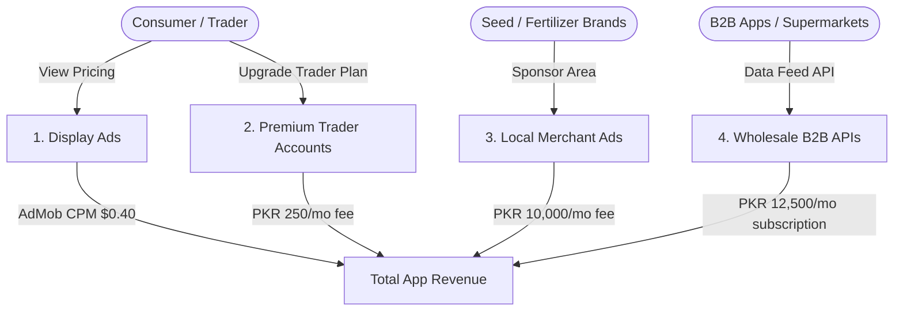

# MandiCheck (منڈی چیک) — Expected Revenue Model & Projections

This document outlines the detailed expected revenue model, monetization vectors, financial assumptions, and projection scenarios for **MandiCheck**, an automated daily commodity price verifier, wholesale sabzi mandi auction lookup, and retail price discrepancy directory application designed for savers, vendors, and traders in **Pakistan**.

---

## 1. Target Market & Demographics

The agricultural retail and wholesale trading sector in Pakistan is a high-volume essential market:

*   **Primary Target**: Karyana shopkeepers, fruit/vegetable retail vendors, commercial hotel/restaurant procurement managers, agritech platforms, wholesale brokers (*Arhtis*), and price-conscious household consumers.
*   **Market Size**: Millions of individuals buy and sell fresh produce daily. Wholesale prices fluctuate hourly based on auctions in local central markets (*Sabzi Mandis*), while retail prices are capped by daily District Commissioner (DC) rate ceilings.
*   **Unique Pain Point**: DC price lists are published as blurry scanned documents or images, leading to retail overcharging and manual data entry bottlenecks. Wholesale price disparities are large, and supply-chain logistics tracking is offline.
*   **Value Proposition**: MandiCheck parses daily scans via Vision AI, normalizes trade units (kg, dozen, mann), tracks price spreads, and alerts magistrates of overcharging.

---

## 2. Monetization Vectors

MandiCheck utilizes a mixed B2C freemium and B2B SaaS architecture, prioritizing wholesale pricing APIs, agri-merchant ads, and premium trader alerts.

### A. Wholesale Supply Chain Data API (B2B SaaS - Primary Stream)
*   **Format**: Clean, daily structured JSON price feed APIs listing wholesale mandi auction results and DC retail ceilings.
*   **Monetization Mechanism**: Recurrent B2B data licensing.
*   **Target Clients**: Supermarket procurement offices (e.g. Metro, Imtiaz, Carrefour), hotel/restaurant chains, B2B logistics networks (e.g. Tajir, Dastgyar), and agritech startups.
*   **Pricing**: 12,500 PKR / month per client API license.
*   **Sponsors**: Target of 20 active B2B subscribers in Year 1.

### B. Agri-Brand & Merchant Ad Placements
*   **Format**: Regional banner spots pinned to specific mandi search queries.
*   **Target Advertisers**: Fertilizer corporations, seed distributors, logistics operators, and local cold-chain warehousing firms trying to reach farmers/brokers.
*   **Pricing**: 10,000 PKR / month per brand placement.
*   **Sponsors**: Target of 15 active sponsors in Year 1.

### C. MandiCheck Premium (Wholesale Traders)
*   **Format**: Premium membership designed for wholesale brokers and large-scale growers.
*   **Premium Features**:
    *   **AI Seasonal Trend Predictor**: Forecasting upcoming commodity price spikes due to monsoons, droughts, or cultural holidays (Eid/Ramadan).
    *   **Export Profitability Estimator**: Live calculator mapping packaging/shipping costs against international market rates.
    *   **WhatsApp Price Bot**: Automated lookups and daily sheets delivered directly to WhatsApp.
*   **Pricing**: 250 PKR / month (approx. $0.90 USD) or 2,000 PKR / year.
*   **Conversion Rate**: Projected at 1.0% of Monthly Active Users (MAU).

### D. Ad-Supported Model (Free Tier)
*   **Format**: Native banner ads on directory price lookup tables. B2B clients and premium traders do not see ads.
*   **Metrics & Assumptions**:
    *   **Pakistan Average CPM**: $0.40 USD (approx. 111 PKR at 278 PKR/USD).
    *   **User Sessions**: Active users track price directories frequently. Free users average 10 sessions/month (checking rates ahead of market runs), viewing 5 pages per visit = 50 ad impressions per free user/month.

---

## 3. Financial Projections (Year 1)

These projections are based on three scenarios of **Monthly Active Users (MAU)** reached by Month 12.
*(Exchange rate used: 1 USD = 278 PKR)*

### Scenario Comparison Table

| Metric | Conservative (Low Growth) | Base Case (Target Growth) | Optimistic (High Growth) |
| :--- | :--- | :--- | :--- |
| **Year 1 Target MAU** | 10,000 | 50,000 | 150,000 |
| **Premium Trader Subs (1.0% - 1.2%)**| 100 (1.0%) | 500 (1.0%) | 1,800 (1.2%) |
| **B2B API Subscribers** | 5 | 20 | 50 |
| **Agri-Brand Sponsors** | 5 | 15 | 40 |
| **Monthly Ad Revenue** | $198.00 (55,044 PKR) | $990.00 (275,220 PKR) | $3,705.00 (1,029,990 PKR) |
| **Monthly B2B Wholesale API Rev** | $224.82 (62,500 PKR) | $899.28 (250,000 PKR) | $2,248.20 (625,000 PKR) |
| **Monthly Agri-Brand Sponsor Rev** | $179.86 (50,000 PKR) | $539.57 (150,000 PKR) | $1,438.85 (400,000 PKR) |
| **Monthly Premium Trader Sub Rev** | $89.93 (25,000 PKR) | $449.64 (125,000 PKR) | $1,618.71 (450,000 PKR) |
| **Total Expected MRR (PKR)** | **192,544 PKR** | **800,220 PKR** | **2,504,990 PKR** |
| **Total Expected MRR (USD equivalent)** | **$692.61** | **$2,878.49** | **$9,010.76** |
| **Total Projected ARR (PKR)** | **2,310,528 PKR** | **9,602,640 PKR** | **30,059,880 PKR** |
| **Total Projected ARR (USD equivalent)** | **$8,311.32** | **$34,541.88** | **$108,129.12** |

---

## 4. Key Financial Formulas

$$\text{Total Monthly Revenue (PKR)} = R_{ad} + R_{api} + R_{spots} + R_{premium}$$

Where:

1.  **Free Ad Revenue ($R_{ad}$)**:
    $$R_{ad} = \left( \text{MAU} \times (1 - \text{TraderConv}) \times \frac{\text{ImpressionsPerUser}}{1000} \right) \times \text{CPM}_{USD} \times \text{Rate}_{PKR/USD}$$
2.  **B2B Wholesale API Revenue ($R_{api}$)**:
    $$R_{api} = \text{ClientCount} \times \text{APILicenseFee}_{PKR}$$
3.  **Agri-Brand Sponsor Revenue ($R_{spots}$)**:
    $$R_{spots} = \text{SponsorCount} \times \text{MonthlyFee}_{PKR}$$
4.  **Premium Trader Subscription Revenue ($R_{premium}$)**:
    $$R_{premium} = \text{MAU} \times \text{TraderConv} \times \text{Price}_{PKR}$$

---

## 5. Dynamic Revenue Calculator

To modify these variables, run custom scenarios, or perform real-time sensitivity analysis, open the interactive browser-based dashboard calculator:

👉 **[revenue_calculator.html](file:///c:/Essentials/SmartFarms/AndroidApps/Revenue/revenue_calculator.html)**

*Open the file in any web browser to adjust parameters (e.g. MAU size, data feed API prices, agri-brand placements) and view updated revenue breakdowns instantly.*
