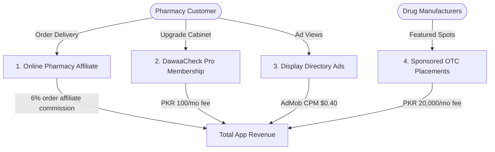

# DawaaCheck (دوا چیک) — Expected Revenue Model & Projections

This document outlines the detailed expected revenue model, monetization vectors, financial assumptions, and projection scenarios for **DawaaCheck**, a Drug Regulatory Authority of Pakistan (DRAP) registration verifier, official price audit directory, generic match aggregator, and pharmacy commission application designed for patients in **Pakistan**.

---

## 1. Target Market & Demographics

The pharmaceutical retail sector in Pakistan is a high-frequency consumer spend market:

*   **Primary Target**: Chronic disease patients (requiring regular monthly refills of cardiovascular, diabetes, asthma, or thyroid medicines), parents of young children buying pediatric syrups, and general consumers seeking standard OTC relief.
*   **Retail Environment**: Large city pharmacy chains (DVAGO, Servaid, Shaheen, Fazal Din, Watson) and thousands of independent local shops.
*   **Unique Pain Point**: Counterfeit medications, arbitrary retail markups exceeding government controlled Maximum Retail Prices (MRP), and frequent shortages of crucial medicines that force patients to seek generic substitutes.
*   **Value Proposition**: DawaaCheck verifies registration, calculates precise price-per-tablet ratios, matches generic equivalents with active pricing, and links to delivery partners to order.

---

## 2. Monetization Vectors

DawaaCheck operates on a consumer utility model combining online pharmacy orders, pharma brand sponsors, and subscription cabinet features.

### A. Online Pharmacy Affiliate Commissions (Primary Stream)
*   **Format**: When users search a brand or generic match, the app displays a "Buy Now / Order Delivery" option linking to pharmacy delivery networks (e.g. DVAGO).
*   **Monetization Mechanism**: Referral payout commission on completed order baskets.
*   **Metrics & Assumptions**:
    *   **Commission Rate**: 6% of order basket values.
    *   **Average Order Basket**: 2,000 PKR (average cost of monthly chronic medication profiles or multi-brand orders).
    *   **Order Conversion Rate**: Projected at 2.5% of Monthly Active Users (MAU) per month.

### B. DawaaCheck Pro (Family Medicine Cabinet)
*   **Format**: Premium subscription tier offering utility features for family medical safety.
*   **Pro Features**:
    *   **AI Doctor Note Scanner**: Vision AI (Gemini) that reads and deciphers famously illegible handwriting on doctor prescriptions, adding verified drugs to shopping checklists.
    *   **Bilingual Voice Dosage Alerts**: Audio announcements of dosing schedules in Urdu/regional languages.
    *   **Ad-free experience**.
*   **Pricing**: 100 PKR / month (approx. $0.36 USD) or 800 PKR / year.
*   **Conversion Rate**: Projected at 1.0% of Monthly Active Users (MAU).

### C. Sponsored OTC Brand Placements
*   **Format**: Local pharmaceutical companies (like Searle, Herbion, Hilton) pay to feature their OTC wellness products, vitamins, or supplements as recommended options.
*   **Monetization Mechanism**: Flat monthly advertising fee per featured brand/branch slot.
*   **Metrics & Assumptions**:
    *   **Monthly Featured Fee**: 20,000 PKR / month.
    *   **Target Partners**: 10 active partner sponsors in Year 1.

### D. Ad-Supported Model (Free Tier)
*   **Format**: Non-intrusive display ads in search results. Pro subscribers are excluded from the ad pool.
*   **Metrics & Assumptions**:
    *   **Pakistan Average CPM**: $0.40 USD (approx. 111 PKR at 278 PKR/USD).
    *   **User Sessions**: Average of 4 sessions/month per free user (weekly pharmacy runs), viewing 4 pages per session = 16 ad impressions per free user/month.

---

## 3. Financial Projections (Year 1)

These projections are based on three scenarios of **Monthly Active Users (MAU)** reached by Month 12.
*(Exchange rate used: 1 USD = 278 PKR)*

### Scenario Comparison Table

| Metric | Conservative (Low Growth) | Base Case (Target Growth) | Optimistic (High Growth) |
| :--- | :--- | :--- | :--- |
| **Year 1 Target MAU** | 20,000 | 100,000 | 300,000 |
| **Monthly Orders (2.0% - 3.0%)** | 400 (2.0%) | 2,500 (2.5%) | 9,000 (3.0%) |
| **Premium Pro Users (1.0% - 1.5%)** | 200 (1.0%) | 1,000 (1.0%) | 4,500 (1.5%) |
| **Sponsored OTC Brands** | 3 | 10 | 25 |
| **Monthly Ad Revenue** | $126.72 (35,228 PKR) | $633.60 (176,141 PKR) | $2,364.00 (657,192 PKR) |
| **Monthly Affiliate Commissions** | $172.66 (48,000 PKR) | $1,079.14 (300,000 PKR) | $3,884.89 (1,080,000 PKR) |
| **Monthly Pro Subscription Rev** | $71.94 (20,000 PKR) | $359.71 (100,000 PKR) | $1,618.71 (450,000 PKR) |
| **Monthly Sponsored Brand Revenue** | $215.83 (60,000 PKR) | $719.42 (200,000 PKR) | $1,798.56 (500,000 PKR) |
| **Total Expected MRR (PKR)** | **163,228 PKR** | **776,141 PKR** | **2,687,192 PKR** |
| **Total Expected MRR (USD equivalent)** | **$587.15** | **$2,791.87** | **$9,666.16** |
| **Total Projected ARR (PKR)** | **1,958,736 PKR** | **9,313,692 PKR** | **32,246,304 PKR** |
| **Total Projected ARR (USD equivalent)** | **$7,045.80** | **$33,502.44** | **$115,993.92** |

---

## 4. Key Financial Formulas

$$\text{Total Monthly Revenue (PKR)} = R_{ad} + R_{affil} + R_{pro} + R_{spots}$$

Where:

1.  **Free Ad Revenue ($R_{ad}$)**:
    $$R_{ad} = \left( \text{MAU} \times (1 - \text{ProConv}) \times \frac{\text{ImpressionsPerUser}}{1000} \right) \times \text{CPM}_{USD} \times \text{Rate}_{PKR/USD}$$
2.  **Affiliate Order Commission ($R_{affil}$)**:
    $$R_{affil} = \text{MAU} \times \text{OrderRate} \times \text{AverageBasket}_{PKR} \times \text{CommissionRate}$$
3.  **Pro Subscription Revenue ($R_{pro}$)**:
    $$R_{pro} = \text{MAU} \times \text{ProConv} \times \text{Price}_{PKR}$$
4.  **Sponsored Brand Revenue ($R_{spots}$)**:
    $$R_{spots} = \text{SponsorCount} \times \text{MonthlyFee}_{PKR}$$

---

## 5. Dynamic Revenue Calculator

To modify these variables, run custom scenarios, or perform real-time sensitivity analysis, open the interactive browser-based dashboard calculator:

👉 **[revenue_calculator.html](file:///c:/Essentials/SmartFarms/AndroidApps/Revenue/revenue_calculator.html)**

*Open the file in any web browser to adjust parameters (e.g. MAU size, online pharmacy affiliate rates, sponsored brand payouts) and view updated revenue breakdowns instantly.*
