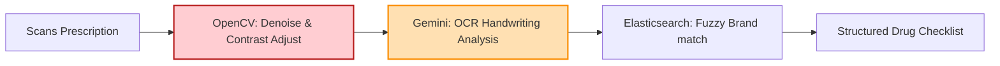

# Technical Details Document: DawaaCheck (دوا چیک)

This document provides the technical specifications, database schemas, scraper designs, handwriting prescription parsing pipelines, and client-server integration protocols for **DawaaCheck (دوا چیک)**. The system is built using a **Next.js Web UI** inside an **Android WebView Wrapper** shell, backed by serverless **AWS Lambda** microservices, **PostgreSQL**, **Elasticsearch**, and **Gemini Vision OCR**.

---

## 1. System Architecture & Prescription Ingestion Pipeline

DawaaCheck verifies Maximum Retail Prices (MRP) against DRAP registries and interprets doctor prescriptions.

```mermaid
graph TD
    %% Scraper Stage
    subgraph Scheduled Scraping (AWS Lambda / EventBridge)
        DRAPScraper[DRAP Portal Crawler] -->|Crawl drap.gov.pk| DRAPData[DRAP Registration PDF/HTML]
        PharmacyScraper[Retail Scraper Lambda] -->|Pull APIs DVAGO, Servaid| RetailStock[Pharmacy Inventory Logs]
    end

    %% Storage Ingestion
    DRAPData & RetailStock --> DataNormalize[Normalizer Lambda]
    DataNormalize --> PostgreSQL[(PostgreSQL DB<br/>DRAP Registry)]
    DataNormalize --> Elasticsearch[(Elasticsearch Catalog)]

    %% Ingestion Workflows
    ScanPrescription[User scans Handwriting Prescription] --> Gateway[API Gateway / Auth]
    Gateway --> PrescriptionLambda[Prescription Parser Lambda]
    PrescriptionLambda --> GeminiOCR[Gemini Handwriting OCR]
    GeminiOCR --> FuzzyMatch[Fuzzy Brand Name Resolver]
    FuzzyMatch --> CheckMRP[Validate DRAP Registration & Price]
    CheckMRP --> ReturnPrescription[Return Structured Checklist JSON]

    %% Client Sync
    Client[Next.js WebView Client] <-->|Search Medicine / Get Alternatives| Gateway
    Gateway <--> DiscoveryAPI[Medicine Lookup Lambda]
    DiscoveryAPI --> PostgreSQL
    DiscoveryAPI --> Elasticsearch

    style DRAPScraper fill:#d4ebf2,stroke:#0288d1,stroke-width:2px
    style PrescriptionLambda fill:#ffe0b2,stroke:#fb8c00,stroke-width:2px
    style GeminiOCR fill:#ffcdd2,stroke:#b71c1c,stroke-width:2px
    style PostgreSQL fill:#ede7f6,stroke:#5e35b1,stroke-width:2px
```

---

## 2. Database Schema & Data Models

### A. PostgreSQL Schema (Relational Store)
Tracks active chemical generics, brand details, pricing history, crowdsourced reports, and pharmacy stock coordinates.

```sql
-- Active Pharmaceutical Ingredients (API / Generics)
CREATE TABLE generic_molecules (
    generic_id UUID PRIMARY KEY DEFAULT gen_random_uuid(),
    generic_name VARCHAR(255) UNIQUE NOT NULL, -- e.g. 'Paracetamol', 'Amoxicillin + Clavulanic Acid'
    pregnancy_category VARCHAR(10), -- e.g. 'A', 'B', 'C', 'D', 'X'
    warnings_en TEXT,
    warnings_ur TEXT
);

-- Brand Directory (Verifying DRAP registration)
CREATE TABLE drug_brands (
    drug_id UUID PRIMARY KEY DEFAULT gen_random_uuid(),
    drap_registration_number VARCHAR(100) UNIQUE NOT NULL, -- D.R. No. e.g. '012952'
    brand_name VARCHAR(255) NOT NULL, -- e.g. 'Panadol', 'Augmentin'
    manufacturer VARCHAR(255) NOT NULL, -- e.g. 'GSK', 'Abbott'
    dosage_form VARCHAR(100) NOT NULL, -- 'Tablet', 'Syrup', 'Injection', 'Suspension'
    generic_id UUID REFERENCES generic_molecules(generic_id) ON DELETE RESTRICT,
    strength VARCHAR(50) NOT NULL, -- e.g. '500mg', '375mg', '125mg/5ml'
    pack_size VARCHAR(100) NOT NULL, -- e.g. '100 Tablets (10 x 10 Blisters)'
    created_at TIMESTAMP WITH TIME ZONE DEFAULT CURRENT_TIMESTAMP
);

-- Regulated Pricing Directory (MRP Inspector)
CREATE TABLE drug_prices (
    price_id UUID PRIMARY KEY DEFAULT gen_random_uuid(),
    drug_id UUID REFERENCES drug_brands(drug_id) ON DELETE CASCADE,
    mrp_pack_pkr NUMERIC(8, 2) NOT NULL, -- Pack maximum price
    mrp_unit_pkr NUMERIC(8, 5) NOT NULL, -- Calculated cost per single tablet/capsule/ml
    is_essential BOOLEAN DEFAULT FALSE, -- Essential drug status (price capped by DRAP)
    last_updated DATE DEFAULT CURRENT_DATE
);

-- Crowdsourced Price Gouging Reports
CREATE TABLE price_gouging_reports (
    report_id UUID PRIMARY KEY DEFAULT gen_random_uuid(),
    drug_id UUID REFERENCES drug_brands(drug_id) ON DELETE CASCADE,
    pharmacy_name VARCHAR(255) NOT NULL,
    pharmacy_address TEXT,
    city VARCHAR(100) NOT NULL,
    charged_price_pkr NUMERIC(8, 2) NOT NULL,
    mrp_price_pkr NUMERIC(8, 2) NOT NULL,
    receipt_image_url VARCHAR(512),
    reported_at TIMESTAMP WITH TIME ZONE DEFAULT CURRENT_TIMESTAMP
);
```

---

## 3. Web Scraping & DRAP Database Sync

A scheduled Python worker crawls the DRAP registration lists and pricing gazettes to maintain up-to-date data.

### A. DRAP Gazette PDF Scraper (Python PDFplumber)
```python
import pdfplumber
import requests
import psycopg2

def scrape_drap_mrp_gazette(pdf_url):
    response = requests.get(pdf_url)
    with open("/tmp/drap_gazette.pdf", "wb") as f:
        f.write(response.content)
        
    conn = psycopg2.connect("dbname=dawaacheck user=postgres password=secret host=localhost")
    cursor = conn.cursor()

    with pdfplumber.open("/tmp/drap_gazette.pdf") as pdf:
        for page in pdf.pages:
            table = page.extract_table()
            if table:
                for row in table[1:]: # Skip header
                    if len(row) >= 5:
                        drap_reg = row[0].strip()
                        brand_name = row[1].strip()
                        strength = row[2].strip()
                        pack_size = row[3].strip()
                        mrp_price = float(row[4].replace(",", "").strip())
                        
                        # Parse units per pack to calculate unit cost
                        units_count = parse_pack_units(pack_size)
                        mrp_unit_cost = mrp_price / units_count if units_count > 0 else mrp_price
                        
                        # Upsert pricing indexes
                        cursor.execute("""
                            INSERT INTO drug_brands (drap_registration_number, brand_name, dosage_form, strength, pack_size, manufacturer)
                            VALUES (%s, %s, 'Tablet', %s, %s, 'Unknown')
                            ON CONFLICT (drap_registration_number) DO NOTHING;
                        """, (drap_reg, brand_name, strength, pack_size))
                        
    conn.commit()
    cursor.close()
    conn.close()
```

---

## 4. AI Handwriting Prescription Interpreter Engine

Deciphering handwriting is a major challenge for local patients. DawaaCheck uses a **Prescription Parser Lambda** powered by Gemini Vision to extract and structure recommended medicines.



### Gemini Handwriting OCR System Prompt Template
```text
You are an expert pharmacist helper. Analyze the handwritten medical prescription image.

RULES:
1. Decipher the physician's handwriting to identify prescribed drug names, dosages, and schedules.
2. Cross-reference the identified names against common drug names to correct spelling errors.
3. Extract:
   - "brand_name" (e.g. Panadol, Lipiget, Augmentin).
   - "dosage" (e.g. 500mg, 10mg, 1g).
   - "frequency" (e.g. once daily, 1+0+1, twice daily).
   - "duration" (e.g. 5 days, 1 month).
4. Output MUST conform strictly to the JSON schema.

JSON Output Schema:
{
  "prescribed_medicines": [
    {
      "deciphered_name": "Augmentin",
      "dosage": "625mg",
      "dosage_form": "Tablet",
      "frequency": "twice daily",
      "duration": "7 days",
      "confidence": 0.0 to 1.0
    }
  ]
}
```

---

## 5. Generic Alternator & Cost Sorting Algorithm

When a specific medicine is unavailable, DawaaCheck identifies local alternatives containing the exact same generic active ingredient (API), strength, and dosage form, sorted by price.

### TypeScript Generic Mapping & Comparison Engine (`lib/generic-alternator.ts`)
```typescript
interface AlternateBrand {
  brandName: string;
  manufacturer: string;
  drapNumber: string;
  mrpPackPKR: number;
  mrpUnitPKR: number;
  priceDifferencePercentage: number;
}

export class GenericAlternator {
  public static findAlternatives(
    targetDrugId: string,
    genericId: string,
    strength: string,
    dosageForm: string,
    targetUnitCost: number,
    allBrandsList: any[] // Loaded from Room DB cache
  ): AlternateBrand[] {
    
    // Filter matching generic molecules, strength, and dosage type
    const matches = allBrandsList.filter(brand => 
      brand.generic_id === genericId &&
      brand.strength === strength &&
      brand.dosage_form === dosageForm &&
      brand.drug_id !== targetDrugId
    );

    const alternatives: AlternateBrand[] = matches.map(brand => {
      const priceDifferencePercentage = ((brand.mrp_unit_pkr - targetUnitCost) / targetUnitCost) * 100;
      
      return {
        brandName: brand.brand_name,
        manufacturer: brand.manufacturer,
        drapNumber: brand.drap_registration_number,
        mrpPackPKR: brand.mrp_pack_pkr,
        mrpUnitPKR: brand.mrp_unit_pkr,
        priceDifferencePercentage
      };
    });

    // Sort by price (cheapest first)
    return alternatives.sort((a, b) => a.mrpUnitPKR - b.mrpUnitPKR);
  }
}
```

---

## 6. Bilingual Voice-Activated Dosage Reader

To assist elderly or illiterate patients, the Next.js UI triggers native Text-to-Speech (TTS) callbacks using the Android wrapper.

### A. Next.js Text-to-Speech JS Callback
```javascript
export function playDosageAudio(instructionEn, instructionUr) {
  if (window.AndroidInterface && typeof window.AndroidInterface.speakUrduText === 'function') {
    // Invoke native Android text to speech (Urdu)
    window.AndroidInterface.speakUrduText(instructionUr);
  } else {
    // Web API TTS Fallback (English default)
    const utterance = new SpeechSynthesisUtterance(instructionEn);
    window.speechSynthesis.speak(utterance);
  }
}
```

### B. Android Native TTS Integration (Kotlin)
```kotlin
class WebAppInterface(private val mContext: Context, private val webView: WebView) : TextToSpeech.OnInitListener {

    private var tts: TextToSpeech = TextToSpeech(mContext, this)

    override fun onInit(status: Int) {
        if (status == TextToSpeech.SUCCESS) {
            // Set language to Urdu (ur-PK) if supported by device
            val result = tts.setLanguage(Locale("ur", "PK"))
            if (result == TextToSpeech.LANG_MISSING_DATA || result == TextToSpeech.LANG_NOT_SUPPORTED) {
                // Fallback to default
                tts.language = Locale.getDefault()
            }
        }
    }

    @JavascriptInterface
    fun speakUrduText(text: String) {
        tts.speak(text, TextToSpeech.QUEUE_FLUSH, null, "UrduDosagePlayID")
    }
}
```

---

## 7. API Reference Specification

### A. Verify Product & Fetch Alternatives
`GET /api/medicine/verify`

#### Query Parameters:
*   `barcode`: Barcode identifier (e.g. `8961001004112`)
*   `drap_reg`: Optional DRAP Registration ID (e.g. `012952`)

#### Response Payload (200 OK):
```json
{
  "drug_details": {
    "drap_registration_number": "012952",
    "brand_name": "Augmentin",
    "manufacturer": "GSK Pakistan",
    "dosage_form": "Tablet",
    "strength": "625mg",
    "pack_size": "12 Tablets"
  },
  "pricing": {
    "mrp_pack_pkr": 420.00,
    "mrp_unit_pkr": 35.00
  },
  "alternatives": [
    {
      "brand_name": "Amoxi-Clav",
      "manufacturer": "Getz Pharma",
      "drap_registration_number": "042911",
      "mrp_pack_pkr": 324.00,
      "mrp_unit_pkr": 27.00,
      "price_difference_percentage": -22.85
    }
  ]
}
```

### B. Parse Prescriptions
`POST /api/prescriptions/parse`

#### Request Payload:
```json
{
  "prescription_image_base64": "iVBORw0KGgoAAAAN..."
}
```

#### Response Payload (200 OK):
```json
{
  "prescribed_medicines": [
    {
      "brand_name": "Augmentin",
      "generic_name": "Amoxicillin + Clavulanic Acid",
      "strength": "625mg",
      "dosage_form": "Tablet",
      "frequency": "twice daily",
      "duration": "7 days",
      "warnings_en": "Take with food to prevent stomach upset.",
      "warnings_ur": "معدے کی خرابی سے بچنے کے لیے کھانا کھانے کے بعد لیں۔"
    }
  ]
}
```
