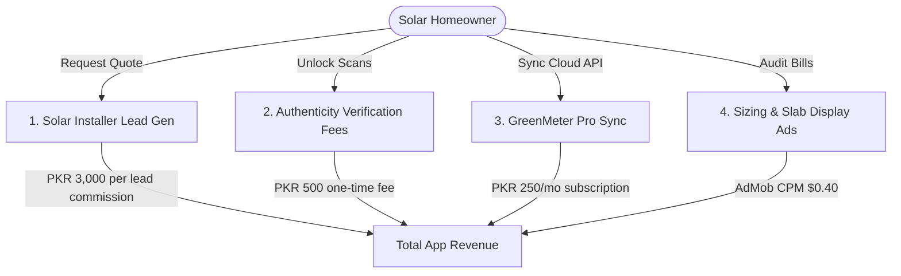

# SolarCheck & GreenMeterCheck — Expected Revenue Model & Projections

This document outlines the detailed expected revenue model, monetization vectors, financial assumptions, and projection scenarios for the combined solar utility lifecycle suite: **SolarCheck** (sizing, hardware auditing, serial verification) and **GreenMeterCheck** (net-metering bill auditing, inverter cloud syncing, and LCD reading) designed for consumers in **Pakistan**.

---

## 1. Target Market & Demographics

The residential and commercial solar market in Pakistan is experiencing exponential growth due to rising utility grid tariffs:

*   **Primary Target**: Homeowners, retail businesses, and small commercial site operators in major metropolitans (Lahore, Karachi, Islamabad/Rawalpindi, Multan, Faisalabad) adopting solar systems (typically 3kW to 25kW).
*   **Unique Pain Point**:
    *   **Pre-Installation / Installation (SolarCheck)**: High prevalence of counterfeit or B-grade panel relabeling, dangerous sub-standard cabling, and massive net-metering approval bottlenecks by local power distribution companies (DISCOs).
    *   **Post-Installation (GreenMeterCheck)**: Complex billing calculations involving Fuel Price Adjustments (FPA), slab adjustments, taxes, and frequent discrepancies where DISCOs under-credit solar exports compared to physical inverter generation logs.
*   **Value Proposition**: SolarCheck verifies hardware authenticity via AEDB barcodes and maps quotes. GreenMeterCheck connects to inverter APIs, read LCD counters, and generates print-ready NEPRA dispute letters.

---

## 2. Monetization Vectors

SolarCheck & GreenMeterCheck operate on an ecosystem transaction and subscription framework, combining lead bounties, equipment verification fees, and cloud API integration.

### A. Solar Installer Lead Generation (Primary Stream - SolarCheck)
*   **Format**: Users input their bill details in the sizing planner. Homeowners requesting physical installation quotes are matched with verified, AEDB-registered installer partners.
*   **Monetization Mechanism**: A flat bounty commission per verified lead routed.
*   **Pricing**: 3,000 PKR commission per verified lead.
*   **Conversion Rate**: Projected at 0.75% of Monthly Active Users (MAU) per month.

### B. Equipment Authenticity Verification Fees (SolarCheck)
*   **Format**: The app includes a panel serial scanner checking AEDB registry databases.
*   **Monetization Mechanism**: Free users can verify up to 5 panel barcodes. Homes building 10kW to 20kW setups (requiring 20 to 40 panels) pay to unlock unlimited scans.
*   **Pricing**: 500 PKR one-time validation fee.
*   **Conversion Rate**: Projected at 0.50% of Monthly Active Users (MAU) per month.

### C. GreenMeter Pro - Inverter Cloud Integration (GreenMeterCheck)
*   **Format**: Syncs the mobile application with the user's inverter portal APIs (Growatt, Huawei, Solis, GoodWe, Solis Cloud) to run automated discrepancies.
*   **Pro Features**:
    *   **Automated Discrepancy Audits**: Sends instant alarms if DISCO-credited units drop below inverter logs by >5%.
    *   **WhatsApp Billing Reports**: Receives weekly production, consumption, and credit status logs via WhatsApp.
    *   **Ombudsman Dispute Pre-Filler**: Generates pre-filled NEPRA dispute PDF files.
*   **Pricing**: 250 PKR / month (approx. $0.90 USD) or 2,000 PKR / year.
*   **Conversion Rate**: Projected at 1.5% of Monthly Active Users (MAU).

### D. Ad-Supported Model (Free Tier)
*   **Format**: Native banner ads on sizing logs and NEPRA policy alarm screens. B2B installers and Pro subscribers do not see ads.
*   **Metrics & Assumptions**:
    *   **Pakistan Average CPM**: $0.40 USD (approx. 111 PKR at 278 PKR/USD).
    *   **User Sessions**: Average of 6 sessions/month per free user (checking generation logs), viewing 5 pages per session = 30 ad impressions per free user/month.

---

## 3. Financial Projections (Year 1)

These projections are based on three scenarios of **Monthly Active Users (MAU)** reached by Month 12.
*(Exchange rate used: 1 USD = 278 PKR)*

### Scenario Comparison Table

| Metric | Conservative (Low Growth) | Base Case (Target Growth) | Optimistic (High Growth) |
| :--- | :--- | :--- | :--- |
| **Year 1 Target MAU** | 10,000 | 40,000 | 120,000 |
| **Pro Inverter Sync Subs (1.5% - 2.0%)**| 150 (1.5%) | 600 (1.5%) | 2,400 (2.0%) |
| **Monthly Installer Leads (0.60% - 0.90%)**| 60 (0.60%) | 300 (0.75%) | 1,080 (0.90%) |
| **Monthly Panel Verification Sales** | 40 (0.40%) | 200 (0.50%) | 720 (0.60%) |
| **Monthly Ad Revenue** | $118.20 (32,860 PKR) | $472.80 (131,438 PKR) | $1,764.00 (490,392 PKR) |
| **Monthly Installer Lead Rev** | $647.48 (180,000 PKR) | $3,237.41 (900,000 PKR) | $11,654.68 (3,240,000 PKR) |
| **Monthly Panel Verification Rev** | $71.94 (20,000 PKR) | $359.71 (100,000 PKR) | $1,294.96 (360,000 PKR) |
| **Monthly Pro Inverter Sync Rev** | $134.89 (37,500 PKR) | $539.57 (150,000 PKR) | $2,158.27 (600,000 PKR) |
| **Total Expected MRR (PKR)** | **270,360 PKR** | **1,281,438 PKR** | **4,690,392 PKR** |
| **Total Expected MRR (USD equivalent)** | **$972.51** | **$4,609.49** | **$16,871.91** |
| **Total Projected ARR (PKR)** | **3,244,320 PKR** | **15,377,256 PKR** | **56,284,704 PKR** |
| **Total Projected ARR (USD equivalent)** | **$11,670.12** | **$55,313.88** | **$202,462.92** |

---

## 4. Key Financial Formulas

$$\text{Total Monthly Revenue (PKR)} = R_{ad} + R_{lead} + R_{verification} + R_{pro}$$

Where:

1.  **Free Ad Revenue ($R_{ad}$)**:
    $$R_{ad} = \left( \text{MAU} \times (1 - \text{ProConv}) \times \frac{\text{ImpressionsPerUser}}{1000} \right) \times \text{CPM}_{USD} \times \text{Rate}_{PKR/USD}$$
2.  **Solar Installer Lead Revenue ($R_{lead}$)**:
    $$R_{lead} = \text{MAU} \times \text{LeadRate} \times \text{Bounty}_{PKR}$$
3.  **Equipment Verification Revenue ($R_{verification}$)**:
    $$R_{verification} = \text{MAU} \times \text{VerificationRate} \times \text{ScanFee}_{PKR}$$
4.  **Pro Inverter Sync Revenue ($R_{pro}$)**:
    $$R_{pro} = \text{MAU} \times \text{ProConv} \times \text{Price}_{PKR}$$

---

## 5. Dynamic Revenue Calculator

To modify these variables, run custom scenarios, or perform real-time sensitivity analysis, open the interactive browser-based dashboard calculator:

👉 **[revenue_calculator.html](file:///c:/Essentials/SmartFarms/AndroidApps/Revenue/revenue_calculator.html)**

*Open the file in any web browser to adjust parameters (e.g. MAU size, lead conversion rates, green-meter subscription prices) and view updated revenue breakdowns instantly.*
