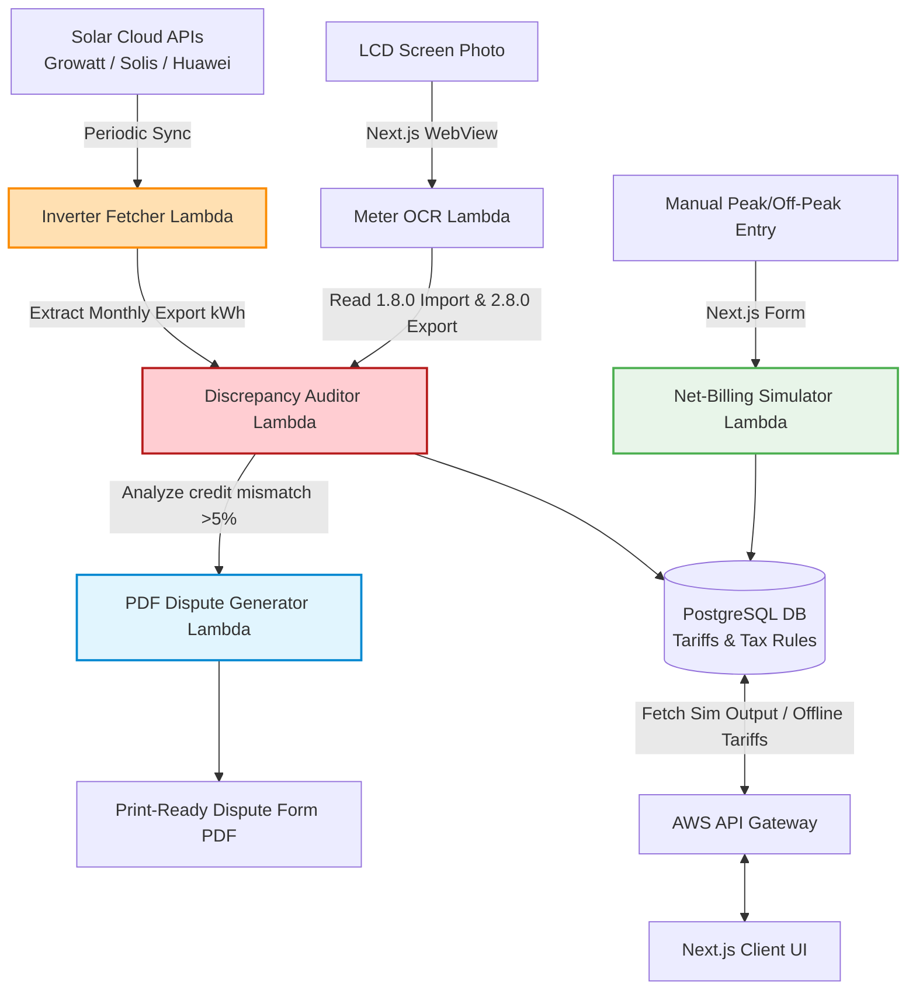
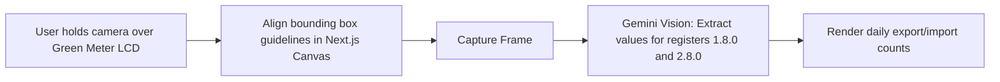

# Technical Details Document: GreenMeterCheck (گرین میٹر چیک)

This document provides the technical specifications, database schemas, solar API sync pipelines, billing formulas, and client-server integration protocols for **GreenMeterCheck (گرین میٹر چیک)**. The system is built around a **Next.js Web UI** inside an **Android WebView Wrapper** shell, communicating with serverless **AWS Lambda** microservices, **PostgreSQL**, and **Gemini Vision OCR**.

---

## 1. System Architecture & Discrepancy Auditing Pipeline

GreenMeterCheck audits net-metering bills by linking physical inverter data from manufacturer clouds, scanning bi-directional meter LCD screens, and running distribution-company specific simulation engines.



---

## 2. Database Schema & Data Models

### A. PostgreSQL Schema (Relational Store)
Tracks distribution company (DISCO) tariff slabs, regulatory buyback rates, fuel adjustments, and user inverter API sync tokens.

```sql
-- Electric Distribution Companies in Pakistan (LESCO, K-Electric, IESCO, MEPCO, FESCO)
CREATE TABLE discos (
    disco_id VARCHAR(20) PRIMARY KEY, -- e.g. 'lesco', 'kelectric', 'iesco', 'mepco'
    disco_name VARCHAR(100) UNIQUE NOT NULL,
    headquarters VARCHAR(100),
    contact_email VARCHAR(150),
    ombudsman_address TEXT
);

-- Slab-Based Retail Tariffs (Imports)
CREATE TABLE disco_tariffs (
    tariff_id UUID PRIMARY KEY DEFAULT gen_random_uuid(),
    disco_id VARCHAR(20) REFERENCES discos(disco_id) ON DELETE CASCADE,
    slab_start_units INT NOT NULL, -- e.g. 0, 101, 201, 301, 701
    slab_end_units INT NOT NULL, -- e.g. 100, 200, 300, 700, 999999
    peak_rate NUMERIC(6, 2) NOT NULL, -- Peak unit charge (PKR)
    off_peak_rate NUMERIC(6, 2) NOT NULL, -- Off-peak unit charge (PKR)
    valid_from DATE NOT NULL,
    valid_to DATE NOT NULL,
    CONSTRAINT unique_disco_slab UNIQUE (disco_id, slab_start_units, valid_from)
);

-- NEPRA Solar Export Buyback Rates
CREATE TABLE nepra_buyback_rates (
    rate_id UUID PRIMARY KEY DEFAULT gen_random_uuid(),
    national_rate NUMERIC(6, 2) NOT NULL, -- Flat rate paid for exported kWh (currently ~22 PKR)
    valid_from DATE NOT NULL,
    valid_to DATE NOT NULL
);

-- Monthly Fuel Price Adjustments (FPA) & Quarterly Tariff Adjustments (QTA)
CREATE TABLE billing_adjustments (
    adjustment_id UUID PRIMARY KEY DEFAULT gen_random_uuid(),
    disco_id VARCHAR(20) REFERENCES discos(disco_id) ON DELETE CASCADE,
    billing_month DATE NOT NULL, -- e.g., '2026-08-01'
    fpa_rate_per_unit NUMERIC(5, 2) DEFAULT 0.00,
    qta_rate_per_unit NUMERIC(5, 2) DEFAULT 0.00,
    excise_duty_percentage NUMERIC(4, 2) DEFAULT 1.50, -- Standard 1.5%
    gst_percentage NUMERIC(4, 2) DEFAULT 17.00, -- Standard 17% sales tax
    updated_at TIMESTAMP WITH TIME ZONE DEFAULT CURRENT_TIMESTAMP
);
```

---

## 3. DISCO Net-Metering Simulation Engine

Net-metering billing in Pakistan is calculated by subtracting exported solar energy from imported grid energy. However, while grid units are priced high and split by Peak/Off-Peak categories, exported solar units are compensated at a much lower, flat NEPRA buyback rate.

### Net-Billing Logic Formulation
1.  **Peak Cost**:
    $$\text{Peak Cost} = \text{Imported Peak Units} \times \text{Peak Rate}$$
2.  **Off-Peak Cost**:
    $$\text{Off-Peak Cost} = \text{Imported Off-Peak Units} \times \text{Off-Peak Rate}$$
3.  **Solar Credit**:
    $$\text{Export Credit} = \text{Exported Solar Units} \times \text{NEPRA Buyback Rate}$$
4.  **Net Energy Bill**:
    $$\text{Net Energy Bill} = (\text{Peak Cost} + \text{Off-Peak Cost}) - \text{Export Credit}$$
5.  **Taxes & Adjustments**:
    $$\text{FPA Cost} = (\text{Imported Peak} + \text{Imported Off-Peak}) \times \text{FPA Rate}$$
    $$\text{GST Cost} = (\text{Net Energy Bill} + \text{FPA Cost}) \times \text{GST \%}$$
    $$\text{Total Bill Due} = \text{Net Energy Bill} + \text{FPA Cost} + \text{GST Cost} + \text{Fixed Surcharges}$$

### JavaScript Simulator Module (`lib/billing-simulator.ts`)
```typescript
interface BillingInput {
  discoId: string;
  importedPeak: number;
  importedOffPeak: number;
  exportedUnits: number;
  peakRate: number;
  offPeakRate: number;
  buybackRate: number;
  fpaRate: number;
  gstRate: number; // e.g. 0.17
}

interface SimulatedBill {
  peakCharge: number;
  offPeakCharge: number;
  grossImportCost: number;
  exportCreditValue: number;
  netEnergyCharge: number;
  fpaCharge: number;
  salesTaxCharge: number;
  expectedTotalBillPKR: number;
  netCreditRollOverPKR: number;
}

export class NetMeteringSimulator {
  public static simulate(input: BillingInput): SimulatedBill {
    const peakCharge = input.importedPeak * input.peakRate;
    const offPeakCharge = input.importedOffPeak * input.offPeakRate;
    const grossImportCost = peakCharge + offPeakCharge;
    
    const exportCreditValue = input.exportedUnits * input.buybackRate;
    
    let netEnergyCharge = grossImportCost - exportCreditValue;
    let netCreditRollOverPKR = 0;
    
    if (netEnergyCharge < 0) {
      // Excess solar exported leads to negative balance (roll-over credit)
      netCreditRollOverPKR = Math.abs(netEnergyCharge);
      netEnergyCharge = 0; // energy charge itself zeroed
    }

    const totalImportedUnits = input.importedPeak + input.importedOffPeak;
    const fpaCharge = totalImportedUnits * input.fpaRate;
    
    const taxableAmount = netEnergyCharge + fpaCharge;
    const salesTaxCharge = taxableAmount > 0 ? taxableAmount * input.gstRate : 0;
    
    const expectedTotalBillPKR = netEnergyCharge + fpaCharge + salesTaxCharge;

    return {
      peakCharge,
      offPeakCharge,
      grossImportCost,
      exportCreditValue,
      netEnergyCharge,
      fpaCharge,
      salesTaxCharge,
      expectedTotalBillPKR,
      netCreditRollOverPKR
    };
  }
}
```

---

## 4. Inverter Cloud API Sync Pipeline

The Inverter Sync Pipeline logs into the user's solar monitoring cloud (e.g., Growatt ShineServer) to compare actual exports with the credits issued on the bill.

### Growatt ShineServer API Sync Implementation (Python Lambda)
To avoid server storage of user API passwords, tokens are decrypted on-device inside the **Android KeyStore** and sent as temporary, single-use request parameters.

```python
import requests
import json

def fetch_growatt_export_data(username, encrypted_password_token):
    # Decrypted password token is resolved inside the Android wrapper
    session = requests.Session()
    
    # 1. Authenticate with Growatt API
    login_url = "https://server.growatt.com/login"
    login_payload = {
        "account": username,
        "password": encrypted_password_token,
        "validateVal": ""
    }
    
    response = session.post(login_url, data=login_payload)
    login_response = response.json()
    
    if login_response.get("result") != 1:
        raise Exception("Authentication with Growatt server failed.")

    # 2. Get Plant ID
    plant_list_url = "https://server.growatt.com/panel/getPlantList"
    plant_response = session.post(plant_list_url)
    plant_id = plant_response.json().get("datas", [{}])[0].get("id")

    # 3. Fetch monthly generation data (containing solar exports)
    monthly_data_url = "https://server.growatt.com/panel/getPlantStorageEnergyInfo"
    data_payload = {
        "plantId": plant_id,
        "date": "2026-08" # Query current billing month
    }
    
    data_response = session.post(monthly_data_url, data=data_payload)
    storage_data = data_response.json()
    
    # Extract total feed-in grid (exported) energy in kWh
    exported_kwh = float(storage_data.get("eToGrid", 0.0))
    return exported_kwh
```

---

## 5. Bi-Directional Meter LCD Screen OCR Reader (Registers 1.8.0 & 2.8.0)

Bi-directional green meters in Pakistan cycle through a series of registers. The meter screen scanner uses the camera to capture the LCD and flags active values using register code overlays:
*   `1.8.0`: Active Import (Energy consumed from the national grid).
*   `2.8.0`: Active Export (Excess solar energy pushed into the grid).



### Gemini Vision Prompt Configuration
```text
You are an expert utility meter OCR analyzer. Inspect this image of a bi-directional grid energy meter LCD screen.

Identify and extract values matching these specific register codes:
1. "1.8.0" (Active Import Peak/Off-Peak combined value in kWh)
2. "2.8.0" (Active Export combined value in kWh)

RULES:
1. Disregard small decimal values if they are highlighted in red frames on the physical LCD.
2. Locate the numeric register code label (e.g. 1.8.0 or 2.8.0) usually visible in the left corner.
3. Validate that the extracted digits match standard energy increments (typically 5 or 6 digits before decimal).
4. Output MUST conform strictly to the JSON schema.

JSON Output Schema:
{
  "register_1_8_0_detected": true | false,
  "import_value_kwh": 0.00,
  "register_2_8_0_detected": true | false,
  "export_value_kwh": 0.00,
  "confidence_score": 0.0 to 1.0
}
```

---

## 6. Official NEPRA Dispute Letter Builder

If the **Discrepancy Auditor Lambda** detects a solar under-crediting rate of $>5\%$, the app generates an official pre-filled dispute letter as a PDF.

### Dispute Builder Module (AWS Lambda / PDFKit)
```python
import pdfkit
import datetime

def generate_nepra_dispute_pdf(user_details, billing_details):
    """
    Generates a print-ready PDF dispute form for NEPRA and DISCO ombudsmen
    """
    html_template = f"""
    <html>
    <head>
        <style>
            body {{ font-family: Arial, sans-serif; padding: 30px; }}
            h2 {{ text-align: center; color: #1b5e20; }}
            .detail-box {{ border: 1px solid #ccc; padding: 15px; margin: 20px 0; }}
        </style>
    </head>
    <body>
        <h2>FORMAL COMPLAINT: BILLING DISCREPANCY & SOLAR UNDER-CREDITING</h2>
        <p><b>Date:</b> {datetime.date.today().strftime('%B %d, %Y')}</p>
        <p><b>To,</b><br>
        The Director Customer Services,<br>
        {user_details['disco_name'].upper()} Head Office, Pakistan.</p>

        <p><b>Subject:</b> Discrepancy in Net-Metering Solar Export Credits - Customer ID {user_details['customer_id']}</p>

        <p>Dear Sir,</p>
        <p>I am writing to report a significant billing error on my net-metering statement for the month of <b>{billing_details['month']}</b>. According to our verified local inverter logs, my solar system exported <b>{billing_details['inverter_export']} kWh</b> to the grid. However, my DISCO statement only credits <b>{billing_details['bill_export']} kWh</b>.</p>

        <div class="detail-box">
            <b>DISCREPANCY SUMMARY:</b><br>
            • Actual Solar Exported: {billing_details['inverter_export']} kWh<br>
            • Credited on Statement: {billing_details['bill_export']} kWh<br>
            • Uncredited Solar Energy: {billing_details['difference']} kWh<br>
            • Estimated Financial Loss: Rs. {billing_details['financial_loss']}
        </div>

        <p>Please resolve this credit discrepancy and adjust my current bill accordingly.</p>
        <p>Sincerely,</p>
        <p>_______________________<br>
        <b>{user_details['name']}</b><br>
        Address: {user_details['address']}<br>
        Phone: {user_details['phone']}</p>
    </body>
    </html>
    """
    
    output_path = f"/tmp/dispute_letter_{user_details['customer_id']}.pdf"
    pdfkit.from_string(html_template, output_path)
    return output_path
```

---

## 7. API Reference Specification

### A. Run Net-Metering Simulation
`GET /api/disco/simulate`

#### Query Parameters:
*   `disco_id`: DISCO key (e.g. `lesco`)
*   `imported_peak`: Peak kWh consumed (e.g. `250`)
*   `imported_off_peak`: Off-peak kWh consumed (e.g. `450`)
*   `exported_units`: Solar units generated (e.g. `850`)

#### Response Payload (200 OK):
```json
{
  "disco_id": "lesco",
  "billing_summary": {
    "peak_units_cost_pkr": 12500.00,
    "off_peak_units_cost_pkr": 18000.00,
    "gross_import_cost_pkr": 30500.00,
    "solar_export_credit_pkr": 18700.00, -- 850 units * 22 PKR flat rate
    "net_energy_charge_pkr": 11800.00,
    "fuel_price_adjustment_pkr": 2100.00, -- FPA applied on gross imports
    "sales_tax_pkr": 2363.00, -- GST percentage on net amount
    "expected_bill_total_pkr": 16263.00,
    "credit_balance_carried_over_pkr": 0.00
  }
}
```

### B. Sync Inverter Data
`POST /api/inverter/sync`

#### Request Payload:
```json
{
  "username": "karachisolar99",
  "encrypted_password_token": "U2FsdGVkX1+vG...",
  "inverter_brand": "growatt"
}
```

#### Response Payload (200 OK):
```json
{
  "status": "synchronized",
  "exported_kwh_api": 920.4,
  "billing_month": "2026-08",
  "last_synced_at": "2026-08-09T15:46:00Z"
}
```
