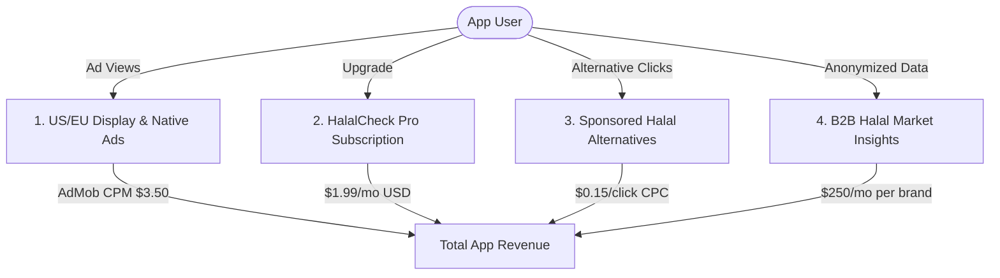

# HalalCheck (حلال چیک) — Expected Revenue Model & Projections (Global/US/EU Focus)

This document outlines the detailed expected revenue model, monetization vectors, financial assumptions, and projection scenarios for **HalalCheck**, a dual-mode camera OCR and barcode Halal/Haram verification mobile application targeting the global Muslim diaspora in **Europe and the United States**.

---

## 1. Target Market & Demographics

Unlike Muslim-majority countries where food is Halal-certified by default under national law, Muslims living in non-Muslim-majority Western societies face a high-stress daily challenge:

*   **Primary Target**: Muslim consumers in the **United States** (approx. 4 million Muslims) and **Europe/UK** (approx. 30 million Muslims).
*   **Retail Environment**: Large-scale supermarkets (Tesco, Carrefour, Walmart, ALDI, Trader Joe's, Costco) where 95%+ of items lack native Halal certification.
*   **Unique Pain Point**: Checking complex scientific ingredient lists for hidden non-Halal ingredients (e.g., pork gelatin, animal emulsifiers, L-cysteine, cochineal, alcohol-based flavor solvents).
*   **Market Dynamics**: Western Muslims have high purchasing power and are willing to pay for reliable digital audit tools to ensure dietary compliance.

---

## 2. Monetization Vectors

HalalCheck leverages four premium monetization streams structured for high-ARPU (Average Revenue Per User) Western digital ecosystems.

### A. Ad-Supported Model (Free Tier)
*   **Format**: Bottom-screen banner ads and native inline sponsored cards on scan results pages.
*   **Metrics & Assumptions**:
    *   **US/EU Average CPM**: $3.50 USD (reflecting premium Western advertising rates in food, lifestyle, and financial sectors).
    *   **User Sessions**: Average of 4 grocery trips per month, scanning 5 products per trip = 20 scans per user/month.
    *   **Ads Displayed**: 1 impression per scan. Average of 20 ad impressions per active free user per month.

### B. HalalCheck Pro (Premium Subscription)
*   **Format**: Subscription tier to remove ads and unlock advanced, high-friction auditing tools.
*   **Premium Features**:
    *   **Cosmetics & Pharma Scan**: In-depth ingredient checking for personal care items, cosmetics (e.g., carmine dye, stearic acid) and medications (e.g., gelatin capsules, inactive ingredients).
    *   **Family Plan**: Covers up to 5 family members on a single subscription.
    *   **Offline Database Sync**: Local download of the 30,000+ barcode dictionary and 500+ E-number registry for rapid offline scanning in steel-framed supermarkets.
*   **Pricing**:
    *   **Monthly Tier**: $1.99 USD / month.
    *   **Annual Tier**: $14.99 USD / year (saves 37%).
    *   **Conversion Rate**: Projected at 2.0% of Monthly Active Users (MAU) due to the strong necessity of advanced features in Western markets.

### C. Sponsored Alternatives & Lead Gen (Halal Substitution Engine)
*   **Format**: When a user scans a product that is flagged as *Haram* or *Mushbooh* (Doubtful), the app lists 2-3 local, verified Halal-certified alternative brands (e.g., suggesting *Crescent Foods* or *Saffron Road* in the US, or local Halal confectionery brands).
*   **Monetization Mechanism**: Halal-certified brands pay a Cost-Per-Click (CPC) referral fee to be suggested when users scan non-Halal competitors.
*   **Metrics & Assumptions**:
    *   **CPC Rate**: $0.15 USD per click (standard Western mobile referral CPC).
    *   **Trigger Rate**: 30% of scans contain *Mushbooh* or *Haram* ingredients (significantly higher than in Muslim countries, as animal-derived emulsifiers and whey processed with animal rennet are present in most standard packaged products).
    *   **Click-Through Rate (CTR)**: 20% of users scanning a doubtful item will click on a suggested Halal alternative.

### D. B2B Market Insights & Data Licensing
*   **Format**: Aggregated, anonymized grocery search trend data licensed to Western food brands looking to target the growing Muslim demographic.
*   **Value Proposition**: Helping brands understand which of their products are scanned most, where dietary compliance confusion lies, and competitor brand-switching trends.
*   **Pricing**: $250 USD / month per brand.
*   **Target Clients**: 5 active corporate brand clients by the end of Year 1.

---

## 3. Financial Projections (Year 1)

These projections are based on three scenarios of **Monthly Active Users (MAU)** reached by Month 12.
*(All figures are in USD; secondary conversion to PKR is calculated at 1 USD = 278 PKR)*

### Scenario Comparison Table

| Metric | Conservative (Low Growth) | Base Case (Target Growth) | Optimistic (High Growth) |
| :--- | :--- | :--- | :--- |
| **Year 1 Target MAU** | 10,000 | 50,000 | 150,000 |
| **Premium Pro Users (2.0% - 2.5% conv)** | 200 (2.0%) | 1,000 (2.0%) | 3,750 (2.5%) |
| **Active B2B Clients** | 2 | 5 | 10 |
| **Monthly Ad Revenue** | $514.50 | $3,430.00 | $14,625.00 |
| **Monthly Sub Revenue** | $398.00 | $1,990.00 | $9,337.50 |
| **Monthly Lead Gen Revenue** | $1,012.50 | $9,000.00 | $45,000.00 |
| **Monthly B2B Revenue** | $500.00 | $1,250.00 | $3,500.00 |
| **Total Expected MRR (USD)** | **$2,425.00** | **$15,670.00** | **$72,462.50** |
| **Total Expected MRR (PKR equivalent)**| **674,150 PKR** | **4,356,260 PKR** | **20,144,575 PKR** |
| **Total Projected ARR (USD)** | **$29,100.00** | **$188,040.00** | **$869,550.00** |
| **Total Projected ARR (PKR equivalent)**| **8,089,800 PKR** | **52,275,120 PKR** | **241,734,900 PKR** |

---

## 4. Key Financial Formulas

$$\text{Total Monthly Revenue (USD)} = R_{ad} + R_{sub} + R_{lead} + R_{b2b}$$

Where:

1.  **Ad Revenue ($R_{ad}$)**:
    $$R_{ad} = \left( \text{MAU} \times (1 - \text{ConvRate}) \times \frac{\text{ImpressionsPerUser}}{1000} \right) \times \text{CPM}_{USD}$$
2.  **Subscription Revenue ($R_{sub}$)**:
    $$R_{sub} = \text{MAU} \times \text{ConvRate} \times \text{Price}_{sub\_USD}$$
3.  **Lead Gen Revenue ($R_{lead}$)**:
    $$R_{lead} = \text{MAU} \times \text{ScansPerUser} \times \text{DoubtfulScanRate} \times \text{AlternativeCTR} \times \text{CPC}_{USD}$$
4.  **B2B Licensing Revenue ($R_{b2b}$)**:
    $$R_{b2b} = \text{CorporateClients} \times \text{MonthlyLicenseFee}_{USD}$$

---

## 5. Dynamic Revenue Calculator

To modify these variables, run custom scenarios, or perform real-time sensitivity analysis, open the interactive browser-based dashboard calculator:

👉 **[revenue_calculator.html](file:///c:/Essentials/SmartFarms/AndroidApps/Revenue/revenue_calculator.html)**

*Open the file in any web browser to adjust parameters (e.g. MAU size, subscription rates, ad CPMs) and view updated revenue breakdowns instantly.*
