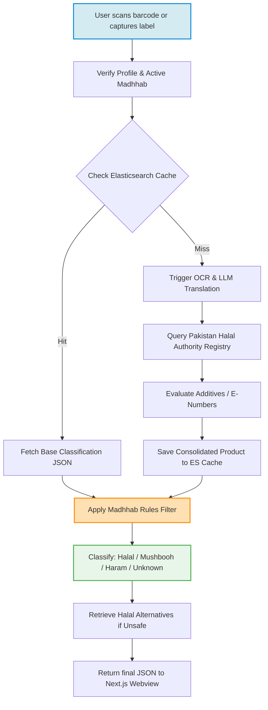
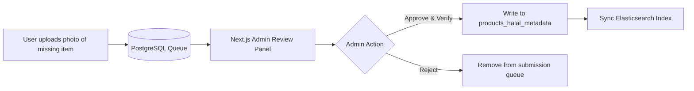

# Technical Details Document: HalalCheck (حلال چیک)

This document provides the technical specifications, processing pipelines, database schemas, jurisprudential rules engines, and client-server integration protocols for **HalalCheck (حلال چیک)**. The system is designed around a **Next.js Web UI** hosted within an **Android WebView Wrapper** shell, communicating with serverless **AWS Lambda** microservices, **PostgreSQL**, **Elasticsearch**, and **Gemini Vision OCR**.

---

## 1. System Architecture & Validation Flow

HalalCheck validates products by parsing ingredients and cross-referencing them against recognized Halal registries (PHA, PHDA, SHA, JAKIM) and an E-number database, adjusted dynamically by the user's selected jurisprudential school of thought (*Madhhab*).



---

## 2. Database Schema & Data Models

### A. PostgreSQL (Central Database Schema)
Tracks product certification status, Halal authorities, E-number indexes, and crowdsourced audit logs.

```sql
-- Registered Halal Certification Bodies (HCBs)
CREATE TABLE halal_authorities (
    authority_id VARCHAR(50) PRIMARY KEY, -- e.g. 'pha', 'phda', 'jakim', 'muianz', 'ifanca'
    authority_name VARCHAR(255) NOT NULL,
    country VARCHAR(100) DEFAULT 'Pakistan',
    website_url VARCHAR(512),
    logo_url VARCHAR(512),
    created_at TIMESTAMP WITH TIME ZONE DEFAULT CURRENT_TIMESTAMP
);

-- Certified Brands and Companies
CREATE TABLE certified_brands (
    cert_id UUID PRIMARY KEY DEFAULT gen_random_uuid(),
    brand_name VARCHAR(255) UNIQUE NOT NULL,
    authority_id VARCHAR(50) REFERENCES halal_authorities(authority_id) ON DELETE RESTRICT,
    certificate_number VARCHAR(100) NOT NULL,
    valid_from DATE NOT NULL,
    valid_to DATE NOT NULL,
    status VARCHAR(50) DEFAULT 'active', -- 'active', 'expired', 'suspended'
    updated_at TIMESTAMP WITH TIME ZONE DEFAULT CURRENT_TIMESTAMP
);

-- Consolidated Product Halal Records
CREATE TABLE products_halal_metadata (
    id UUID PRIMARY KEY DEFAULT gen_random_uuid(),
    barcode VARCHAR(50) UNIQUE,
    product_name VARCHAR(255) NOT NULL,
    brand_name VARCHAR(255),
    ingredients_raw TEXT,
    is_certified_halal BOOLEAN DEFAULT FALSE,
    certificate_source VARCHAR(50) REFERENCES halal_authorities(authority_id) ON DELETE SET NULL,
    e_numbers_present VARCHAR(50)[], -- Array of E-numbers detected (e.g. ['E120', 'E471'])
    marine_life_detected BOOLEAN DEFAULT FALSE, -- Flag for Madhhab filtering
    contains_gelatin BOOLEAN DEFAULT FALSE,
    gelatin_source VARCHAR(50), -- 'bovine', 'porcine', 'poultry', 'fish', 'synthetic', 'unknown'
    contains_alcohol BOOLEAN DEFAULT FALSE,
    alcohol_percentage NUMERIC(5, 3) DEFAULT 0.000,
    created_at TIMESTAMP WITH TIME ZONE DEFAULT CURRENT_TIMESTAMP,
    updated_at TIMESTAMP WITH TIME ZONE DEFAULT CURRENT_TIMESTAMP
);
```

### B. Elasticsearch Mapping (`products_halal_index`)
Used for fuzzy keyword matching of ingredients and barcode lookups.

```json
{
  "mappings": {
    "properties": {
      "barcode": { "type": "keyword" },
      "product_name": { "type": "text", "analyzer": "standard" },
      "brand_name": { "type": "keyword" },
      "ingredients_translated": { "type": "text", "analyzer": "english" },
      "is_certified_halal": { "type": "boolean" },
      "e_numbers": { "type": "keyword" },
      "marine_ingredients": { "type": "keyword" }, -- list of species names
      "gelatin_details": {
        "properties": {
          "contains": { "type": "boolean" },
          "source": { "type": "keyword" }
        }
      },
      "alcohol_details": {
        "properties": {
          "contains": { "type": "boolean" },
          "percentage": { "type": "float" }
        }
      },
      "last_indexed": { "type": "date" }
    }
  }
}
```

---

## 3. Jurisprudential Rules Engine (Madhhab Selector)

Different schools of jurisprudence (*Madhhabs*) have varying rulings regarding marine species, gelatin transformation (*Istihalah*), and chemical trace limits.

### Jurisprudence Matrix
| School of Thought | Seafood (Shellfish / Crustaceans) | Gelatin (*Istihalah* Rule) | Alcohol Carrier (Flavorings) |
|---|---|---|---|
| **Hanafi** | Only Fish Permissible. Crabs, lobsters, shrimp, oysters are **Makruh Tahrimi / Haram**. | Structural change does not clean porcine source; only Zabiha bovine clean. | Small percentage allowed in flavor carrier if not wine/grape-derived. |
| **Shafi'i** | All marine life permissible by default (Halal). | Transformation of impure animal substances is invalid (Haram if porcine/non-Zabiha). | Zero-tolerance on added alcohol, synthetic extraction permitted. |
| **Maliki** | All marine life permissible by default (Halal). | Transformation valid under strict chemical structural changes (Istihalah accepted). | Trace levels allowed if non-intoxicating. |
| **Hanbali** | All marine life permissible by default (Halal). | Transformation invalid. Gelatin must come strictly from Halal-slaughtered animals. | Zero-tolerance on synthetic or fermented traces. |

### Rules Engine Script (Next.js / TypeScript)
This engine runs on the client or within the Lambdas to dynamically evaluate the database metadata.

```typescript
export interface UserPreferences {
  madhhab: 'hanafi' | 'shafii' | 'maliki' | 'hanbali';
  acceptIstihalah: boolean;
  strictCosmetics: boolean;
}

export interface ProductMetadata {
  isCertifiedHalal: boolean;
  eNumbers: string[];
  marineIngredients: string[]; // e.g. ["crab", "prawn"]
  gelatinSource: 'porcine' | 'bovine_zabiha' | 'bovine_non_zabiha' | 'fish' | 'unknown' | null;
  alcoholPercentage: number;
}

export type HalalClassification = 'HALAL' | 'MUSHBOOH' | 'HARAM' | 'UNKNOWN';

export class HalalRulesEngine {
  public static evaluate(product: ProductMetadata, prefs: UserPreferences): HalalClassification {
    
    // Rule 1: Porcine gelatin is universally HARAM
    if (product.gelatinSource === 'porcine') {
      return 'HARAM';
    }

    // Rule 2: Gelatin from non-Zabiha bovine animals
    if (product.gelatinSource === 'bovine_non_zabiha') {
      if (prefs.acceptIstihalah && prefs.madhhab === 'maliki') {
        // Maliki accepts transformation (Istihalah) of bone gelatin
        // Downgrade to Mushbooh instead of Haram
        return 'MUSHBOOH';
      }
      return 'HARAM';
    }

    // Rule 3: Marine Life Filtering (Hanafi exception)
    if (product.marineIngredients.length > 0) {
      if (prefs.madhhab === 'hanafi') {
        const containsShellfish = product.marineIngredients.some(item => 
          ['crab', 'lobster', 'shrimp', 'prawn', 'oyster', 'clam', 'octopus'].includes(item.toLowerCase())
        );
        if (containsShellfish) {
          return 'HARAM'; // Hanafi classifies non-fish marine life as impermissible
        }
      }
    }

    // Rule 4: Alcohol carrier threshold
    if (product.alcoholPercentage > 0) {
      if (prefs.madhhab === 'shafii' || prefs.madhhab === 'hanbali') {
        if (product.alcoholPercentage > 0.05) return 'HARAM'; // Strict limit
      } else {
        if (product.alcoholPercentage > 0.5) return 'HARAM'; // Relaxed limit for Hanafi/Maliki on carriers
      }
      return 'MUSHBOOH';
    }

    // Rule 5: Certified Halal bypasses subchecks
    if (product.isCertifiedHalal) {
      return 'HALAL';
    }

    // Rule 6: Unverified animal derivatives or unknown gelatin source
    if (product.gelatinSource === 'unknown' || product.gelatinSource === 'bovine_non_zabiha') {
      return 'MUSHBOOH';
    }

    return 'HALAL';
  }
}
```

---

## 4. Bilingual Translation & Ingredient Normalization

The backend parsing engine translates and maps local Urdu (Nastaliq) and Roman-Urdu terms onto master chemical database records.

### Bilingual Parsing Dictionary
```json
{
  "haram_triggers": {
    "pig_derivatives": {
      "english": ["pork", "lard", "bacon", "porcine", "ham", "swine", "tallow (porcine)"],
      "urdu": ["سور", "خنزیر", "چربی خنزیر", "سور کا گوشت"],
      "roman_urdu": ["soor", "khanzeer", "suwar", "soor ki charbi", "khanzir"]
    },
    "alcohol_derivatives": {
      "english": ["ethanol", "ethyl alcohol", "beer", "wine", "spirit", "liqueur"],
      "urdu": ["شراب", "الکوحل", "نشیلی چیز"],
      "roman_urdu": ["sharab", "alcohol", "nasha", "shraab"]
    }
  },
  "mushbooh_triggers": {
    "gelatin": {
      "english": ["gelatin", "gelatine", "hydrolyzed collagen", "gelling agent"],
      "urdu": ["جیلیٹن", "جیلی"],
      "roman_urdu": ["gelatin", "jelly"]
    },
    "rennet": {
      "english": ["rennet", "pepsin", "animal rennet", "calf rennet"],
      "urdu": ["پنیر مایا", "مایہ پنیر"],
      "roman_urdu": ["paneer maya", "rennet"]
    }
  }
}
```

---

## 5. API Reference Specification

### A. Verify Product Halal Status
`POST /api/halal/verify`

Processes an image capture or barcode scan to check Halal compliance.

#### Request Headers:
```http
Authorization: Bearer <JWT_TOKEN>
Content-Type: application/json
```

#### Request Body Payload:
```json
{
  "barcode": "5000159461122",
  "image_base64": null,
  "user_preferences": {
    "madhhab": "hanafi",
    "accept_istihalah": false,
    "strict_cosmetics": true
  }
}
```

#### Response Payload (200 OK):
```json
{
  "barcode": "5000159461122",
  "product_name": "Pringles Sour Cream & Onion",
  "brand_name": "Pringles",
  "classification": "MUSHBOOH",
  "reasoning_en": "This product contains whey powder and emulsifier (E471). The raw material source (animal vs vegetable) of E471 is not verified on the packaging, classifying it as Mushbooh.",
  "reasoning_ur": "اس پروڈکٹ میں وہی پاؤڈر (whey powder) اور ایملسیفائر (E471) شامل ہیں۔ پیکیجنگ پر E471 کے خام مال کے ماخذ (جانور یا سبزی) کی تصدیق نہیں کی گئی ہے، اس لیے اسے مشتبہ درجہ بندی دی گئی ہے۔",
  "details": {
    "certified_halal": false,
    "gelatin": { "present": false, "source": null },
    "alcohol": { "present": false, "percentage": 0.0 },
    "e_numbers_detected": [
      { "code": "E471", "name": "Mono- and diglycerides", "status": "Doubtful", "reason": "Can be animal or plant source" }
    ]
  },
  "halal_alternatives": [
    {
      "product_name": "Lays French Cheese",
      "brand": "Lays Pakistan",
      "certification": "SANHA Halal Certified",
      "purchase_url": "https://imtiaz.com.pk/lays-french-cheese"
    }
  ]
}
```

---

## 6. Official Authority Scrapers

The backend uses custom scheduled Python crawlers to scrape provincial and international registries to update the brand certification index.

### Authority Scraper Script (`crawlers/pha_scraper.py`)
```python
import requests
from bs4 import BeautifulSoup
import psycopg2

def scrape_punjab_halal_agency():
    # PHDA official registered registry page
    url = "http://www.halal.punjab.gov.pk/RegisteredCompanies"
    response = requests.get(url)
    soup = BeautifulSoup(response.content, 'html.parser')
    
    conn = psycopg2.connect("dbname=halalcheck user=postgres password=secret host=localhost")
    cursor = conn.cursor()
    
    # Parse rows in registered companies table
    table = soup.find('table', {'id': 'companiesTable'})
    if table:
        for row in table.find_all('tr')[1:]:
            cols = row.find_all('td')
            if len(cols) >= 5:
                company_name = cols[0].text.strip()
                brand_name = cols[1].text.strip()
                cert_number = cols[2].text.strip()
                expiry_date = parse_date(cols[4].text.strip())
                
                # Upsert into PostgreSQL database
                cursor.execute("""
                    INSERT INTO certified_brands (brand_name, authority_id, certificate_number, valid_from, valid_to, status)
                    VALUES (%s, 'phda', %s, NOW(), %s, 'active')
                    ON CONFLICT (brand_name) 
                    DO UPDATE SET certificate_number = EXCLUDED.certificate_number, valid_to = EXCLUDED.valid_to;
                """, (brand_name, cert_number, expiry_date))
                
    conn.commit()
    cursor.close()
    conn.close()
```

---

## 7. Crowdsourcing Admin Queue Layout

When a user submits a missing product, it is logged into the `crowdsourced_products` database. The Next.js admin dashboard queries these entries, allowing administrators to verify raw packaging images and enter verified ingredient details.



### Next.js Verification Form Hook (`admin/verify-product.tsx`)
```typescript
import { useState } from 'react';

export default function VerifyProductForm({ submission, onCompleted }) {
  const [productName, setProductName] = useState(submission.product_name);
  const [ingredients, setIngredients] = useState(submission.raw_ingredients_text);
  const [isCertified, setIsCertified] = useState(false);

  const handleVerify = async () => {
    const response = await fetch(`/api/admin/verify-submission`, {
      method: 'POST',
      headers: { 'Content-Type': 'application/json' },
      body: JSON.stringify({
        submissionId: submission.id,
        productName,
        ingredients,
        isCertified
      })
    });
    
    if (response.ok) {
      onCompleted();
    }
  };

  return (
    <div className="admin-card">
      <h3>Review Submission: {submission.barcode}</h3>
      
      <input value={productName} onChange={(e) => setProductName(e.target.value)} />
      <textarea value={ingredients} onChange={(e) => setIngredients(e.target.value)} />
      <label>
        <input type="checkbox" checked={isCertified} onChange={(e) => setIsCertified(e.target.checked)} />
        Verified Halal Certificate Present
      </label>
      <button onClick={handleVerify}>Approve and Publish</button>
    </div>
  );
}
```
