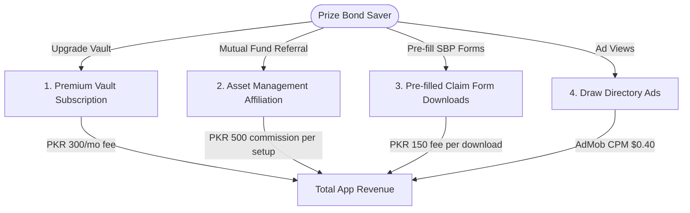

# KismatBond (قسمت بانڈ) — Expected Revenue Model & Projections

This document outlines the detailed expected revenue model, monetization vectors, financial assumptions, and projection scenarios for **KismatBond**, a camera OCR scanner, portfolio management locker, and claim pre-filling application designed for prize bond savers in **Pakistan**.

---

## 1. Target Market & Demographics

National Savings prize bonds are one of the most widely held low-risk retail investment assets in Pakistan:

*   **Primary Target**: Retail prize bond savers, high-net-worth individuals holding bulk bond sheets, and commercial prize bond dealers active in currency/bond trading markets.
*   **Market Size**: Trillions of rupees are held in prize bonds across denominations (Rs. 100, 200, 750, 1,500) and premium registered bonds (Rs. 25,000 and 40,000). 
*   **Unique Pain Point**: Checking bond numbers manually against thousands of pages of official drawing lists is extremely tedious and error-prone. Savers frequently miss wins, and the legal right to claim a prize expires after exactly 6 years.
*   **Value Proposition**: KismatBond provides instant camera OCR scanning, series range tracking (e.g. tracking a pack of 100 consecutive bonds), automated draw verification, and SBP claim form PDF pre-filling.

---

## 2. Monetization Vectors

KismatBond leverages a freemium consumer model focusing on bulk portfolio subscriptions, mutual fund referrals, and document processing fees.

### A. KismatBond Premium (Bulk Portfolios)
*   **Format**: Monthly or annual membership designed for bulk savers and commercial bond dealers.
*   **Premium Features**:
    *   **Unlimited Lockers**: Free tier is capped at 100 active bonds. Premium allows unlimited saved bonds.
    *   **CSV Import/Export**: Large portfolios can be imported via spreadsheets or backed up.
    *   **Automated Series Ranges**: Enter starting and ending serial numbers to generate lists instantly.
    *   **Real-time WhatsApp Alerts**: Direct messages when a saved bond wins.
*   **Pricing**: 300 PKR / month (approx. $1.08 USD) or 2,400 PKR / year.
*   **Conversion Rate**: Projected at 2.0% of Monthly Active Users (MAU).

### B. Mutual Fund & Savings Referrals (Affiliate Stream)
*   **Format**: Promoting low-risk, high-yield cash alternatives (Islamic Income Mutual Funds, money market mutual funds) to prize bond holders.
*   **Monetization Mechanism**: Referral bounty paid by asset management partners (e.g. Al Meezan, MCB-AH, NBP Funds) for onboarding verified new accounts.
*   **Metrics & Assumptions**:
    *   **Commission**: 500 PKR per successful account setup.
    *   **Conversion Rate**: Projected at 0.5% of MAU per month.

### C. Claim Form Generation (DR-1 / SBP Forms)
*   **Format**: Pre-fills official State Bank of Pakistan (SBP) prize bond claim forms (Form 22 or DR-1) with winner's CNIC, bank IBAN, and winning serial number.
*   **Pricing**: 150 PKR flat fee per pre-filled document download.
*   **Conversion Rate**: Projected at 0.1% of MAU per month.

### D. Ad-Supported Model (Free Tier)
*   **Format**: Banner and native display ads shown during draw history checks. Premium subscribers do not see ads.
*   **Metrics & Assumptions**:
    *   **Pakistan Average CPM**: $0.40 USD (approx. 111 PKR at 278 PKR/USD).
    *   **User Sessions**: Users check drawing sheets frequently (draws happen 4 times a month on different denominations). Average of 6 sessions/month, viewing 5 pages per session = 30 ad impressions per free user/month.

---

## 3. Financial Projections (Year 1)

These projections are based on three scenarios of **Monthly Active Users (MAU)** reached by Month 12.
*(Exchange rate used: 1 USD = 278 PKR)*

### Scenario Comparison Table

| Metric | Conservative (Low Growth) | Base Case (Target Growth) | Optimistic (High Growth) |
| :--- | :--- | :--- | :--- |
| **Year 1 Target MAU** | 20,000 | 100,000 | 300,000 |
| **Premium Subscribers (2.0% - 2.5%)**| 400 (2.0%) | 2,000 (2.0%) | 7,500 (2.5%) |
| **Mutual Fund Referrals/mo (0.5% - 0.6%)**| 100 (0.5%) | 500 (0.5%) | 1,800 (0.6%) |
| **Claim Form Downloads/mo (0.10% - 0.12%)**| 20 (0.10%) | 100 (0.10%) | 360 (0.12%) |
| **Monthly Ad Revenue** | $235.20 (65,386 PKR) | $1,176.00 (326,928 PKR) | $4,387.50 (1,219,725 PKR) |
| **Monthly Premium Subscription Rev** | $431.65 (120,000 PKR) | $2,158.27 (600,000 PKR) | $8,093.53 (2,250,000 PKR) |
| **Monthly Mutual Fund Referral Rev** | $179.86 (50,000 PKR) | $899.28 (250,000 PKR) | $3,237.41 (900,000 PKR) |
| **Monthly Claim Form Revenue** | $10.79 (3,000 PKR) | $53.96 (15,000 PKR) | $194.24 (54,000 PKR) |
| **Total Expected MRR (PKR)** | **238,386 PKR** | **1,191,928 PKR** | **4,423,725 PKR** |
| **Total Expected MRR (USD equivalent)** | **$857.50** | **$4,287.51** | **$15,912.68** |
| **Total Projected ARR (PKR)** | **2,860,632 PKR** | **14,303,136 PKR** | **53,084,700 PKR** |
| **Total Projected ARR (USD equivalent)** | **$10,290.00** | **$51,450.12** | **$190,952.16** |

---

## 4. Key Financial Formulas

$$\text{Total Monthly Revenue (PKR)} = R_{ad} + R_{prem} + R_{refer} + R_{claim}$$

Where:

1.  **Free Ad Revenue ($R_{ad}$)**:
    $$R_{ad} = \left( \text{MAU} \times (1 - \text{PremConv}) \times \frac{\text{ImpressionsPerUser}}{1000} \right) \times \text{CPM}_{USD} \times \text{Rate}_{PKR/USD}$$
2.  **Premium Subscription Revenue ($R_{prem}$)**:
    $$R_{prem} = \text{MAU} \times \text{PremConv} \times \text{Price}_{PKR}$$
3.  **Mutual Fund Referral Revenue ($R_{refer}$)**:
    $$R_{refer} = \text{MAU} \times \text{ReferralRate} \times \text{ReferralBounty}_{PKR}$$
4.  **Claim Form Revenue ($R_{claim}$)**:
    $$R_{claim} = \text{MAU} \times \text{ClaimConv} \times \text{FormFee}_{PKR}$$

---

## 5. Dynamic Revenue Calculator

To modify these variables, run custom scenarios, or perform real-time sensitivity analysis, open the interactive browser-based dashboard calculator:

👉 **[revenue_calculator.html](file:///c:/Essentials/SmartFarms/AndroidApps/Revenue/revenue_calculator.html)**

*Open the file in any web browser to adjust parameters (e.g. MAU size, mutual fund referral payouts, premium subscription rates) and view updated revenue breakdowns instantly.*
