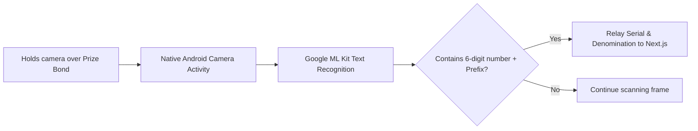

# Technical Details Document: KismatBond (قسمت بانڈ)

This document provides the technical specifications, database schemas, draw scraping engines, OCR frameworks, and client-server integration protocols for **KismatBond (قسمت بانڈ)**. The application is built using a **Next.js Web UI** inside an **Android WebView Wrapper** shell, backed by serverless **AWS Lambda** microservices, **PostgreSQL**, **Elasticsearch**, and a custom **6-digit Bond OCR Scanner**.

---

## 1. System Architecture & Draw Verification Pipeline

KismatBond schedule workers scrap the National Savings Pakistan portal daily, index winning numbers, check saved user portfolios, and compute potential payouts based on FBR taxpayer status.

```mermaid
graph TD
    %% Scraper Stage
    subgraph Scheduled Draw Scraper (AWS Lambda / EventBridge)
        Cron[Draw Trigger] --> Scraper[National Savings Scraper Lambda]
        Scraper -->|Crawl savings.gov.pk| OfficialDraws[Raw PDF / Text Draw Lists]
        OfficialDraws --> Parser[Draw List Parser Lambda]
    end

    %% Storage & Indexing
    Parser --> PostgreSQL[(PostgreSQL DB<br/>Draw Master)]
    Parser --> Elasticsearch[(Elasticsearch Cluster)]

    %% Input Workflows
    ScanBond[User scans physical bond] --> WrapperOCR[ML Kit Native OCR Client]
    WrapperOCR -->|Extract Serial & Denomination| NextJS[Next.js Portfolio UI]
    NextJS -->|Save Serial encrypted| LocalRoom[(Local SQLite Room DB)]

    %% Draw Checking
    NextJS <-->|Check Portfolio Wins| APIGateway[AWS API Gateway]
    APIGateway <--> VerificationAPI[Verification Lambda]
    VerificationAPI -->|Query ATL status| FBRAPI[FBR Active Taxpayer API]
    VerificationAPI --> PostgreSQL
    VerificationAPI -->|Return Winnings & Tax Details| NextJS

    style Scraper fill:#d4ebf2,stroke:#0288d1,stroke-width:2px
    style Parser fill:#ffe0b2,stroke:#fb8c00,stroke-width:2px
    style WrapperOCR fill:#ffcdd2,stroke:#b71c1c,stroke-width:2px
    style PostgreSQL fill:#ede7f6,stroke:#5e35b1,stroke-width:2px
```

---

## 2. Database Schema & Data Models

### A. Client-Side SQLite Database (Room DB)
To safeguard investor privacy, all scanned prize bond serials, denominations, and portfolios are encrypted and stored locally.

```sql
-- Saved Portfolios / Virtual Lockers
CREATE TABLE bond_lockers (
    locker_id INTEGER PRIMARY KEY AUTOINCREMENT,
    locker_name VARCHAR(100) NOT NULL, -- e.g. 'My Personal Vault', 'Father's Bonds'
    created_at TIMESTAMP DEFAULT CURRENT_TIMESTAMP
);

-- Saved Prize Bond Serials
CREATE TABLE prize_bonds (
    bond_id INTEGER PRIMARY KEY AUTOINCREMENT,
    locker_id INTEGER REFERENCES bond_lockers(locker_id) ON DELETE CASCADE,
    serial_number VARCHAR(6) NOT NULL, -- 6-digit serial (e.g. '018592')
    series_prefix VARCHAR(10) NOT NULL, -- e.g. 'AQ', 'BC'
    denomination INT NOT NULL, -- 100, 200, 750, 1500, 25000, 40000
    purchase_date DATE,
    is_premium BOOLEAN DEFAULT FALSE,
    encrypted_payload TEXT -- Encrypted backup metadata (key stored in Android KeyStore)
);
```

### B. PostgreSQL Schema (Relational Store)
Tracks official draw schedules, winning numbers, and FBR Active Taxpayer List (ATL) cache mappings.

```sql
-- National Savings Draw Schedules
CREATE TABLE draw_schedules (
    draw_id UUID PRIMARY KEY DEFAULT gen_random_uuid(),
    draw_number INT NOT NULL,
    denomination INT NOT NULL, -- 100, 200, 750, 1500, 25000, 40000
    draw_date DATE NOT NULL,
    city_location VARCHAR(100),
    created_at TIMESTAMP WITH TIME ZONE DEFAULT CURRENT_TIMESTAMP
);

-- Master Winning Numbers Index
CREATE TABLE winning_numbers (
    win_id UUID PRIMARY KEY DEFAULT gen_random_uuid(),
    draw_id UUID REFERENCES draw_schedules(draw_id) ON DELETE CASCADE,
    serial_number VARCHAR(6) NOT NULL, -- Winning 6-digit number
    prize_rank INT NOT NULL, -- 1 (First), 2 (Second), 3 (Third)
    prize_amount_pkr NUMERIC(12, 2) NOT NULL, -- Gross prize money
    CONSTRAINT unique_draw_serial UNIQUE (draw_id, serial_number)
);

-- Cached FBR Active Taxpayers List
CREATE TABLE fbr_atl_cache (
    cnic_hash VARCHAR(64) PRIMARY KEY, -- SHA256 hashed CNIC for privacy
    is_filer BOOLEAN DEFAULT FALSE,
    last_verified TIMESTAMP WITH TIME ZONE DEFAULT CURRENT_TIMESTAMP
);
```

---

## 3. Draw Web Scraper & Normalization Engine

National Savings Pakistan publishes draw results in inconsistent text files. A daily Python scraper parses these files, extract serials, and maps them to structured rows.

### A. Python National Savings Draw Crawler (Parser)
```python
import requests
import re
import psycopg2

def download_and_parse_draw(draw_number, denomination, txt_url):
    response = requests.get(txt_url)
    raw_text = response.text
    
    # Connect to PostgreSQL
    conn = psycopg2.connect("dbname=kismatbond user=postgres password=secret host=localhost")
    cursor = conn.cursor()
    
    # 1. Insert draw schedule metadata
    cursor.execute("""
        INSERT INTO draw_schedules (draw_number, denomination, draw_date, city_location)
        VALUES (%s, %s, CURRENT_DATE, 'Unknown')
        RETURNING draw_id;
    """, (draw_number, denomination))
    draw_id = cursor.fetchone()[0]

    # 2. Extract winning numbers using Regex patterns
    # The first and second prizes are usually standalone blocks; third prizes are listed in blocks
    first_prize_match = re.search(r'First Prize of Rs[\s\S]+?([0-9]{6})', raw_text)
    second_prize_matches = re.findall(r'Second Prize of Rs[\s\S]+?([0-9]{6})', raw_text)
    third_prize_list = re.findall(r'\b[0-9]{6}\b', raw_text) # Find all standalone 6 digit sequences
    
    # Remove first/second prizes from third prize collection
    exclude = set([first_prize_match.group(1)] if first_prize_match else [])
    exclude.update(second_prize_matches)
    
    # Insert First Prize
    if first_prize_match:
        cursor.execute("""
            INSERT INTO winning_numbers (draw_id, serial_number, prize_rank, prize_amount_pkr)
            VALUES (%s, %s, 1, %s);
        """, (draw_id, first_prize_match.group(1), get_prize_amount(denomination, 1)))

    # Insert Second Prizes
    for num in second_prize_matches:
        cursor.execute("""
            INSERT INTO winning_numbers (draw_id, serial_number, prize_rank, prize_amount_pkr)
            VALUES (%s, %s, 2, %s);
        """, (draw_id, num, get_prize_amount(denomination, 2)))

    # Insert Third Prizes (remaining 6 digit sequences)
    third_prize_value = get_prize_amount(denomination, 3)
    for num in third_prize_list:
        if num not in exclude:
            cursor.execute("""
                INSERT INTO winning_numbers (draw_id, serial_number, prize_rank, prize_amount_pkr)
                VALUES (%s, %s, 3, %s)
                ON CONFLICT (draw_id, serial_number) DO NOTHING;
            """, (draw_id, num, third_prize_value))

    conn.commit()
    cursor.close()
    conn.close()
```

---

## 4. 6-Digit Prize Bond OCR Scanner (Google ML Kit Client)

To allow fast in-store scanning, the Android WebView uses a native Google ML Kit interface to read the 6-digit serial number on paper bonds.



### Android Native OCR Bridge (Kotlin)
```kotlin
class WebAppInterface(private val mContext: Context, private val webView: WebView) {

    @JavascriptInterface
    fun triggerBondCameraScanner() {
        val intent = Intent(mContext, NativeOCRScannerActivity::class.java)
        (mContext as Activity).startActivityForResult(intent, OCR_SCANNER_REQUEST_CODE)
    }

    // Android returns verified scan results to Next.js WebView
    fun sendScanResultToWeb(serial: String, prefix: String, denomination: String) {
        webView.post {
            webView.evaluateJavascript(
                "window.onBondScanned('$serial', '$prefix', '$denomination');", null
            )
        }
    }
}
```

---

## 5. Withholding Tax (WHT) & Expiry Calculations

Winning payouts vary significantly based on whether the recipient is registered as an Active Taxpayer with the Federal Board of Revenue (FBR).

### A. WHT Calculator (Filer vs. Non-Filer Rates)
Under active tax laws, the withholding tax rates are:
*   **Active Filer**: 15% flat deduction on total gross prize winnings.
*   **Non-Filer**: 30% flat deduction on total gross prize winnings.

```typescript
interface PayoutBreakdown {
  grossPrizePKR: number;
  taxRatePercentage: number;
  taxDeductionPKR: number;
  netPayoutPKR: number;
}

export class WithholdingTaxCalculator {
  public static calculate(grossPrize: number, isFiler: boolean): PayoutBreakdown {
    const taxRatePercentage = isFiler ? 15 : 30;
    const taxDeductionPKR = grossPrize * (taxRatePercentage / 100);
    const netPayoutPKR = grossPrize - taxDeductionPKR;

    return {
      grossPrizePKR,
      taxRatePercentage,
      taxDeductionPKR,
      netPayoutPKR
    };
  }
}
```

### B. 6-Year Legal Expiry Monitor
Bonds must be claimed within exactly 6 years from the draw date:
$$\text{Claim Deadline} = \text{Draw Date} + 6 \text{ Years}$$

```typescript
export function evaluateClaimExpiry(drawDateString: string): { 
  daysRemaining: number; 
  isExpired: boolean; 
  deadlineDate: string;
} {
  const drawDate = new Date(drawDateString);
  const deadlineDate = new Date(drawDate.setFullYear(drawDate.getFullYear() + 6));
  const today = new Date();
  
  const differenceTime = deadlineDate.getTime() - today.getTime();
  const daysRemaining = Math.ceil(differenceTime / (1000 * 60 * 60 * 24));
  const isExpired = daysRemaining <= 0;

  return {
    daysRemaining: Math.max(0, daysRemaining),
    isExpired,
    deadlineDate: deadlineDate.toISOString().split('T')[0]
  };
}
```

---

## 6. Official SBP Claim Form PDF Generator

Winners can output pre-filled PDF claim forms (State Bank of Pakistan Form 22 / DR-1) directly from the application.

### SBP Claim Form Renderer (Python PDFkit)
```python
import pdfkit

def generate_sbp_claim_form_pdf(user_details, bond_details):
    html_content = f"""
    <html>
    <head>
        <style>
            body {{ font-family: Courier, monospace; padding: 40px; line-height: 1.6; }}
            .form-header {{ text-align: center; font-weight: bold; font-size: 18px; }}
            .underlined {{ text-decoration: underline; }}
        </style>
    </head>
    <body>
        <div class="form-header">STATE BANK OF PAKISTAN (BSC)</div>
        <div class="form-header">APPLICATION FOR CLAIM OF PRIZE ON WINNING PRIZE BOND</div>
        
        <p>To,<br>
        The Office In-Charge,<br>
        State Bank of Pakistan BSC,<br>
        Karachi/Lahore/Islamabad, Pakistan.</p>

        <p>Dear Sir,</p>
        <p>I, <b>{user_details['name']}</b>, holder of CNIC No. <b>{user_details['cnic']}</b>, hereby submit a claim for the winning prize bond(s) as detailed below:</p>

        <table border="1" cellpadding="5" style="border-collapse: collapse; width: 100%;">
            <tr>
                <th>Denomination</th>
                <th>Draw No.</th>
                <th>Draw Date</th>
                <th>Prefix & Serial</th>
                <th>Gross Prize Amount</th>
            </tr>
            <tr>
                <td>Rs. {bond_details['denomination']}</td>
                <td>{bond_details['draw_number']}</td>
                <td>{bond_details['draw_date']}</td>
                <td>{bond_details['prefix']} - {bond_details['serial']}</td>
                <td>Rs. {bond_details['gross_prize']}</td>
            </tr>
        </table>

        <p>Please deposit the net prize winnings directly to my bank account (IBAN): <b>{user_details['iban']}</b>, held at <b>{user_details['bank_name']}</b>.</p>

        <p>Yours faithfully,</p>
        <p>_______________________<br>
        Signature of Claimant</p>
    </body>
    </html>
    """
    options = {
        'page-size': 'Letter',
        'margin-top': '10mm',
        'margin-bottom': '10mm'
    }
    
    output_path = f"/tmp/sbp_claim_{bond_details['serial']}.pdf"
    pdfkit.from_string(html_content, output_path, options=options)
    return output_path
```

---

## 7. API Reference Specification

### A. Validate Saved Portfolio Wins
`POST /api/portfolio/check-wins`

Matches a list of user serials against the master draw results database.

#### Request Body Payload:
```json
{
  "cnic": "42101-1234567-1", -- Used to query FBR ATL for taxpayer status
  "bonds": [
    { "serial": "018592", "prefix": "AQ", "denomination": 750 },
    { "serial": "119283", "prefix": "BC", "denomination": 1500 }
  ]
}
```

#### Response Payload (200 OK):
```json
{
  "filer_status": {
    "is_filer": true,
    "last_checked": "2026-08-09T15:46:00Z"
  },
  "total_wins_detected": 1,
  "net_payout_total_pkr": 12750.00,
  "win_records": [
    {
      "serial": "018592",
      "prefix": "AQ",
      "denomination": 750,
      "draw_details": {
        "draw_number": 95,
        "draw_date": "2026-06-15",
        "prize_rank": 3,
        "gross_prize_pkr": 15000.00,
        "tax_deducted_pkr": 2250.00, -- 15% Filer WHT
        "net_payout_pkr": 12750.00
      },
      "expiry_status": {
        "days_remaining": 2132,
        "is_expired": false,
        "deadline": "2032-06-15"
      }
    }
  ]
}
```
