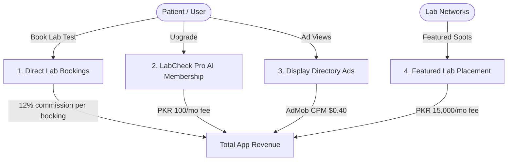

# LabCheck (لیب چیک) — Expected Revenue Model & Projections

This document outlines the detailed expected revenue model, monetization vectors, financial assumptions, and projection scenarios for **LabCheck**, an independent diagnostic lab price comparison directory, regulatory license lookup, and booking commission mobile application designed for patients in **Pakistan**.

---

## 1. Target Market & Demographics

The private diagnostic healthcare sector in Pakistan is a massive, high-volume industry:

*   **Primary Target**: Self-paying patients (lacking private health insurance coverage) in major urban centers who require blood tests, lipid profiles, PCRs, MRIs, and specialized scans.
*   **Retail Environment**: Fragmented private lab networks. Major national diagnostic chains (e.g. Aga Khan Labs, Chughtai Lab, IDC, Al-Khidmat, Shaukat Khanum) compete aggressively for walk-in patients.
*   **Unique Pain Point**: Price variation for identical tests is huge (up to 400% differences). Prescribing doctors often receive substantial kickbacks (20% to 50%) from diagnostic labs, driving up standard retail prices for self-paying patients.
*   **Value Proposition**: LabCheck lists flat price comparisons, maps welfare/independent labs that bypass doctor commissions to offer direct cash discounts, and allows direct test bookings via the app.

---

## 2. Monetization Vectors

LabCheck leverages four monetization streams, prioritizing booking commissions and sponsored lab directory slots.

### A. Direct Lab Booking Commissions (Primary Stream)
*   **Format**: When patients compare test rates on the app, they can book the test directly at the laboratory of their choice.
*   **Monetization Mechanism**: LabCheck collects a standard referral commission fee from the partner lab for delivering walk-in test volumes.
*   **Metrics & Assumptions**:
    *   **Commission Rate**: 12% of the total booking basket value.
    *   **Average Test Basket Value**: 3,000 PKR (reflecting typical pathology test packages or multi-test profiles like blood sugar + LFTs).
    *   **Booking Conversion Rate**: Projected at 2.0% of Monthly Active Users (MAU) per month.

### B. LabCheck Pro (AI Pathology Assistant)
*   **Format**: Premium subscription for patients seeking advanced medical tools.
*   **Pro Features**:
    *   **AI Lab Report Interpreter**: Users scan report PDFs; the built-in Gemini parser explains the complex clinical findings in plain, non-technical English and Urdu.
    *   **Historical Health Tracker**: Automatically logs and plots blood pressure, blood glucose, cholesterol, and other vital stats over time.
    *   **Ad-Free Experience**.
*   **Pricing**: 100 PKR / month (approx. $0.36 USD) or 800 PKR / year.
*   **Conversion Rate**: Projected at 1.5% of Monthly Active Users (MAU).

### C. Featured Lab & Collection Center Placements
*   **Format**: Local laboratory branches or national diagnostic chains pay to be highlighted at the top of test comparison searches in specific towns or pinned as "PHC/SHCC Regulatory Certified".
*   **Monetization Mechanism**: Flat monthly advertising fee per featured branch slot.
*   **Metrics & Assumptions**:
    *   **Monthly Featured Fee**: 15,000 PKR / month.
    *   **Target Partners**: 15 active partner slots in Year 1.

### D. Ad-Supported Model (Free Tier)
*   **Format**: Banner ads and native slots shown during directory search results. Pro subscribers are excluded from ad pools.
*   **Metrics & Assumptions**:
    *   **Pakistan Average CPM**: $0.40 USD (approx. 111 PKR at 278 PKR/USD).
    *   **User Sessions**: Average of 3 sessions/month per free user (triggered when a doctor prescribes diagnostic tests), viewing 4 pages per session = 12 ad impressions per free user/month.

---

## 3. Financial Projections (Year 1)

These projections are based on three scenarios of **Monthly Active Users (MAU)** reached by Month 12.
*(Exchange rate used: 1 USD = 278 PKR)*

### Scenario Comparison Table

| Metric | Conservative (Low Growth) | Base Case (Target Growth) | Optimistic (High Growth) |
| :--- | :--- | :--- | :--- |
| **Year 1 Target MAU** | 20,000 | 100,000 | 300,000 |
| **Monthly Bookings (1.5% - 2.5%)** | 300 (1.5%) | 2,000 (2.0%) | 7,500 (2.5%) |
| **Premium Pro Users (1.5% - 2.0%)** | 300 (1.5%) | 1,500 (1.5%) | 6,000 (2.0%) |
| **Featured Lab Sponsors** | 5 | 15 | 40 |
| **Monthly Ad Revenue** | $94.56 (26,288 PKR) | $472.80 (131,438 PKR) | $1,764.00 (490,392 PKR) |
| **Monthly Booking Commissions** | $388.49 (108,000 PKR) | $2,589.93 (720,000 PKR) | $9,712.23 (2,700,000 PKR) |
| **Monthly Pro Subscription Rev** | $107.91 (30,000 PKR) | $539.57 (150,000 PKR) | $2,158.27 (600,000 PKR) |
| **Monthly Featured Brand Revenue** | $269.78 (75,000 PKR) | $809.35 (225,000 PKR) | $2,158.27 (600,000 PKR) |
| **Total Expected MRR (PKR)** | **239,288 PKR** | **1,226,438 PKR** | **4,390,392 PKR** |
| **Total Expected MRR (USD equivalent)** | **$860.74** | **$4,411.65** | **$15,792.77** |
| **Total Projected ARR (PKR)** | **2,871,456 PKR** | **14,717,256 PKR** | **52,684,704 PKR** |
| **Total Projected ARR (USD equivalent)** | **$10,328.88** | **$52,939.80** | **$189,513.24** |

---

## 4. Key Financial Formulas

$$\text{Total Monthly Revenue (PKR)} = R_{ad} + R_{book} + R_{pro} + R_{featured}$$

Where:

1.  **Free Ad Revenue ($R_{ad}$)**:
    $$R_{ad} = \left( \text{MAU} \times (1 - \text{ProConv}) \times \frac{\text{ImpressionsPerUser}}{1000} \right) \times \text{CPM}_{USD} \times \text{Rate}_{PKR/USD}$$
2.  **Booking Referral Commission ($R_{book}$)**:
    $$R_{book} = \text{MAU} \times \text{BookingRate} \times \text{AverageBasket}_{PKR} \times \text{CommissionRate}$$
3.  **Pro Subscription Revenue ($R_{pro}$)**:
    $$R_{pro} = \text{MAU} \times \text{ProConv} \times \text{Price}_{PKR}$$
4.  **Featured Lab Revenue ($R_{featured}$)**:
    $$R_{featured} = \text{SponsorCount} \times \text{MonthlyFee}_{PKR}$$

---

## 5. Dynamic Revenue Calculator

To modify these variables, run custom scenarios, or perform real-time sensitivity analysis, open the interactive browser-based dashboard calculator:

👉 **[revenue_calculator.html](file:///c:/Essentials/SmartFarms/AndroidApps/Revenue/revenue_calculator.html)**

*Open the file in any web browser to adjust parameters (e.g. MAU size, booking commission rates, wellness basket size) and view updated revenue breakdowns instantly.*
