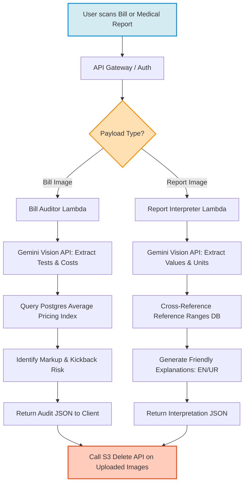
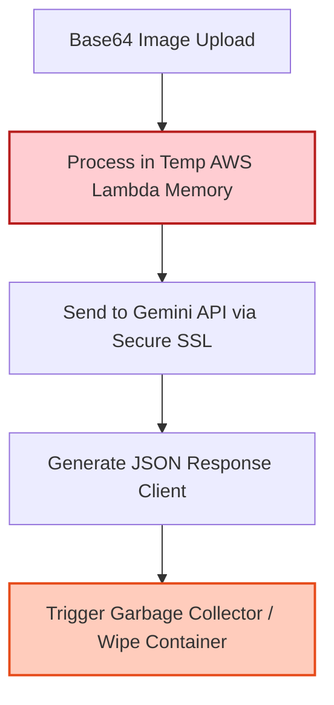

# Technical Details Document: LabCheck (لیب چیک)

This document provides the technical specifications, database schemas, scraper pipelines, and client-server integration protocols for **LabCheck (لیب چیک)**. The system is built using a **Next.js Web UI** inside an **Android WebView Wrapper** shell, backed by serverless **AWS Lambda** microservices, **PostgreSQL**, **Elasticsearch**, and **Gemini Vision OCR**.

---

## 1. System Architecture & Processing Pipeline

LabCheck compares diagnostic test prices, verifies regulatory compliance with provincial healthcare commissions, and audits patient bills/medical reports.



---

## 2. Database Schema & Data Models

### A. PostgreSQL Schema (Relational Store)
Tracks diagnostic laboratories, tests, pricing matrices, regulatory licenses, and crowdsourced quality reviews.

```sql
-- Diagnostic Laboratory Networks
CREATE TABLE lab_networks (
    network_id UUID PRIMARY KEY DEFAULT gen_random_uuid(),
    network_name VARCHAR(150) UNIQUE NOT NULL, -- e.g. 'Chughtai Lab', 'Aga Khan University Hospital Labs'
    headquarters_city VARCHAR(100),
    is_ethical_non_commission BOOLEAN DEFAULT FALSE, -- True for labs like Al-Khidmat or SKMCH that offer direct-to-patient discount rates
    created_at TIMESTAMP WITH TIME ZONE DEFAULT CURRENT_TIMESTAMP
);

-- Master Diagnostic Tests Catalog
CREATE TABLE diagnostic_tests (
    test_id UUID PRIMARY KEY DEFAULT gen_random_uuid(),
    test_code VARCHAR(50) UNIQUE NOT NULL, -- e.g. 'CBC', 'LFT', 'TSH', 'LIPID'
    test_name VARCHAR(255) NOT NULL, -- e.g. 'Complete Blood Count'
    test_name_ur VARCHAR(255), -- Urdu title (e.g. 'خون کا تفصیلی معائنہ')
    category VARCHAR(100) NOT NULL, -- 'haematology', 'biochemistry', 'immunology', etc.
    normal_ranges_reference JSONB NOT NULL, -- Reference ranges (age/gender groups)
    created_at TIMESTAMP WITH TIME ZONE DEFAULT CURRENT_TIMESTAMP
);

-- Dynamic Price Matrix
CREATE TABLE lab_test_prices (
    price_id UUID PRIMARY KEY DEFAULT gen_random_uuid(),
    network_id UUID REFERENCES lab_networks(network_id) ON DELETE CASCADE,
    test_id UUID REFERENCES diagnostic_tests(test_id) ON DELETE CASCADE,
    price_pkr NUMERIC(10, 2) NOT NULL,
    discount_pkr NUMERIC(10, 2) DEFAULT 0.00, -- direct-to-patient walk-in discount
    last_updated DATE DEFAULT CURRENT_DATE,
    CONSTRAINT unique_lab_test UNIQUE(network_id, test_id)
);

-- Provincial Healthcare Commission Licenses (Punjab, Sindh, KPK, Balochistan)
CREATE TABLE regulatory_licenses (
    license_id UUID PRIMARY KEY DEFAULT gen_random_uuid(),
    lab_name VARCHAR(255) NOT NULL,
    registration_number VARCHAR(100) UNIQUE NOT NULL, -- e.g., 'PHC-56291'
    commission_type VARCHAR(20) NOT NULL, -- 'PHC', 'SHCC', 'KP_HCC', 'BHC'
    status VARCHAR(50) DEFAULT 'registered', -- 'registered', 'unlicensed', 'sealed', 'suspended'
    address TEXT,
    issue_date DATE,
    expiry_date DATE,
    updated_at TIMESTAMP WITH TIME ZONE DEFAULT CURRENT_TIMESTAMP
);

-- Crowdsourced Collection Center Reviews
CREATE TABLE collection_center_reviews (
    review_id UUID PRIMARY KEY DEFAULT gen_random_uuid(),
    lab_name VARCHAR(255) NOT NULL,
    branch_address TEXT NOT NULL,
    city VARCHAR(100) NOT NULL,
    phlebotomy_skill INT CHECK (phlebotomy_skill BETWEEN 1 AND 5),
    hygiene_score INT CHECK (hygiene_score BETWEEN 1 AND 5),
    syringe_disposal_verified BOOLEAN DEFAULT FALSE,
    comment TEXT,
    created_at TIMESTAMP WITH TIME ZONE DEFAULT CURRENT_TIMESTAMP
);
```

---

## 3. Web Scraping & License Sync Pipeline

A scheduled Python worker scrapes laboratory portals for test price indices and synchronizes registration lists from provincial healthcare commission databases (such as the Punjab Healthcare Commission).

### A. Chughtai Lab / IDC Price Scraper (BeautifulSoup)
```python
import requests
from bs4 import BeautifulSoup
import psycopg2

def scrape_chughtai_test_prices(network_id):
    # Crawling Chughtai test index portal
    url = "https://chughtailab.com/tests/"
    response = requests.get(url)
    soup = BeautifulSoup(response.content, 'html.parser')
    
    conn = psycopg2.connect("dbname=labcheck user=postgres password=secret host=localhost")
    cursor = conn.cursor()
    
    # Select test rows from directory table
    test_rows = soup.find_all('div', class_='test-list-item')
    for row in test_rows:
        test_name = row.find('h4', class_='test-name').text.strip()
        price_text = row.find('span', class_='price').text.strip() # e.g. "Rs. 1,200"
        price_pkr = float(price_text.replace("Rs.", "").replace(",", "").strip())
        
        # Resolve test_id using text matching in PostgreSQL
        cursor.execute("SELECT test_id FROM diagnostic_tests WHERE test_name ILIKE %s LIMIT 1;", (test_name,))
        result = cursor.fetchone()
        
        if result:
            test_id = result[0]
            # Upsert pricing matrix entry
            cursor.execute("""
                INSERT INTO lab_test_prices (network_id, test_id, price_pkr, last_updated)
                VALUES (%s, %s, %s, CURRENT_DATE)
                ON CONFLICT (network_id, test_id)
                DO UPDATE SET price_pkr = EXCLUDED.price_pkr, last_updated = CURRENT_DATE;
            """, (network_id, test_id, price_pkr))
            
    conn.commit()
    cursor.close()
    conn.close()
```

---

## 4. AI Bill Auditor & Report Interpreter Pipeline

Patients upload their receipts or medical reports to the serverless processing pipelines to evaluate costs and explain clinical results.

### A. Diagnostic Test Reference Range Model (JSONB)
To verify if a patient's results fall within acceptable parameters, `diagnostic_tests.normal_ranges_reference` lists ranges segmented by age group and gender.

```json
{
  "TSH": {
    "unit": "uIU/mL",
    "adult_male": { "min": 0.4, "max": 4.0 },
    "adult_female": { "min": 0.4, "max": 4.0 },
    "pregnancy_first_trimester": { "min": 0.1, "max": 2.5 }
  },
  "Hb": {
    "unit": "g/dL",
    "adult_male": { "min": 13.5, "max": 17.5 },
    "adult_female": { "min": 12.0, "max": 15.5 },
    "child": { "min": 11.0, "max": 16.0 }
  }
}
```

### B. Report Interpreter Prompt Template (Gemini Vision)
```text
You are an empathetic medical auditor. Analyze this diagnostic laboratory report. Extract values and translate the clinical findings into plain English and Urdu.

JSON Reference Ranges: {REFERENCE_RANGES_JSON}
Patient Gender: {GENDER}
Patient Age: {AGE}

RULES:
1. Extract every test name, observed value, and unit (e.g. Hemoglobin: 9.5 g/dL).
2. Compare the values with the reference ranges for the age and gender.
3. Identify if values are Low, Normal, or High.
4. Translate clinical terms into friendly, conversational Urdu (Nastaliq script) and English.
5. Emphasize that this is an informational audit and recommend consulting their doctor.
6. Do not include markdown code block backticks in your output.

JSON Output Schema:
{
  "extracted_tests": [
    {
      "test_code": "Hb",
      "observed_value": 9.5,
      "unit": "g/dL",
      "classification": "LOW | NORMAL | HIGH",
      "explanation_en": "Your hemoglobin is low, which indicates mild anemia.",
      "explanation_ur": "آپ کا ہیموگلوبن کم ہے، جو خون کی کمی کی علامت ہو سکتا ہے۔"
    }
  ],
  "medical_summary_en": "Overall diagnostic summary.",
  "medical_summary_ur": "مجموعی خلاصہ اردو میں۔"
}
```

---

## 5. Security & Medical Privacy Framework

All uploaded receipts and lab report images contain highly sensitive Protected Health Information (PHI). To protect patient confidentiality and comply with health privacy standards:



*   **No Persistent File Storage**: Image files uploaded for OCR evaluation are kept strictly in-memory (RAM) inside the **OCR Lambda**. They are never saved to permanent disk blocks (AWS S3) unless the user explicitly opts into a secure, encrypted storage vault.
*   **Encrypted Payloads**: All data transmission channels utilize HTTPS TLS 1.3 protocol. User profiles and stored histories are encrypted at rest using AES-256 database triggers.

---

## 6. API Reference Specification

### A. Compare Test Prices
`GET /api/labs/compare`

Returns test prices across different laboratory networks.

#### Query Parameters:
*   `test_code`: Code string (e.g. `CBC`)
*   `city`: City location (e.g. `Karachi`)

#### Response Payload (200 OK):
```json
{
  "test_details": {
    "test_code": "CBC",
    "test_name": "Complete Blood Count",
    "test_name_ur": "خون کا تفصیلی معائنہ"
  },
  "comparisons": [
    {
      "lab_name": "Al-Khidmat Labs",
      "is_ethical_non_commission": true,
      "original_price": 1000.00,
      "direct_patient_discount_pct": 30.00,
      "final_price": 700.00,
      "home_sampling_fee": 200.00,
      "turnaround_hours": 12
    },
    {
      "lab_name": "Chughtai Lab",
      "is_ethical_non_commission": false,
      "original_price": 1800.00,
      "direct_patient_discount_pct": 0.00,
      "final_price": 1800.00,
      "home_sampling_fee": 150.00,
      "turnaround_hours": 8
    },
    {
      "lab_name": "Aga Khan University Hospital Labs",
      "is_ethical_non_commission": false,
      "original_price": 2500.00,
      "direct_patient_discount_pct": 0.00,
      "final_price": 2500.00,
      "home_sampling_fee": 300.00,
      "turnaround_hours": 24
    }
  ]
}
```

### B. Verify Regulatory Registration Status
`GET /api/labs/verify-license`

Queries provincial healthcare commission databases.

#### Query Parameters:
*   `registration_number`: Unique registration code (e.g. `PHC-56291`)

#### Response Payload (200 OK):
```json
{
  "registration_number": "PHC-56291",
  "lab_name": "Care & Cure Collection Point",
  "commission": "PHC",
  "status": "sealed",
  "details": {
    "address": "Block H, Johar Town, Lahore",
    "issue_date": "2023-01-10",
    "expiry_date": "2025-01-10",
    "reason_for_status": "Sealed by PHC inspect team due to unqualified staff and lack of disposable syringe protocols."
  }
}
```
