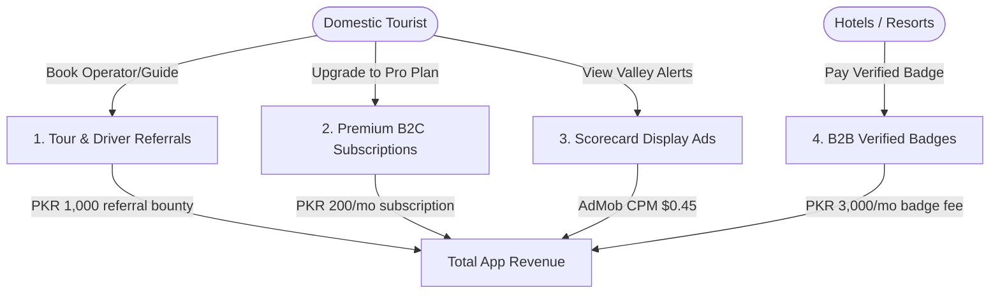

# Siyahat (سیاحت) — Expected Revenue Model & Projections

This document outlines the detailed expected revenue model, monetization vectors, financial assumptions, and projection scenarios for **Siyahat**, an independent hotel review aggregator, road difficulty score finder, and tour guide/jeep driver referral booking application designed for domestic tourists in **Pakistan**.

---

## 1. Target Market & Demographics

The domestic tourism sector in Pakistan attracts millions of visitors annually to regions like the Northern Valleys (Murree, Hunza, Swat, Skardu, Naran) and coastal beaches (Kund Malir, Gwadar):

*   **Primary Target**: Domestic vacationers, families, trekkers, and remote workers looking to verify hotel services, winter heating conditions, and road access.
*   **Infrastructure Pain Points**: Photoshopped booking listings frequently hide critical hotel defects: geyser and heater outages, zero load-shedding backup systems, winter snow road blocks, signal drops (especially Gilgit-Baltistan’s reliance on SCOM), and transport cartel jeep monopolies.
*   **Value Proposition**: Siyahat verifies traveler reviews, maps mobile carrier signal speed (SCOM, Zong, Telenor), logs geyser schedules, and publishes real jeep cartel fare indexes to secure tourist spends.

---

## 2. Monetization Vectors

Siyahat operates on a combined model of hotel verified badges, tour operator referrals, premium traveler checks, and native directory ads.

### A. B2B Hotel Verified Badges (Primary Stream)
*   **Format**: Accommodations that pass independent inspection parameters (consistent hot water, generator fuel back-ups, speed tests, verified sheets) pay to carry a **"Siyahat Verified" Badge** on their profiles, boosting reservations.
*   **Monetization Mechanism**: Recurrent monthly SaaS verification fee.
*   **Pricing**: 3,000 PKR / month per hotel location.
*   **Target Partners**: 150 verified hotel partners in Year 1.

### B. Tour Operator & Local Driver Referrals (B2B Transactions)
*   **Format**: The app connects users directly to vetted local tour operators, tourist drivers, or local jeep associations.
*   **Monetization Mechanism**: Referral bounty paid by the tour operator/driver per completed booking.
*   **Pricing**: 1,000 PKR flat commission per referral booking.
*   **Conversion Rate**: Projected at 0.50% of Monthly Active Users (MAU) per month.

### C. Siyahat Pro (Premium B2C Subscription)
*   **Format**: Premium subscription unlocking advanced features for travelers.
*   **Pro Features**:
    *   **Live Landslide & Snow Alerts**: Real-time push warnings on road blockage updates in northern valleys.
    *   **Verified Signal Speed Lists**: Detail logs of active download speeds by hotel for remote workers.
    *   **Offline Valley Maps**: High-detail downloadable PDF trail maps with GPS coordinates.
*   **Pricing**: 200 PKR / month (approx. $0.72 USD) or 1,200 PKR / year.
*   **Conversion Rate**: Projected at 1.0% of Monthly Active Users (MAU).

### D. Ad-Supported Model (Free Tier)
*   **Format**: Display banners shown on valley maps, road reports, and hotel profiles. Pro subscribers and B2B badge partners do not see ads.
*   **Metrics & Assumptions**:
    *   **Pakistan Average CPM**: $0.45 USD (approx. 125 PKR at 278 PKR/USD).
    *   **User Sessions**: Free users check listings intensely before trips. Free users average 6 sessions/month (active pre-trip and in-trip checks), viewing 6 pages per visit = 36 ad impressions per free user/month.

---

## 3. Financial Projections (Year 1)

These projections are based on three scenarios of **Monthly Active Users (MAU)** reached by Month 12.
*(Exchange rate used: 1 USD = 278 PKR)*

### Scenario Comparison Table

| Metric | Conservative (Low Growth) | Base Case (Target Growth) | Optimistic (High Growth) |
| :--- | :--- | :--- | :--- |
| **Year 1 Target MAU** | 15,000 | 50,000 | 150,000 |
| **Pro Subscribers (1.0% - 1.2%)**| 150 (1.0%) | 500 (1.0%) | 1,800 (1.2%) |
| **Tour / Guide Bookings (0.4% - 0.6%)**| 60 (0.40%) | 250 (0.50%) | 900 (0.60%) |
| **B2B Verified Hotel Partners**| 40 | 150 | 400 |
| **Monthly Ad Revenue** | $240.57 (66,878 PKR)  | $801.90 (222,928 PKR)  | $2,667.60 (741,593 PKR) |
| **Monthly Tour Referral Rev** | $215.83 (60,000 PKR)  | $899.28 (250,000 PKR)  | $3,237.41 (900,000 PKR)  |
| **Monthly Hotel Verified Badge Rev**| $431.65 (120,000 PKR) | $1,618.71 (450,000 PKR) | $4,316.55 (1,200,000 PKR)|
| **Monthly Pro Subscription Rev** | $107.91 (30,000 PKR)  | $359.71 (100,000 PKR)  | $1,294.96 (360,000 PKR)  |
| **Total Expected MRR (PKR)** | **276,878 PKR** | **1,022,928 PKR** | **3,201,593 PKR** |
| **Total Expected MRR (USD equivalent)** | **$995.96** | **$3,679.60** | **$11,516.52** |
| **Total Projected ARR (PKR)** | **3,322,536 PKR** | **12,275,136 PKR** | **38,419,116 PKR** |
| **Total Projected ARR (USD equivalent)** | **$11,951.52** | **$44,155.20** | **$138,198.24** |

---

## 4. Key Financial Formulas

$$\text{Total Monthly Revenue (PKR)} = R_{ad} + R_{tours} + R_{badges} + R_{pro}$$

Where:

1.  **Free Ad Revenue ($R_{ad}$)**:
    $$R_{ad} = \left( \text{MAU} \times (1 - \text{ProConv}) \times \frac{\text{ImpressionsPerUser}}{1000} \right) \times \text{CPM}_{USD} \times \text{Rate}_{PKR/USD}$$
2.  **Tour Operator & Driver Referral Revenue ($R_{tours}$)**:
    $$R_{tours} = \text{MAU} \times \text{ReferralRate} \times \text{ReferralBounty}_{PKR}$$
3.  **B2B Hotel Verified Badge Revenue ($R_{badges}$)**:
    $$R_{badges} = \text{PartnerCount} \times \text{MonthlyBadgeFee}_{PKR}$$
4.  **Premium Pro Subscription Revenue ($R_{pro}$)**:
    $$R_{pro} = \text{MAU} \times \text{ProConv} \times \text{Price}_{PKR}$$

---

## 5. Dynamic Revenue Calculator

To modify these variables, run custom scenarios, or perform real-time sensitivity analysis, open the interactive browser-based dashboard calculator:

👉 **[revenue_calculator.html](file:///c:/Essentials/SmartFarms/AndroidApps/Revenue/revenue_calculator.html)**

*Open the file in any web browser to adjust parameters (e.g. MAU size, referral rates, hotel badge counts) and view updated revenue breakdowns instantly.*
