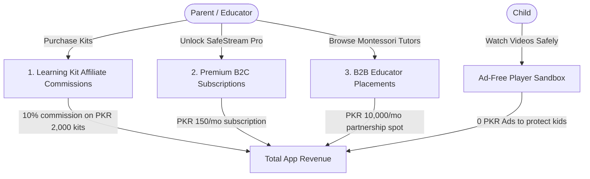

# SafeStream Kids (سیف اسٹریم کڈز) — Expected Revenue Model & Projections

This document outlines the detailed expected revenue model, monetization vectors, financial assumptions, and projection scenarios for **SafeStream Kids**, a parent-controlled YouTube wrapper sandbox player, bedtime scheduler, and AI Urdu transcript filter application designed for families in **Pakistan**.

---

## 1. Target Market & Demographics

The rise of digital screen time among Pakistani children has increased safety risks:

*   **Primary Target**: Middle to upper-middle-class urban parents with children aged 2 to 12 who want to prevent exposure to inappropriate local ads (betting, gambling, adult products) and aggressive algorithm traps.
*   **Safety Priority**: SafeStream Kids blocks all YouTube ads, restricts content strictly to parent-defined whitelists, and limits mobile data usage to protect households from expensive bill shocks.
*   **Ad-Free Pledge**: Because parental trust is paramount, **SafeStream Kids contains zero advertisements (0 PKR ad revenue)**. It relies entirely on value-added parental utility upgrades.

---

## 2. Monetization Vectors

SafeStream Kids monetizes through premium subscriptions (SafeStream Pro), educator referral listings (Parent Portal only), and learning kit affiliate commissions.

### A. SafeStream Pro (Premium B2C Subscription)
*   **Format**: Premium subscription unlocking advanced parental control features.
*   **Free Tier vs. Pro**:
    *   *Free*: Up to 1 child profile, maximum of 10 parent whitelisted links or 1 playlist, access to the pre-vetted starter library.
    *   *Pro*: Unlimited whitelisted videos, up to 5 child profiles (Toddler, Kid, Pre-teen levels), AI-powered Urdu transcript/description slang filters, screen-time bedtime lockout calendars, and offline Wi-Fi downloads.
*   **Pricing**: 150 PKR / month (approx. $0.54 USD) or 1,000 PKR / year.
*   **Conversion Rate**: Projected at 2.0% of Monthly Active Users (MAU).

### B. Montessori & STEM Kit Affiliate Store (B2B Transactions)
*   **Format**: Affiliate referral store built directly into the PIN-protected Parent Portal (never visible to kids) showcasing physical STEM kits, bilingual flashcards, and local language children's storybooks.
*   **Monetization Mechanism**: 10% commission on checkout value.
*   **Pricing**: Average checkout basket of 2,000 PKR (yielding 200 PKR net commission).
*   **Conversion Rate**: Projected at 0.75% of MAU monthly.

### C. B2B Educator Placements (Parent Portal Only)
*   **Format**: Private daycare networks, child psychologists, pediatric clinics, and specialized online Urdu tutors purchase sponsored placement cards inside the Parent Portal's advice section.
*   **Monetization Mechanism**: Recurrent monthly partner listing fee.
*   **Pricing**: 10,000 PKR / month per partner.
*   **Target Partners**: 10 active sponsors in Year 1.

---

## 3. Financial Projections (Year 1)

These projections are based on three scenarios of **Monthly Active Users (MAU)** reached by Month 12.
*(Exchange rate used: 1 USD = 278 PKR)*

### Scenario Comparison Table

| Metric | Conservative (Low Growth) | Base Case (Target Growth) | Optimistic (High Growth) |
| :--- | :--- | :--- | :--- |
| **Year 1 Target MAU** | 15,000 | 50,000 | 150,000 |
| **Pro Subscribers (2.0% - 2.5%)**| 300 (2.0%) | 1,000 (2.0%) | 3,750 (2.5%) |
| **Monthly Montessori Kit Sales** | 75 sales (0.50%) | 375 sales (0.75%) | 1,500 sales (1.00%) |
| **B2B Educator Placements** | 3 | 10 | 25 |
| **Monthly Ad Revenue** | **0 PKR ($0)** | **0 PKR ($0)** | **0 PKR ($0)** |
| **Monthly Montessori Kit Comm**| $53.96 (15,000 PKR) | $269.78 (75,000 PKR) | $1,079.14 (300,000 PKR) |
| **Monthly B2B Placement Rev** | $107.91 (30,000 PKR)| $359.71 (100,000 PKR) | $899.28 (250,000 PKR) |
| **Monthly Pro Subscription Rev** | $161.87 (45,000 PKR) | $539.57 (150,000 PKR)  | $2,023.38 (562,500 PKR) |
| **Total Expected MRR (PKR)** | **90,000 PKR** | **325,000 PKR** | **1,112,500 PKR** |
| **Total Expected MRR (USD equivalent)** | **$323.74** | **$1,169.06** | **$4,001.80** |
| **Total Projected ARR (PKR)** | **1,080,000 PKR** | **3,900,000 PKR** | **13,350,000 PKR** |
| **Total Projected ARR (USD equivalent)** | **$3,884.88** | **$14,028.72** | **$48,021.60** |

---

## 4. Key Financial Formulas

$$\text{Total Monthly Revenue (PKR)} = R_{ad} + R_{subs} + R_{referrals} + R_{placements}$$

Where:

1.  **Free Ad Revenue ($R_{ad}$)**:
    $$R_{ad} = 0\text{ PKR (100\% Ad-Free for Child Safety)}$$
2.  **Premium Pro Subscriptions ($R_{subs}$)**:
    $$R_{subs} = \text{MAU} \times \text{ProConv} \times \text{Price}_{PKR}$$
3.  **Montessori Kit Referrals ($R_{referrals}$)**:
    $$R_{referrals} = \text{MAU} \times \text{SalesRate} \times \text{KitBasket}_{PKR} \times \text{CommRate}$$
4.  **B2B Educator Placements ($R_{placements}$)**:
    $$R_{placements} = \text{PartnerCount} \times \text{MonthlyPlacementFee}_{PKR}$$

---

## 5. Dynamic Revenue Calculator

To modify these variables, run custom scenarios, or perform real-time sensitivity analysis, open the interactive browser-based dashboard calculator:

👉 **[revenue_calculator.html](file:///c:/Essentials/SmartFarms/AndroidApps/Revenue/revenue_calculator.html)**

*Open the file in any web browser to adjust parameters (e.g. MAU size, Montessori kit sales rates, sponsor listing fees) and view updated revenue breakdowns instantly.*
