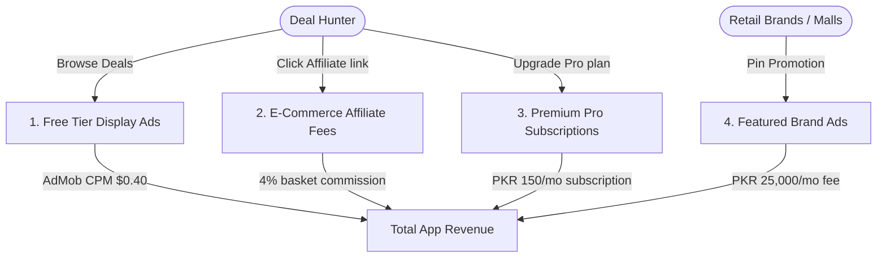

# SaleScout (سیل اسکاؤٹ) — Expected Revenue Model & Projections

This document outlines the detailed expected revenue model, monetization vectors, financial assumptions, and projection scenarios for **SaleScout**, a location-based mobile application, crowdsourced deal directory, automated price tracker, and bank card discount stacking aggregator designed for shoppers in **Pakistan**.

---

## 1. Target Market & Demographics

The retail fashion and e-commerce shopping sector in Pakistan is a high-demand, high-frequency consumer market:

*   **Primary Target**: Bargain hunters, fashion enthusiasts, and tech-savvy middle-class shoppers looking to optimize their household spend against inflation.
*   **Retail Environment**: Large-scale malls (Emporium, Packages, Lucky One, Centaurus) and e-commerce portals (Daraz, Elo, Bagallery) draw massive sales volumes duringPaydays, Eid-ul-Fitr, Eid-ul-Adha, August 14th Independence Day, and Blessed Friday.
*   **Unique Pain Point**: Consumers are bombarded with promotional SMS spam while missing clearance sales from brands they care about. In-store clearances in shopping malls are often invisible online. Original prices are often artificially inflated before major holiday sales.
*   **Value Proposition**: SaleScout aggregates listings, provides geofenced mall clearance alerts, ranks true discounts via history charts, and calculates card stacking bonuses.

---

## 2. Monetization Vectors

SaleScout is primarily an ad-supported application. It monetizes through display and native ads on the free tier, supplemented by e-commerce affiliate checkouts, B2B brand placements, and premium card stacking memberships.

### A. Ad-Supported Model (Free Tier)
*   **Format**: Display banners shown on search directories, mall listing grids, and seasonal holiday calendars. B2B brand partners and Pro subscribers do not see ads.
*   **Metrics & Assumptions**:
    *   **Pakistan Average CPM**: $0.40 USD (approx. 111 PKR at 278 PKR/USD).
    *   **User Sessions**: Deal hunters check the app frequently. Free users average 12 sessions/month (checking weekly clearances), viewing 5 pages per visit = 60 ad impressions per free user/month.

### B. E-Commerce Affiliate Commissions
*   **Format**: Users click direct shopping links for partnered e-commerce networks (Daraz, Elo, Bagallery) inside the deal directories.
*   **Monetization Mechanism**: A percentage commission on completed checkout shopping carts.
*   **Pricing**: Average **4% affiliate commission** on the total order value.
*   **Order Basket Size**: 3,000 PKR average checkout order.
*   **Conversion Rate**: Projected at 0.50% of Monthly Active Users (MAU) per month.

### C. SaleScout Pro (Premium B2C Subscription)
*   **Format**: Premium subscription unlocking advanced features for heavy shoppers.
*   **Pro Features**:
    *   **True-Discount Price Auditor**: Historical tracker verifying if a brand's sale is a genuine price cut or if original prices were marked up beforehand.
    *   **Bank Card Stacking Calculator**: Automatically calculates stacked card discounts (combining store sales with bank credit card partnerships).
    *   **WhatsApp digest alerts**: Direct weekly alerts for followed brands.
*   **Pricing**: 150 PKR / month (approx. $0.54 USD) or 1,000 PKR / year.
*   **Conversion Rate**: Projected at 1.0% of Monthly Active Users (MAU).

### D. Featured Brand Campaigns (B2B Placements)
*   **Format**: Retail brands pay to pin their clearance ads at the top of local search feeds, mall categories, or send targeted push alerts to brand followers.
*   **Monetization Mechanism**: Recurrent monthly advertising fees per campaign location/brand.
*   **Pricing**: 25,000 PKR / month per brand sponsor.
*   **Target Partners**: 15 active brand partnerships in Year 1.

---

## 3. Financial Projections (Year 1)

These projections are based on three scenarios of **Monthly Active Users (MAU)** reached by Month 12.
*(Exchange rate used: 1 USD = 278 PKR)*

### Scenario Comparison Table

| Metric | Conservative (Low Growth) | Base Case (Target Growth) | Optimistic (High Growth) |
| :--- | :--- | :--- | :--- |
| **Year 1 Target MAU** | 30,000 | 100,000 | 300,000 |
| **Pro Subscribers (1.0% - 1.2%)**| 300 (1.0%) | 1,000 (1.0%) | 3,600 (1.2%) |
| **Monthly E-Commerce Orders (0.4% - 0.6%)**| 120 (0.40%) | 500 (0.50%) | 1,800 (0.60%) |
| **Featured B2B Brand Partners**| 5 | 15 | 35 |
| **Monthly Ad Revenue** | $712.80 (198,158 PKR) | $2,376.00 (660,528 PKR) | $8,892.00 (2,471,976 PKR) |
| **Monthly B2B Brand Campaign Rev**| $449.64 (125,000 PKR) | $1,348.92 (375,000 PKR) | $3,147.48 (875,000 PKR) |
| **Monthly E-Commerce Affiliate Rev**| $51.80 (14,400 PKR)   | $215.83 (60,000 PKR)    | $776.98 (216,000 PKR)    |
| **Monthly Pro Subscription Rev** | $161.87 (45,000 PKR)   | $539.57 (150,000 PKR)   | $1,942.45 (540,000 PKR)   |
| **Total Expected MRR (PKR)** | **382,558 PKR** | **1,245,528 PKR** | **4,102,976 PKR** |
| **Total Expected MRR (USD equivalent)** | **$1,376.11** | **$4,480.32** | **$14,758.91** |
| **Total Projected ARR (PKR)** | **4,590,696 PKR** | **14,946,336 PKR** | **49,235,712 PKR** |
| **Total Projected ARR (USD equivalent)** | **$16,513.32** | **$53,763.84** | **$177,106.92** |

---

## 4. Key Financial Formulas

$$\text{Total Monthly Revenue (PKR)} = R_{ad} + R_{brands} + R_{affiliate} + R_{pro}$$

Where:

1.  **Free Ad Revenue ($R_{ad}$)**:
    $$R_{ad} = \left( \text{MAU} \times (1 - \text{ProConv}) \times \frac{\text{ImpressionsPerUser}}{1000} \right) \times \text{CPM}_{USD} \times \text{Rate}_{PKR/USD}$$
2.  **Featured Brand Campaign Revenue ($R_{brands}$)**:
    $$R_{brands} = \text{CampaignCount} \times \text{MonthlyFee}_{PKR}$$
3.  **E-Commerce Affiliate Commission Revenue ($R_{affiliate}$)**:
    $$R_{affiliate} = \text{MAU} \times \text{AffilRate} \times \text{BasketSize}_{PKR} \times \text{CommissionRate}$$
4.  **Premium Pro Subscription Revenue ($R_{pro}$)**:
    $$R_{pro} = \text{MAU} \times \text{ProConv} \times \text{Price}_{PKR}$$

---

## 5. Dynamic Revenue Calculator

To modify these variables, run custom scenarios, or perform real-time sensitivity analysis, open the interactive browser-based dashboard calculator:

👉 **[revenue_calculator.html](file:///c:/Essentials/SmartFarms/AndroidApps/Revenue/revenue_calculator.html)**

*Open the file in any web browser to adjust parameters (e.g. MAU size, affiliate conversion rates, brand sponsor counts) and view updated revenue breakdowns instantly.*
