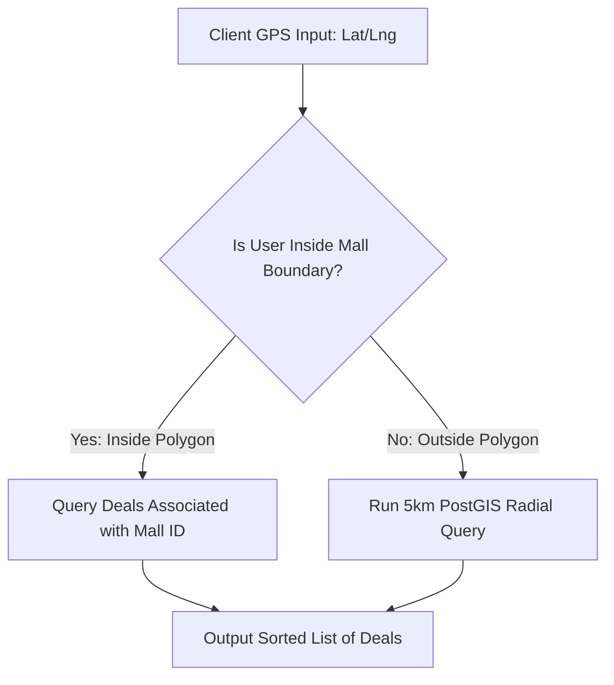

# Technical Details Document: SaleScout (سیل اسکاؤٹ)

This document provides the technical specifications, database schemas, scraper pipelines, and client-server integration protocols for **SaleScout (سیل اسکاؤٹ)**. The system is built using a **Next.js Web UI** inside an **Android WebView Wrapper** shell, backed by serverless **AWS Lambda** microservices, **PostgreSQL** (with **PostGIS**), **Elasticsearch**, and **Meta's WhatsApp Cloud API**.

---

## 1. System Architecture & Deal Aggregation Pipeline

SaleScout aggregates, normalizes, and geolocates sales from multiple sources: brand web crawlers, Instagram social scrapers, SMS marketing feeds, and crowdsourced in-store submissions.

```mermaid
graph TD
    %% Aggregation Sources
    subgraph Data Crawling & Parsing (AWS Lambda)
        WebCrawler[Web Crawler Lambda] -->|Scrape Shopify / WooCommerce| StoreFronts[E-Commerce Brand Sites]
        InstaWatcher[Instagram Scraper Lambda] -->|API / Web Scraping| BrandProfiles[Social Feeds]
        SMSReceiver[SMS Gateway / App Interceptor] -->|Filter Brand Masks| SMSFeed[SMS Promotions]
        CrowdUpload[User Flash Upload] -->|Metadata Stripper Lambda| RawPhoto[Cleaned Photos]
    end

    %% Normalization & Caching
    StoreFronts & BrandProfiles & SMSFeed & RawPhoto --> DataIngest[Ingestion & LLM Parsing Lambda]
    DataIngest --> PostgreSQL[(PostgreSQL DB<br/>PostGIS Spatial)]
    DataIngest --> Elasticsearch[(Elasticsearch Cluster<br/>Deals & Search Index)]

    %% Client Services
    Client[Next.js App / Android Shell] <-->|Get Localized Stacked Deals| APIGateway[AWS API Gateway]
    APIGateway <--> DiscoveryAPI[Deal Discovery Lambda]
    DiscoveryAPI --> PostgreSQL
    DiscoveryAPI --> Elasticsearch
    
    %% Notifications
    PostgreSQL --> NotificationWorker[Notification Lambda]
    NotificationWorker -->|WhatsApp Cloud API| UserWhatsApp[WhatsApp Notification Digest]
    NotificationWorker -->|Firebase Cloud Messaging| NativePush[Android Geofenced Alerts]

    style DataIngest fill:#ffe0b2,stroke:#fb8c00,stroke-width:2px
    style PostgreSQL fill:#ede7f6,stroke:#5e35b1,stroke-width:2px
    style Elasticsearch fill:#e0f2f1,stroke:#00695c,stroke-width:2px
    style NotificationWorker fill:#e8f5e9,stroke:#4caf50,stroke-width:2px
```

---

## 2. Database Schema & Data Models

### A. PostgreSQL Schema (Spatial Relational Store)
Tracks brands, shopping malls, physical branches, deals, credit card stacking configs, and price histories.

```sql
-- Enable PostGIS extension for spatial queries
CREATE EXTENSION IF NOT EXISTS postgis;

-- Retail Brands
CREATE TABLE brands (
    brand_id UUID PRIMARY KEY DEFAULT gen_random_uuid(),
    brand_name VARCHAR(150) NOT NULL,
    normalized_handle VARCHAR(150) UNIQUE NOT NULL, -- e.g., 'sapphire', 'khaadi', 'kfc'
    category VARCHAR(100) NOT NULL, -- 'apparel', 'dining', 'e_commerce', 'grocery', 'other'
    website_url VARCHAR(512),
    logo_url VARCHAR(512),
    created_at TIMESTAMP WITH TIME ZONE DEFAULT CURRENT_TIMESTAMP
);

-- Shopping Malls in Pakistan
CREATE TABLE shopping_malls (
    mall_id UUID PRIMARY KEY DEFAULT gen_random_uuid(),
    mall_name VARCHAR(255) NOT NULL, -- e.g. 'Emporium Mall', 'Packages Mall', 'Lucky One'
    city VARCHAR(100) NOT NULL, -- 'Karachi', 'Lahore', 'Islamabad', etc.
    geofence_boundary GEOMETRY(Polygon, 4326), -- Polygon outline of physical mall
    center_latitude NUMERIC(10, 8) NOT NULL,
    center_longitude NUMERIC(11, 8) NOT NULL,
    created_at TIMESTAMP WITH TIME ZONE DEFAULT CURRENT_TIMESTAMP
);

-- Physical Brand Outlets
CREATE TABLE brand_outlets (
    outlet_id UUID PRIMARY KEY DEFAULT gen_random_uuid(),
    brand_id UUID REFERENCES brands(brand_id) ON DELETE CASCADE,
    mall_id UUID REFERENCES shopping_malls(mall_id) ON DELETE SET NULL, -- Null if standalone shop
    address TEXT NOT NULL,
    latitude NUMERIC(10, 8) NOT NULL,
    longitude NUMERIC(11, 8) NOT NULL,
    geom GEOMETRY(Point, 4326), -- PostGIS Point representation
    created_at TIMESTAMP WITH TIME ZONE DEFAULT CURRENT_TIMESTAMP
);

-- Active Promotions Directory
CREATE TABLE deals (
    deal_id UUID PRIMARY KEY DEFAULT gen_random_uuid(),
    brand_id UUID REFERENCES brands(brand_id) ON DELETE CASCADE,
    title VARCHAR(255) NOT NULL, -- e.g., 'Blessed Friday Sale - Flat 50%'
    description TEXT,
    discount_type VARCHAR(50) NOT NULL, -- 'flat', 'upto', 'bogo', 'cashback'
    discount_value NUMERIC(5, 2) NOT NULL, -- e.g. 50.00
    valid_from DATE NOT NULL,
    valid_to DATE NOT NULL,
    promo_code VARCHAR(50), -- Optional voucher code (e.g. 'EID20')
    source VARCHAR(100) DEFAULT 'crawler', -- 'crawler', 'sms', 'crowdsourced'
    image_url VARCHAR(512),
    is_verified BOOLEAN DEFAULT TRUE,
    created_at TIMESTAMP WITH TIME ZONE DEFAULT CURRENT_TIMESTAMP
);

-- Historical Item Price Registry (True-Discount Analytics)
CREATE TABLE item_price_history (
    price_log_id UUID PRIMARY KEY DEFAULT gen_random_uuid(),
    brand_id UUID REFERENCES brands(brand_id) ON DELETE CASCADE,
    item_sku VARCHAR(100) NOT NULL,
    item_name VARCHAR(255) NOT NULL,
    listed_price NUMERIC(10, 2) NOT NULL, -- original listed price
    discounted_price NUMERIC(10, 2) NOT NULL,
    log_date DATE DEFAULT CURRENT_DATE,
    CONSTRAINT unique_sku_date UNIQUE(brand_id, item_sku, log_date)
);
```

---

## 3. Web Scraping & Ingestion Workers

To maintain current discount directories, the scraping suite tracks e-commerce inventories, brand social posts, and incoming marketing SMS text feeds.

### A. Python E-Commerce Crawler (Shopify Indexer API)
Since most fashion brands in Pakistan (Sapphire, Outfitters, Limelight) run on Shopify, the Python worker polls their structured JSON endpoints directly.

```python
import requests
import json
import psycopg2

def scrape_shopify_brand_discounts(brand_id, base_url):
    # Shopify public API endpoint for products
    products_url = f"{base_url}/products.json?limit=250"
    response = requests.get(products_url)
    products_data = response.json().get('products', [])
    
    conn = psycopg2.connect("dbname=salescout user=postgres password=secret host=localhost")
    cursor = conn.cursor()
    
    for product in products_data:
        title = product.get('title')
        sku = product.get('variants')[0].get('sku', '')
        variants = product.get('variants', [])
        
        for variant in variants:
            price = float(variant.get('price', 0.0))
            compare_at_price = variant.get('compare_at_price')
            
            if compare_at_price:
                original_price = float(compare_at_price)
                discount_percentage = ((original_price - price) / original_price) * 100
                
                # Update database price log
                cursor.execute("""
                    INSERT INTO item_price_history (brand_id, item_sku, item_name, listed_price, discounted_price, log_date)
                    VALUES (%s, %s, %s, %s, %s, CURRENT_DATE)
                    ON CONFLICT (brand_id, item_sku, log_date) 
                    DO UPDATE SET discounted_price = EXCLUDED.discounted_price;
                """, (brand_id, sku, title, original_price, price))
                
    conn.commit()
    cursor.close()
    conn.close()
```

### B. SMS Parsing Gateway API
Many clearances are announced exclusively via SMS with brand masks (e.g. `KHAADI`, `SAPPHIRE`). If users allow SMS access in the wrapper, the client parses incoming marketing texts locally and uploads them to the aggregation database.

#### API Endpoint: `POST /api/deals/sms-report`
```json
{
  "sender_mask": "SAPPHIRE",
  "message_body": "Lawn Sale is live! Enjoy flat 30% and 50% off in-stores and online. Use code LAWN50. Valid till 15th Aug.",
  "timestamp": "2026-08-09T15:43:00Z"
}
```

#### Ingestion Parser Regex & LLM Handler:
The parser extracts dates, codes, and discount values:
```python
import re

def parse_sms_details(message):
    # Regex searches
    discount_match = re.search(r'(flat|up to)\s*(\d+)%', message, re.IGNORECASE)
    code_match = re.search(r'code\s*([A-Z0-9]+)', message, re.IGNORECASE)
    
    return {
        "value": float(discount_match.group(2)) if discount_match else None,
        "type": discount_match.group(1).lower() if discount_match else "flat",
        "code": code_match.group(1) if code_match else None
    }
```

---

## 4. Geospatial Queries: Mall Geofencing & PostGIS Calculations

To retrieve deals occurring inside a shopping mall or within 5km of a user's location, the system queries the PostGIS geospatial coordinates.



### SQL PostGIS Geo-Discovery Query
```sql
-- Retrieve active deals within 5km radius or specifically inside a mall's polygon
WITH user_location AS (
    SELECT ST_SetSRID(ST_MakePoint(67.0284, 24.8138), 4326) AS geom -- user coordinate (Karachi)
)
SELECT 
    b.brand_name,
    d.title,
    d.discount_value,
    d.discount_type,
    o.address,
    m.mall_name,
    ST_Distance(o.geom::geography, u.geom::geography) AS distance_meters
FROM brand_outlets o
CROSS JOIN user_location u
INNER JOIN brands b ON o.brand_id = b.brand_id
INNER JOIN deals d ON b.brand_id = d.brand_id
LEFT JOIN shopping_malls m ON o.mall_id = m.mall_id
WHERE 
    (
      -- Option A: Outlet is inside user's 5km radius
      ST_DWithin(o.geom::geography, u.geom::geography, 5000)
      OR
      -- Option B: Outlet is inside a mall that contains the user's GPS point
      (m.mall_id IS NOT NULL AND ST_Contains(m.geofence_boundary, u.geom))
    )
    AND d.valid_from <= CURRENT_DATE 
    AND d.valid_to >= CURRENT_DATE
ORDER BY d.discount_value DESC, distance_meters ASC;
```

---

## 5. true-Discount & Card Stacking Engine

To flag inflated discounts, the system tracks prices before sales and layers credit card partnerships to calculate the actual net price.

### A. True-Discount Calculation Rule
```python
def check_true_discount(brand_id, sku, advertised_price, advertised_sale_price):
    """
    Looks at the lowest price of the product in the past 30 days 
    to verify if the discount was inflated.
    """
    # Query database for past prices (excluding the current sale day)
    past_prices = query_historical_prices(brand_id, sku, days_limit=30)
    if not past_prices:
        return 1.0 # Default confidence (no price history)

    base_reference_price = min(p['listed_price'] for p in past_prices)
    
    # Calculate real discount vs advertised discount
    advertised_discount = (advertised_price - advertised_sale_price) / advertised_price
    real_discount = (base_reference_price - advertised_sale_price) / base_reference_price
    
    true_discount_ratio = real_discount / advertised_discount if advertised_discount > 0 else 1.0
    return max(0.0, min(1.0, true_discount_ratio))
```

### B. Credit Card Offer Stacking Calculator
Many merchants allow shoppers to stack store-wide discounts with bank card promos.
$$\text{Net Price} = \text{Original Price} \times (1 - \text{Store Discount \%}) \times (1 - \text{Bank Card Discount \%})$$

```typescript
// Stacking Logic inside Next.js Component
export function calculateStackedPricing(
  originalPrice: number,
  storeDiscountPercent: number, // e.g. 30 for 30% off
  bankDiscountPercent: number,  // e.g. 15 for 15% off
  bankDiscountCap: number       // e.g. 1000 PKR maximum card discount cap
): { discountedPrice: number; cardSavings: number; finalNetPrice: number } {
  
  const priceAfterStoreSale = originalPrice * (1 - (storeDiscountPercent / 100));
  let cardSavings = priceAfterStoreSale * (bankDiscountPercent / 100);
  
  // Apply card promo maximum limits
  if (cardSavings > bankDiscountCap) {
    cardSavings = bankDiscountCap;
  }
  
  const finalNetPrice = priceAfterStoreSale - cardSavings;
  
  return {
    discountedPrice: priceAfterStoreSale,
    cardSavings,
    finalNetPrice
  };
}
```

---

## 6. Crowdsourced Anonymity Guard (EXIF Stripper)

When users upload pictures of in-mall sales racks to share with the community, the **Metadata Stripper Lambda** scrubs private coordinates and camera signatures from the images before they are saved to S3.

```python
import io
from PIL import Image
import boto3

def clean_and_upload_image(event, context):
    """
    AWS Lambda handler triggered on file uploads
    """
    s3_client = boto3.client('s3')
    bucket_name = "salescout-crowdsourced-photos"
    
    # Retrieve base64 image or raw event buffer
    file_content = event['file_content']
    image_key = event['file_name']
    
    # Read image and strip EXIF
    image = Image.open(io.BytesIO(file_content))
    
    # Re-save image without exif metadata
    output_buffer = io.BytesIO()
    image.save(output_buffer, format=image.format, exif=b"") # writing empty byte string to exif
    output_buffer.seek(0)
    
    # Upload clean image to public S3 directory
    s3_client.put_object(
        Bucket=bucket_name,
        Key=f"public_deals/{image_key}",
        Body=output_buffer,
        ContentType=image.format
    )
    
    return {
        "status": "success",
        "url": f"https://{bucket_name}.s3.amazonaws.com/public_deals/{image_key}"
    }
```

---

## 7. WhatsApp Digest API Integration

Users receive automated weekly updates summarizing deals for their followed brands and nearby malls.

### Meta WhatsApp Business API Request Template
```python
import requests
import json

def send_whatsapp_digest(user_phone_number, followed_brands, nearby_sales_count):
    url = "https://graph.facebook.com/v17.0/YOUR_PHONE_NUMBER_ID/messages"
    headers = {
        "Authorization": "Bearer WHATSAPP_API_TOKEN",
        "Content-Type": "application/json"
    }
    
    # Constructing localized templates
    payload = {
        "messaging_product": "whatsapp",
        "recipient_type": "individual",
        "to": user_phone_number,
        "type": "template",
        "template": {
            "name": "salescout_weekly_digest",
            "language": { "code": "ur_PK" }, -- Urdu localized template
            "components": [
                {
                    "type": "body",
                    "parameters": [
                        { "type": "text", "text": ", ".join(followed_brands) },
                        { "type": "text", "text": str(nearby_sales_count) }
                    ]
                }
            ]
        }
    }
    
    response = requests.post(url, headers=headers, data=json.dumps(payload))
    return response.json()
```
