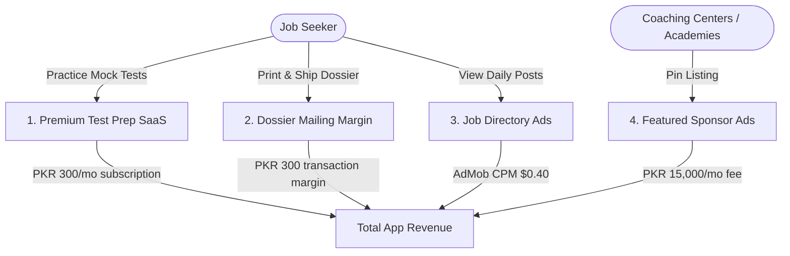

# SarkariNaukri (سرکاری نوکری) — Expected Revenue Model & Projections

This document outlines the detailed expected revenue model, monetization vectors, financial assumptions, and projection scenarios for **SarkariNaukri**, an automated government jobs aggregator, print classified ad scraper, testing agency helper, and dossier mailing coordinator application designed for job seekers in **Pakistan**.

---

## 1. Target Market & Demographics

The government recruitment and public sector testing market in Pakistan is a high-volume, highly active sector:

*   **Primary Target**: Unemployed youth, fresh graduates, and active job seekers across Pakistan preparing for Public Service Commissions (FPSC, PPSC, SPSC, KPPSC, BPSC) and national testing services (NTS, OTS, PTS).
*   **BPS Grading System**: Government jobs are structured under the Basic Pay Scale (BPS-1 to BPS-22). Stability, pensions, and allowances make public sector positions highly coveted, drawing millions of applicants annually.
*   **Unique Pain Point**: Jobs are scattered across hard-to-read scanned newspaper classifieds. Downloading rolls/slips is split across dozens of disjointed agency websites. Applying requires physical dossiers of certified degrees, domicile files, and photos compiled and couriered, alongside cash challans deposited at local banks.
*   **Value Proposition**: SarkariNaukri aggregates listings, parses scans via Vision AI, pre-fills bank challan slips, notifies users matching their profiles, and compiles printed dossier packages for courier delivery.

---

## 2. Monetization Vectors

SarkariNaukri leverages B2C subscriptions for test preparation, courier printing margins, coaching sponsorships, and directory ads.

### A. Premium Test Preparation (B2C SaaS - Primary Stream)
*   **Format**: Monthly B2C subscription giving candidates access to mock exams, past paper PDF archives, video tutorials, and syllabus-based practice quizzes.
*   **Pricing**: 300 PKR / month (approx. $1.08 USD) or 2,000 PKR / year.
*   **Conversion Rate**: Projected at 1.5% of Monthly Active Users (MAU).

### B. Automated Dossier Printing & Mailing Service (B2C Transactions)
*   **Format**: Since government jobs require physically mailing application dossiers, the app partners with couriers (e.g. TCS, Pakistan Post). Users upload digital copies of their documents, and the app prints, compiles, and ships the package.
*   **Monetization Mechanism**: Service margin on printing and courier operations.
*   **Pricing**: 600 PKR flat user price, yielding a **300 PKR net service margin** per order.
*   **Conversion Rate**: Projected at 0.50% of Monthly Active Users (MAU) per month.

### C. Featured Coaching Center Placements
*   **Format**: Local test preparation academies (PPSC/FPSC centers, CSS tutoring platforms) pay to place banner ads or pin their profiles at the top of local directories.
*   **Pricing**: 15,000 PKR / month per placement.
*   **Target Partners**: 10 active coaching center sponsors in Year 1.

### D. Ad-Supported Model (Free Tier)
*   **Format**: Display banners shown on daily scanned newspaper postings. Premium test prep users do not see ads.
*   **Metrics & Assumptions**:
    *   **Pakistan Average CPM**: $0.40 USD (approx. 111 PKR at 278 PKR/USD).
    *   **User Sessions**: Job seekers check postings constantly. Free users average 15 sessions/month, viewing 6 pages per session = 90 ad impressions per free user/month.

---

## 3. Financial Projections (Year 1)

These projections are based on three scenarios of **Monthly Active Users (MAU)** reached by Month 12.
*(Exchange rate used: 1 USD = 278 PKR)*

### Scenario Comparison Table

| Metric | Conservative (Low Growth) | Base Case (Target Growth) | Optimistic (High Growth) |
| :--- | :--- | :--- | :--- |
| **Year 1 Target MAU** | 50,000 | 200,000 | 600,000 |
| **Premium Test Prep Subs (1.0% - 2.0%)**| 500 (1.0%) | 3,000 (1.5%) | 12,000 (2.0%) |
| **Monthly Dossier Shipments (0.4% - 0.6%)**| 200 (0.40%) | 1,000 (0.50%) | 3,600 (0.60%) |
| **Featured Academy Partners** | 3 | 10 | 25 |
| **Monthly Ad Revenue** | $1,782.00 (495,396 PKR)| $7,092.00 (1,971,576 PKR)| $26,460.00 (7,355,880 PKR)|
| **Monthly Test Prep Sub Rev** | $539.57 (150,000 PKR) | $3,237.41 (900,000 PKR) | $12,949.64 (3,600,000 PKR) |
| **Monthly Dossier Shipment Rev** | $215.83 (60,000 PKR)  | $1,079.14 (300,000 PKR)  | $3,884.89 (1,080,000 PKR)  |
| **Monthly Academy Sponsor Rev**| $161.87 (45,000 PKR)  | $539.57 (150,000 PKR)   | $1,348.92 (375,000 PKR)   |
| **Total Expected MRR (PKR)** | **750,396 PKR** | **3,321,576 PKR** | **12,410,880 PKR** |
| **Total Expected MRR (USD equivalent)** | **$2,699.27** | **$11,948.12** | **$44,643.45** |
| **Total Projected ARR (PKR)** | **9,004,752 PKR** | **39,858,912 PKR** | **148,930,560 PKR** |
| **Total Projected ARR (USD equivalent)** | **$32,391.24** | **$143,377.44** | **$535,721.40** |

---

## 4. Key Financial Formulas

$$\text{Total Monthly Revenue (PKR)} = R_{ad} + R_{prep} + R_{dossier} + R_{sponsors}$$

Where:

1.  **Free Ad Revenue ($R_{ad}$)**:
    $$R_{ad} = \left( \text{MAU} \times (1 - \text{PrepConv}) \times \frac{\text{ImpressionsPerUser}}{1000} \right) \times \text{CPM}_{USD} \times \text{Rate}_{PKR/USD}$$
2.  **Premium Test Prep SaaS Revenue ($R_{prep}$)**:
    $$R_{prep} = \text{MAU} \times \text{PrepConv} \times \text{Price}_{PKR}$$
3.  **Dossier Print & Courier Revenue ($R_{dossier}$)**:
    $$R_{dossier} = \text{MAU} \times \text{MailingRate} \times \text{DossierMargin}_{PKR}$$
4.  **Academy Sponsor Placements ($R_{sponsors}$)**:
    $$R_{sponsors} = \text{SponsorCount} \times \text{MonthlyFee}_{PKR}$$

---

## 5. Dynamic Revenue Calculator

To modify these variables, run custom scenarios, or perform real-time sensitivity analysis, open the interactive browser-based dashboard calculator:

👉 **[revenue_calculator.html](file:///c:/Essentials/SmartFarms/AndroidApps/Revenue/revenue_calculator.html)**

*Open the file in any web browser to adjust parameters (e.g. MAU size, prep subscription prices, courier margins) and view updated revenue breakdowns instantly.*
