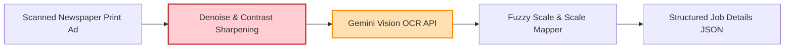

# Technical Details Document: SarkariNaukri (سرکاری نوکری)

This document provides the technical specifications, database schemas, scraper pipelines, AI print advertisement parsing engines, and client-server integration protocols for **SarkariNaukri (سرکاری نوکری)**. The application is built using a **Next.js Web UI** inside an **Android WebView Wrapper** shell, backed by serverless **AWS Lambda** microservices, **PostgreSQL**, **Elasticsearch**, and **Gemini Vision OCR**.

---

## 1. System Architecture & Ad Aggregation Pipeline

SarkariNaukri scrapes digital government portals and processes printed classified ads from daily Urdu and English newspapers (Daily Jang, Express, Dawn), converting them into searchable job listings.

```mermaid
graph TD
    %% Scraping Tier
    subgraph Data Crawlers (AWS Lambda / EventBridge)
        NewsScraper[Newspaper Ad Crawler] -->|Scrape Daily Jang, Express, Dawn| RawImages[Classified Image Ads]
        PortalScraper[Portal Crawler Lambda] -->|Scrape FPSC, PPSC, NTS, OTS| PortalData[Portal Job Tables]
    end

    %% Storage Ingestion
    RawImages --> AdOCR[AI Classified Ad Parser Lambda]
    AdOCR -->|Gemini Vision OCR: Extract BPS & Slabs| CleanedJobJSON[Normalized Job JSON]
    PortalData --> CleanedJobJSON
    
    CleanedJobJSON --> PostgreSQL[(PostgreSQL DB<br/>Jobs & Testing Directories)]
    CleanedJobJSON --> Elasticsearch[(Elasticsearch Sector Index)]

    %% Alerting Tier
    PostgreSQL --> AlertWorker[WhatsApp Alert Worker Lambda]
    AlertWorker -->|Match CNIC Age & Degree| WAAPI[WhatsApp Cloud API]
    WAAPI --> UserWA[User WhatsApp Alerts]

    %% Client Tier
    Client[Next.js WebView Client] <-->|Check Eligibility & Fetch PDF Challans| APIGateway[AWS API Gateway]
    APIGateway <--> DiscoveryAPI[Job Discovery Lambda]
    DiscoveryAPI --> PostgreSQL
    DiscoveryAPI --> Elasticsearch

    style AdOCR fill:#ffe0b2,stroke:#fb8c00,stroke-width:2px
    style AlertWorker fill:#e8f5e9,stroke:#4caf50,stroke-width:2px
    style PostgreSQL fill:#ede7f6,stroke:#5e35b1,stroke-width:2px
```

---

## 2. Database Schema & Data Models

### A. PostgreSQL Schema (Relational Store)
Tracks job postings, testing agencies, BPS grades, salary schedules, and user job eligibility profiles.

```sql
-- Testing Agencies & Commissions (FPSC, PPSC, NTS, OTS, PTS)
CREATE TABLE testing_agencies (
    agency_id VARCHAR(50) PRIMARY KEY, -- e.g. 'fpsc', 'ppsc', 'nts', 'ots', 'pts'
    agency_name VARCHAR(255) NOT NULL,
    official_website VARCHAR(255),
    challan_fee_default NUMERIC(6, 2) DEFAULT 300.00
);

-- Consolidated Job Postings (National & Provincial)
CREATE TABLE job_postings (
    job_id UUID PRIMARY KEY DEFAULT gen_random_uuid(),
    agency_id VARCHAR(50) REFERENCES testing_agencies(agency_id) ON DELETE SET NULL,
    job_title VARCHAR(255) NOT NULL,
    department_name VARCHAR(255) NOT NULL, -- e.g., 'Punjab Police', 'Ministry of Finance'
    bps_grade INT NOT NULL CHECK (bps_grade BETWEEN 1 AND 22), -- Basic Pay Scale
    province VARCHAR(100) NOT NULL, -- 'Punjab', 'Sindh', 'KPK', 'Balochistan', 'Federal'
    minimum_education VARCHAR(100) NOT NULL, -- 'Matric', 'Intermediate', 'Bachelors', 'Masters'
    age_limit_max INT NOT NULL, -- Base maximum age (excluding relaxation)
    age_relaxation_allowed INT DEFAULT 5, -- standard general relaxation is 5 years
    quota_details JSONB, -- e.g. {"minority_percentage": 5, "women_percentage": 15}
    publish_date DATE NOT NULL,
    application_deadline DATE NOT NULL,
    source_newspaper VARCHAR(150), -- e.g. 'Daily Jang'
    ad_image_url VARCHAR(512), -- S3 link to scanned classified
    syllabus_guide TEXT,
    created_at TIMESTAMP WITH TIME ZONE DEFAULT CURRENT_TIMESTAMP,
    updated_at TIMESTAMP WITH TIME ZONE DEFAULT CURRENT_TIMESTAMP
);

-- Basic Pay Scale (BPS) Salary & Allowances Index
CREATE TABLE bps_salary_index (
    bps_grade INT PRIMARY KEY CHECK (bps_grade BETWEEN 1 AND 22),
    basic_pay_min NUMERIC(10, 2) NOT NULL,
    basic_pay_max NUMERIC(10, 2) NOT NULL,
    house_rent_allowance NUMERIC(10, 2) NOT NULL,
    medical_allowance NUMERIC(10, 2) NOT NULL,
    ad_hoc_relief NUMERIC(10, 2) NOT NULL
);

-- User Eligibility Profiles (for automated matching)
CREATE TABLE user_job_profiles (
    profile_id UUID PRIMARY KEY DEFAULT gen_random_uuid(),
    user_id UUID UNIQUE NOT NULL,
    date_of_birth DATE NOT NULL,
    gender VARCHAR(10) CHECK (gender IN ('male', 'female', 'transgender')),
    highest_degree VARCHAR(100) NOT NULL, -- e.g. 'Bachelors'
    degree_major VARCHAR(150) NOT NULL, -- e.g. 'Computer Science'
    domicile_district VARCHAR(150) NOT NULL, -- e.g. 'Lahore'
    domicile_province VARCHAR(100) NOT NULL, -- 'Punjab', etc.
    is_disabled BOOLEAN DEFAULT FALSE,
    is_minority BOOLEAN DEFAULT FALSE,
    updated_at TIMESTAMP WITH TIME ZONE DEFAULT CURRENT_TIMESTAMP
);
```

---

## 3. Print Classified Scraper & Ingestion Worker

Most government jobs are announced via print ads. The system uses crawlers to pull high-resolution images from newspaper digital epaper portals, extracting text with Gemini.

### A. Urdu Print Newspaper Classified Scraper (Python)
```python
import requests
from bs4 import BeautifulSoup
import urllib.request

def scrape_daily_jang_classified_ads():
    # Crawling Daily Jang E-Paper classified jobs page
    url = "https://e.jang.com.pk/classified_jobs.htm"
    response = requests.get(url)
    soup = BeautifulSoup(response.content, 'html.parser')
    
    scraped_ad_links = []
    # Identify image elements matching classified blocks
    for img_tag in soup.find_all('img', class_='classified-ad-block'):
        img_url = img_tag.get('src')
        if img_url:
            full_img_url = "https://e.jang.com.pk/" + img_url
            scraped_ad_links.append(full_img_url)
            
    # Download images to process via the AI Parser Lambda
    for i, link in enumerate(scraped_ad_links):
        urllib.request.urlretrieve(link, f"/tmp/jang_ad_{i}.jpg")
        # Trigger Ingestion Pipeline Lambda on /tmp/jang_ad_{i}.jpg...
```

---

## 4. AI print Classified Ad & Syllabus Parser (Gemini Integration)

The **AI Parser Lambda** sharpens low-quality scanned newspaper print ads, runs OCR, and structures the qualifications and BPS grades using Gemini.



### Gemini Vision Ad Parser System Prompt Template
```text
You are an expert recruitment system auditor. Analyze this Pakistani government job advertisement.

RULES:
1. Identify the job title, department, and Basic Pay Scale grade (BPS-1 to BPS-22).
2. Extract the minimum required education level (e.g. Matric, FA/FSc, BA/BSc, Masters).
3. Find the maximum age limit and identify if provincial or general age relaxation limits are mentioned.
4. Extract quotas for women, minorities, or disabled applicants.
5. Parse the required application method, testing agency (e.g. NTS, PPSC), and the syllabus guide.
6. Output MUST conform strictly to the JSON schema.

JSON Output Schema:
{
  "job_title": "String",
  "department": "String",
  "bps_grade": 1 to 22,
  "education_required": "Matric | Intermediate | Bachelors | Masters",
  "age_limit_max": 0,
  "age_relaxation_years": 0,
  "quotas": {
    "women": false,
    "minorities": false,
    "disabled": false
  },
  "testing_agency": "FPSC | PPSC | SPSC | KPPSC | BPSC | NTS | OTS | PTS | None",
  "syllabus_keywords": ["String"],
  "confidence_score": 0.0 to 1.0
}
```

---

## 5. BPS Grade Salary & Eligibility Evaluator

The BPS Salary Calculator estimates the total take-home pay for government scales (BPS-1 to BPS-22) under current civil servant allowance tables.

### A. Monthly Gross Take-Home Pay Formula
$$\text{Gross Pay} = \text{BPS Minimum Basic Pay} + \text{House Rent Allowance} + \text{Medical Allowance} + \text{Ad-Hoc Relief Allowance}$$

### TypeScript BPS Grade Calculator (`lib/bps-salary-calculator.ts`)
```typescript
interface SalaryBreakdown {
  basicPayMin: number;
  houseRent: number;
  medical: number;
  adHocRelief: number;
  estimatedGrossPayPKR: number;
}

export class BPSSalaryCalculator {
  // Allowance mapping by BPS scale
  private static salaryIndex: Record<number, { min: number; hrPct: number; med: number; reliefPct: number }> = {
    11: { min: 18770, hrPct: 0.30, med: 1500, reliefPct: 0.15 },
    14: { min: 22530, hrPct: 0.30, med: 1500, reliefPct: 0.15 },
    16: { min: 28070, hrPct: 0.45, med: 2000, reliefPct: 0.25 },
    17: { min: 45070, hrPct: 0.45, med: 2500, reliefPct: 0.25 }
  };

  public static calculate(bpsGrade: number): SalaryBreakdown {
    const config = this.salaryIndex[bpsGrade] || { min: 15000, hrPct: 0.30, med: 1500, reliefPct: 0.15 };
    
    const basicPayMin = config.min;
    const houseRent = basicPayMin * config.hrPct;
    const medical = config.med;
    const adHocRelief = basicPayMin * config.reliefPct;
    const estimatedGrossPayPKR = basicPayMin + houseRent + medical + adHocRelief;

    return {
      basicPayMin,
      houseRent,
      medical,
      adHocRelief,
      estimatedGrossPayPKR
    };
  }
}
```

---

## 6. NBP Challan Form Helper

Government testing agencies require deposit slip challans at National Bank of Pakistan (NBP) branches. The **Challan Helper** pre-fills the official NBP Challan 32-A PDF template.

### SBP Challan PDF Renderer (Python PDFkit)
```python
import pdfkit

def generate_nbp_challan_32a_pdf(user_name, cnic, job_details):
    html_content = f"""
    <html>
    <head>
        <style>
            body {{ font-family: Arial, sans-serif; padding: 20px; font-size: 12px; }}
            .challan-header {{ text-align: center; font-weight: bold; }}
            .copy-row {{ display: flex; justify-content: space-between; }}
        </style>
    </head>
    <body>
        <div class="challan-header">NBP CHALLAN FORM 32-A</div>
        <div class="challan-header">Treasury Copy / Bank Copy</div>
        
        <p><b>Depositor Name:</b> {user_name}</p>
        <p><b>Depositor CNIC:</b> {cnic}</p>
        
        <table border="1" cellpadding="4" style="border-collapse: collapse; width: 100%;">
            <tr>
                <th>Head of Account</th>
                <th>Description</th>
                <th>Amount</th>
            </tr>
            <tr>
                <td>C02101-ORGAN OF STATE</td>
                <td>Application Processing Fee for {job_details['job_title']} ({job_details['agency']})</td>
                <td>Rs. {job_details['fee']}/-</td>
            </tr>
        </table>
        
        <p><b>Rupees:</b> Three Hundred Only</p>
        <p>_______________________<br>Cashier Signature</p>
    </body>
    </html>
    """
    
    output_path = f"/tmp/nbp_challan_{cnic}.pdf"
    pdfkit.from_string(html_content, output_path)
    return output_path
```

---

## 7. API Reference Specification

### A. Fetch Jobs Scorecard & Eligibility Matches
`GET /api/jobs/search`

Returns jobs matching the candidate's age and degree qualifications.

#### Query Parameters:
*   `user_id`: Unique identifier (queries user profile database)
*   `bps_grade`: Optional filter (e.g. `17`)
*   `province`: Optional filter (e.g. `Punjab`)

#### Response Payload (200 OK):
```json
{
  "total_active_listings": 1,
  "results": [
    {
      "job_id": "4d112-4462-8b22-83b3b27bcfb9",
      "job_title": "Assistant Director (IT)",
      "department": "Punjab Police",
      "bps_grade": 17,
      "province": "Punjab",
      "minimum_education": "Bachelors",
      "salary_estimate": {
        "bps_grade": 17,
        "basic_pay_min": 45070.00,
        "estimated_gross_pay_pkr": 68837.50
      },
      "deadline": "2026-08-25",
      "eligibility": {
        "is_eligible": true,
        "reason": "Candidate holds a Bachelor's degree and is 28 years old, which fits the age ceiling of 33 years (inclusive of general age relaxation)."
      },
      "challan_download_url": "https://api.sarkarinaukri.pk/challan/generate?user_id=123"
    }
  ]
}
```

### B. Parse Scanned Ad
`POST /api/jobs/parse-ad`

#### Request Payload:
```json
{
  "ad_image_base64": "iVBORw0KGgoAAAAN..."
}
```

#### Response Payload (200 OK):
```json
{
  "job_title": "Assistant Director (IT)",
  "department": "Punjab Police",
  "bps_grade": 17,
  "education_required": "Bachelors",
  "age_limit_max": 30,
  "age_relaxation_years": 5,
  "testing_agency": "PPSC",
  "syllabus_keywords": ["database management", "networking", "software development"],
  "confidence_score": 0.96
}
```
