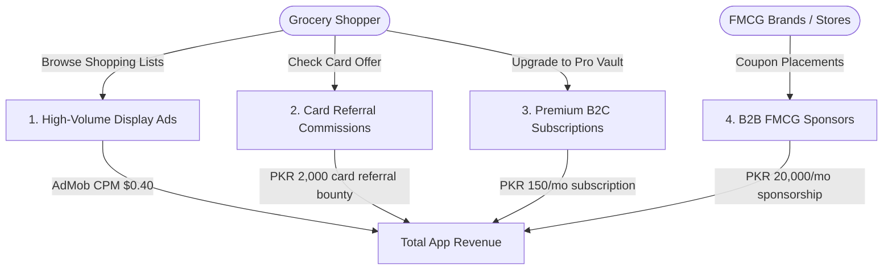

# SastaSauda (سستا سودا) — Expected Revenue Model & Projections

This document outlines the detailed expected revenue model, monetization vectors, financial assumptions, and projection scenarios for **SastaSauda**, a crowdsourced monthly grocery basket price comparison, FBR receipt OCR auditor, shrinkflation tracker, and bank card discount optimizer application designed for households in **Pakistan**.

---

## 1. Target Market & Demographics

Double-digit inflation in Pakistan has placed massive pressure on household monthly budgets:

*   **Primary Target**: Middle to upper-middle-class urban grocery shoppers and homemakers responsible for monthly grocery procurement in major cities (Lahore, Karachi, Islamabad/Rawalpindi, Faisalabad).
*   **Pricing Discrepancies**: Identical branded items (cooking oil, tea, detergent, milk, baby formula) vary widely between discount networks (Imtiaz, Save Mart, Chase Up) and premium marts (Alfatah, Carrefour, Jalal Sons).
*   **Value Proposition**: SastaSauda optimizes the monthly list, applies active credit/debit card deals from the shopper's wallet, warns of shrinkflation cost-per-gram shifts, and audits FBR receipt sales tax to find the absolute cheapest store.

---

## 2. Monetization Vectors

SastaSauda operates on an ad-supported B2C utility model. Free users generate display ad impressions during budgeting and shopping sessions, with premium upgrades for card discounts, brand coupons, and cost calculators.

### A. Ad-Supported Model (Free Tier)
*   **Format**: Highly active display banner and interstitial ads shown during list building, shelf audits, and receipt uploads. Pro subscribers do not see ads.
*   **Metrics & Assumptions**:
    *   **Pakistan Average CPM**: $0.40 USD (approx. 111 PKR at 278 PKR/USD).
    *   **User Sessions**: Users actively checking grocery items look at screens repeatedly. Free users average 10 sessions/month, viewing 8 pages per session = 80 ad impressions per free user/month.

### B. Credit Card Affiliate Referrals (B2B Transaction - Lead Gen)
*   **Format**: The app's wallet optimizer calculates how much extra a shopper could save on their specific basket if they possessed a partner credit/debit card (e.g. Silkbank, Bank Alfalah, HBL).
*   **Monetization Mechanism**: Flat lead bounty paid by the banking partner for each completed card approval.
*   **Pricing**: 2,000 PKR approved card referral bounty.
*   **Conversion Rate**: Projected at 0.15% of Monthly Active Users (MAU) per month.

### C. SastaSauda Pro (Premium B2C Subscription)
*   **Format**: Premium subscription unlocking advanced budgeting and audit features.
*   **Pro Features**:
    *   **Historical Shrinkflation Log**: Track product packaging size history to see cost-per-gram shifts.
    *   **FBR Sales Tax Auditor**: Automatically checks if scanned thermal receipts applied correct GST rates.
    *   **Price Drop Alert Watchlist**: Push notifications when favorite products hit deal pricing in local marts.
*   **Pricing**: 150 PKR / month (approx. $0.54 USD) or 1,000 PKR / year.
*   **Conversion Rate**: Projected at 1.0% of Monthly Active Users (MAU).

### D. FMCG Brand Sponsored Placements (B2B Sponsors)
*   **Format**: Fast-Moving Consumer Goods (FMCG) brands (e.g. Unilever, P&G, Tapal, Dalda) pay to sponsor alternative recommendations, highlight discounts, or place coupons inside shopping lists.
*   **Monetization Mechanism**: Recurrent monthly placement fee per slot.
*   **Pricing**: 20,000 PKR / month per brand sponsor.
*   **Target Partners**: 15 active sponsors in Year 1.

---

## 3. Financial Projections (Year 1)

These projections are based on three scenarios of **Monthly Active Users (MAU)** reached by Month 12.
*(Exchange rate used: 1 USD = 278 PKR)*

### Scenario Comparison Table

| Metric | Conservative (Low Growth) | Base Case (Target Growth) | Optimistic (High Growth) |
| :--- | :--- | :--- | :--- |
| **Year 1 Target MAU** | 30,000 | 100,000 | 300,000 |
| **Pro Subscribers (1.0% - 1.2%)**| 300 (1.0%) | 1,000 (1.0%) | 3,600 (1.2%) |
| **Approved Card Referrals (0.1% - 0.2%)**| 30 (0.10%) | 150 (0.15%) | 600 (0.20%) |
| **B2B FMCG Brand Sponsors** | 5 | 15 | 35 |
| **Monthly Ad Revenue** | $950.40 (264,211 PKR) | $3,168.00 (880,704 PKR) | $10,670.40 (2,966,371 PKR)|
| **Monthly Card Referral Rev** | $215.83 (60,000 PKR)  | $1,079.14 (300,000 PKR)  | $4,316.55 (1,200,000 PKR) |
| **Monthly FMCG Brand Sponsor Rev**| $359.71 (100,000 PKR) | $1,079.14 (300,000 PKR)  | $2,517.99 (700,000 PKR)  |
| **Monthly Pro Subscription Rev** | $161.87 (45,000 PKR)  | $539.57 (150,000 PKR)   | $1,942.45 (540,000 PKR)  |
| **Total Expected MRR (PKR)** | **469,211 PKR** | **1,630,704 PKR** | **5,406,371 PKR** |
| **Total Expected MRR (USD equivalent)** | **$1,687.81** | **$5,865.85** | **$19,447.39** |
| **Total Projected ARR (PKR)** | **5,630,532 PKR** | **19,568,448 PKR** | **64,876,452 PKR** |
| **Total Projected ARR (USD equivalent)** | **$20,253.72** | **$70,390.20** | **$233,368.68** |

---

## 4. Key Financial Formulas

$$\text{Total Monthly Revenue (PKR)} = R_{ad} + R_{cards} + R_{fmcg} + R_{pro}$$

Where:

1.  **Free Ad Revenue ($R_{ad}$)**:
    $$R_{ad} = \left( \text{MAU} \times (1 - \text{ProConv}) \times \frac{\text{ImpressionsPerUser}}{1000} \right) \times \text{CPM}_{USD} \times \text{Rate}_{PKR/USD}$$
2.  **Credit Card Referral Revenue ($R_{cards}$)**:
    $$R_{cards} = \text{MAU} \times \text{ApprovalRate} \times \text{LeadBounty}_{PKR}$$
3.  **FMCG Brand Placements ($R_{fmcg}$)**:
    $$R_{fmcg} = \text{SponsorCount} \times \text{MonthlySponsorship}_{PKR}$$
4.  **Premium Pro Subscriptions ($R_{pro}$)**:
    $$R_{pro} = \text{MAU} \times \text{ProConv} \times \text{Price}_{PKR}$$

---

## 5. Dynamic Revenue Calculator

To modify these variables, run custom scenarios, or perform real-time sensitivity analysis, open the interactive browser-based dashboard calculator:

👉 **[revenue_calculator.html](file:///c:/Essentials/SmartFarms/AndroidApps/Revenue/revenue_calculator.html)**

*Open the file in any web browser to adjust parameters (e.g. MAU size, approval rates, brand placement slots) and view updated revenue breakdowns instantly.*
