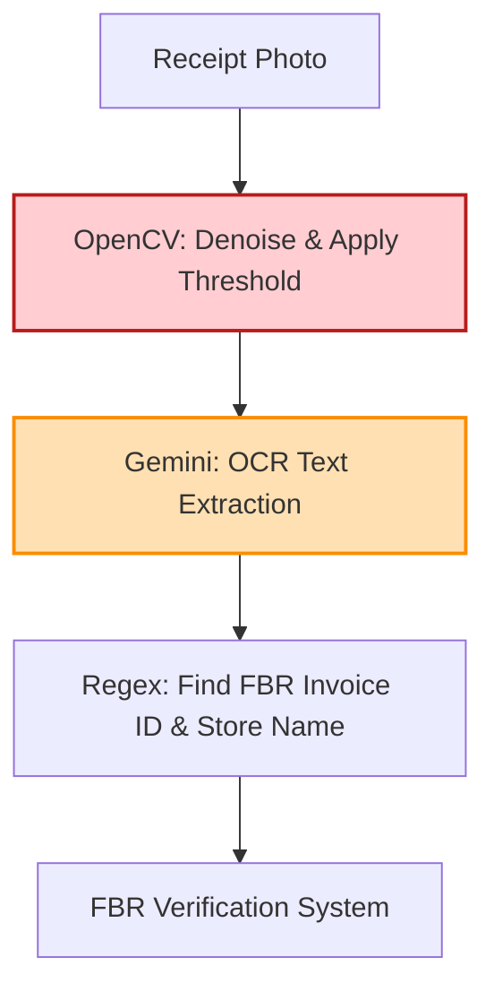

# Technical Details Document: SastaSauda (سستا سودا)

This document provides the technical specifications, database schemas, scraper designs, AI receipt parsing engines, and client-server integration protocols for **SastaSauda (سستا سودا)**. The application is built using a **Next.js Web UI** inside an **Android WebView Wrapper** shell, backed by serverless **AWS Lambda** microservices, **PostgreSQL** (with **PostGIS**), **Elasticsearch**, and **Gemini Vision OCR**.

---

## 1. System Architecture & Price Ingestion Pipeline

SastaSauda tracks grocery inflation by combining online grocery web scrapers, crowdsourced FBR receipt OCR data, and automated outlier detection pipelines.

```mermaid
graph TD
    %% Ingestion Sources
    subgraph Data Crawling & Parsing (AWS Lambda)
        MartsScraper[Marts Web Scraper] -->|Crawl Imtiaz, Carrefour, Metro| ScrapedPrices[Scraped Price Matrix]
        ReceiptUpload[User uploads FBR receipt] --> ReceiptLambda[Receipt Parser Lambda]
    end

    %% Receipt Processing Pipeline
    ReceiptLambda --> OpenCV[OpenCV: Denoise & Threshold]
    OpenCV --> Gemini[Gemini Vision: Extract Items, Prices, FBR Inv ID]
    Gemini --> OutlierFilter{Outlier Detector Lambda}
    
    %% Storage
    ScrapedPrices & OutlierFilter -->|Verify +/- 50% Median check| Postgres[(PostgreSQL DB<br/>Grocery Catalog)]
    ScrapedPrices & OutlierFilter --> Elasticsearch[(Elasticsearch Catalog)]

    %% Client Services
    Client[Next.js Client WebView] <-->|Fetch Basket Comparison & Cards| APIGateway[AWS API Gateway]
    APIGateway <--> BasketAPI[Basket Optimizer Lambda]
    BasketAPI --> Postgres
    BasketAPI --> Elasticsearch

    style ReceiptLambda fill:#ffe0b2,stroke:#fb8c00,stroke-width:2px
    style OutlierFilter fill:#ffcdd2,stroke:#b71c1c,stroke-width:2px
    style Postgres fill:#ede7f6,stroke:#5e35b1,stroke-width:2px
```

---

## 2. Database Schema & Data Models

### A. PostgreSQL Schema (Relational Store)
Tracks products, supermarket chains, physical branch coordinates, price histories, shrinkflation events, and bank promotions.

```sql
-- Enable PostGIS extension for spatial queries
CREATE EXTENSION IF NOT EXISTS postgis;

-- Supermarket Chains
CREATE TABLE supermarket_chains (
    chain_id UUID PRIMARY KEY DEFAULT gen_random_uuid(),
    chain_name VARCHAR(150) UNIQUE NOT NULL, -- e.g. 'Imtiaz Super Market', 'Metro Cash & Carry'
    logo_url VARCHAR(512),
    created_at TIMESTAMP WITH TIME ZONE DEFAULT CURRENT_TIMESTAMP
);

-- Physical Store Outlets
CREATE TABLE supermarket_branches (
    branch_id UUID PRIMARY KEY DEFAULT gen_random_uuid(),
    chain_id UUID REFERENCES supermarket_chains(chain_id) ON DELETE CASCADE,
    branch_name VARCHAR(255) NOT NULL, -- e.g. 'Gulshan Branch', 'DHA Phase 6 Branch'
    city VARCHAR(100) NOT NULL,
    latitude NUMERIC(10, 8) NOT NULL,
    longitude NUMERIC(11, 8) NOT NULL,
    geom GEOMETRY(Point, 4326), -- PostGIS Point geometry
    created_at TIMESTAMP WITH TIME ZONE DEFAULT CURRENT_TIMESTAMP
);

-- Master Product Directory (Staples)
CREATE TABLE grocery_products (
    product_id UUID PRIMARY KEY DEFAULT gen_random_uuid(),
    barcode VARCHAR(50) UNIQUE,
    brand_name VARCHAR(150) NOT NULL, -- e.g. 'Dalda', 'Tapal', 'Surf Excel'
    product_name VARCHAR(255) NOT NULL, -- e.g. 'Banaspati Ghee', 'Danedar Tea'
    net_weight_grams NUMERIC(8, 2) NOT NULL, -- Current net weight
    unit_volume_ml NUMERIC(8, 2), -- for liquids (e.g. Olpers milk)
    category VARCHAR(100) NOT NULL, -- 'staple_foods', 'personal_care', 'beverages', etc.
    created_at TIMESTAMP WITH TIME ZONE DEFAULT CURRENT_TIMESTAMP
);

-- Branch-Level Price Matrix
CREATE TABLE product_branch_prices (
    price_id UUID PRIMARY KEY DEFAULT gen_random_uuid(),
    branch_id UUID REFERENCES supermarket_branches(branch_id) ON DELETE CASCADE,
    product_id UUID REFERENCES grocery_products(product_id) ON DELETE CASCADE,
    current_price NUMERIC(8, 2) NOT NULL,
    last_verified DATE DEFAULT CURRENT_DATE,
    CONSTRAINT unique_branch_product UNIQUE (branch_id, product_id)
);

-- Shrinkflation Tracker Log
CREATE TABLE shrinkflation_history (
    log_id UUID PRIMARY KEY DEFAULT gen_random_uuid(),
    product_id UUID REFERENCES grocery_products(product_id) ON DELETE CASCADE,
    old_weight_grams NUMERIC(8, 2) NOT NULL,
    new_weight_grams NUMERIC(8, 2) NOT NULL,
    old_price NUMERIC(8, 2) NOT NULL,
    new_price NUMERIC(8, 2) NOT NULL,
    recorded_date DATE DEFAULT CURRENT_DATE
);
```

---

## 3. Web Scraping & Ingestion Workers

A Python worker pulls prices from online grocery services, while an **Outlier Detector Lambda** flags incorrect or spoofed user receipt submissions.

### A. Python Online Grocer Scraper (Selenium / Request Parser)
```python
import requests
import psycopg2

def scrape_imtiaz_prices(branch_id):
    # Imtiaz online store API endpoint
    api_url = "https://imtiaz.com.pk/api/products/get-all-mrp"
    headers = {
        "Content-Type": "application/json",
        "X-Branch-ID": "branch_identifier_key"
    }
    
    response = requests.post(api_url, headers=headers)
    products_data = response.json().get('data', [])
    
    conn = psycopg2.connect("dbname=sastasauda user=postgres password=secret host=localhost")
    cursor = conn.cursor()
    
    for product in products_data:
        barcode = product.get('barcode')
        price = float(product.get('price', 0.0))
        
        # Look up product_id from database
        cursor.execute("SELECT product_id FROM grocery_products WHERE barcode = %s LIMIT 1;", (barcode,))
        result = cursor.fetchone()
        
        if result:
            product_id = result[0]
            # Upsert price matrix
            cursor.execute("""
                INSERT INTO product_branch_prices (branch_id, product_id, current_price, last_verified)
                VALUES (%s, %s, %s, CURRENT_DATE)
                ON CONFLICT (branch_id, product_id)
                DO UPDATE SET current_price = EXCLUDED.current_price, last_verified = CURRENT_DATE;
            """, (branch_id, product_id, price))
            
    conn.commit()
    cursor.close()
    conn.close()
```

### B. Outlier Detection Rule
To prevent incorrect data entry, submissions are verified against median price tables before the database updates:
```python
def check_price_outlier(median_price, submitted_price):
    # Flag submissions that deviate by more than 50% from the median city price
    deviation = abs(submitted_price - median_price) / median_price
    if deviation > 0.50:
        return True # Outlier flagged (reject/needs review)
    return False # Normal price fluctuation
```

---

## 4. AI FBR Receipt OCR Parser Pipeline

Thermal receipts from large Pakistani supermarkets contain products, prices, and FBR invoice barcodes. The **Receipt Parser Lambda** processes these images using Gemini.



### Gemini Vision Receipt System Prompt Template
```text
You are an expert financial receipt auditor. Analyze this supermarket POS receipt.

RULES:
1. Extract the name of the store chain and the specific branch address.
2. Locate the FBR Invoice Number (FBR INV NO) or POS ID code.
3. Extract each line item showing product description, weight/volume (e.g. 950g), quantity, and unit price.
4. Output MUST conform strictly to the JSON schema.

JSON Output Schema:
{
  "store_name": "String",
  "branch_address": "String",
  "fbr_invoice_number": "String",
  "receipt_items": [
    {
      "description": "Tapal Danedar Tea",
      "weight_grams": 950.00,
      "quantity": 1,
      "total_price_pkr": 1150.00
    }
  ],
  "confidence_score": 0.0 to 1.0
}
```

---

## 5. Shrinkflation & Unit Cost Tracking Engine

The system calculates price-per-gram shifts to reveal when weight reductions are used to mask pricing increases.

### Shrinkflation Calculation Formulas
$$\text{Old Unit Cost} = \frac{\text{Old Price}}{\text{Old Weight (Grams)}}$$
$$\text{New Unit Cost} = \frac{\text{New Price}}{\text{New Weight (Grams)}}$$
$$\text{Shrinkflation Cost Increase \%} = \left( \frac{\text{New Unit Cost} - \text{Old Unit Cost}}{\text{Old Unit Cost}} \right) \times 100$$

### TypeScript Cost Auditor Module (`lib/shrinkflation-auditor.ts`)
```typescript
interface ShrinkflationReport {
  oldUnitCost: number;
  newUnitCost: number;
  effectivePriceHikePercentage: number;
  isShrinkflationDetected: boolean;
}

export class ShrinkflationAuditor {
  public static audit(
    oldWeight: number,
    newWeight: number,
    oldPrice: number,
    newPrice: number
  ): ShrinkflationReport {
    const oldUnitCost = oldPrice / oldWeight;
    const newUnitCost = newPrice / newWeight;
    
    const effectivePriceHikePercentage = ((newUnitCost - oldUnitCost) / oldUnitCost) * 100;
    
    // Flag if weight drops but price remains identical or increases
    const isShrinkflationDetected = newWeight < oldWeight && newPrice >= oldPrice;

    return {
      oldUnitCost,
      newUnitCost,
      effectivePriceHikePercentage,
      isShrinkflationDetected
    };
  }
}
```

---

## 6. Credit Card Stacked Basket Optimizer

The **Basket Optimizer Lambda** calculates total grocery list costs for each store and maps active bank cards to calculate the cheapest checkout option.

```typescript
interface CardPromo {
  bankName: string;
  discountPercentage: number; // e.g. 15 for 15%
  maxCapPKR: number; // maximum limit e.g. 2000
}

interface StoreBasketCost {
  branchId: string;
  branchName: string;
  chainName: string;
  baseBasketCostPKR: number;
  optimalCard: string | null;
  cardSavingsPKR: number;
  finalNetCostPKR: number;
}

export class BasketOptimizer {
  public static calculateOptimalStore(
    baseCosts: { branchId: string; branchName: string; chainName: string; cost: number }[],
    userCards: CardPromo[],
    activePromos: Record<string, CardPromo[]> // maps chainName to bank promos
  ): StoreBasketCost[] {
    
    return baseCosts.map(store => {
      const promos = activePromos[store.chainName] || [];
      // Filter promos matching cards owned by user
      const matchingPromos = promos.filter(promo => 
        userCards.some(card => card.bankName === promo.bankName)
      );

      let optimalCard = null;
      let maxSavings = 0;

      for (const promo of matchingPromos) {
        let savings = store.cost * (promo.discountPercentage / 100);
        if (savings > promo.maxCapPKR) {
          savings = promo.maxCapPKR;
        }

        if (savings > maxSavings) {
          maxSavings = savings;
          optimalCard = promo.bankName;
        }
      }

      const finalNetCostPKR = store.cost - maxSavings;

      return {
        branchId: store.branchId,
        branchName: store.branchName,
        chainName: store.chainName,
        baseBasketCostPKR: store.cost,
        optimalCard,
        cardSavingsPKR: maxSavings,
        finalNetCostPKR
      };
    }).sort((a, b) => a.finalNetCostPKR - b.finalNetCostPKR); // Sort cheapest first
  }
}
```

---

## 7. API Reference Specification

### A. Optimize Grocery Basket Costs
`POST /api/basket/optimize`

Calculates basket costs and matches bank cards to find the cheapest local checkout options.

#### Request Body Payload:
```json
{
  "city": "Karachi",
  "latitude": 24.8138,
  "longitude": 67.0284,
  "basket_items": [
    { "product_id": "9b22-48a803e62061", "quantity": 2 }, -- Dalda Ghee
    { "product_id": "bc22-38a803e72084", "quantity": 1 }  -- Tapal Tea
  ],
  "user_wallet_cards": [
    { "bank_name": "HBL" },
    { "bank_name": "Bank Alfalah" }
  ]
}
```

#### Response Payload (200 OK):
```json
{
  "total_alternatives_compared": 3,
  "results": [
    {
      "branch_id": "branch_dha_phase_6_imtiaz",
      "branch_name": "DHA Phase 6 Branch",
      "chain_name": "Imtiaz Super Market",
      "base_basket_cost_pkr": 3800.00,
      "optimal_card": "Bank Alfalah",
      "card_savings_pkr": 570.00, -- 15% discount applied
      "final_net_cost_pkr": 3230.00,
      "distance_meters": 1200.5
    },
    {
      "branch_id": "branch_clifton_carrefour",
      "branch_name": "Clifton Branch",
      "chain_name": "Carrefour",
      "base_basket_cost_pkr": 3600.00,
      "optimal_card": "HBL",
      "card_savings_pkr": 300.00, -- 10% discount capped at 300 PKR
      "final_net_cost_pkr": 3300.00,
      "distance_meters": 2400.2
    }
  ]
}
```

### B. Upload Crowdsourced Receipt
`POST /api/receipts/upload`

#### Request Payload:
```json
{
  "receipt_image_base64": "iVBORw0KGgoAAAANS..."
}
```

#### Response Payload (200 OK):
```json
{
  "status": "processing",
  "message": "Receipt received. Outliers will be evaluated and price database indexes updated upon verification.",
  "fbr_verification_id_matched": "POS-562919-2026"
}
```
