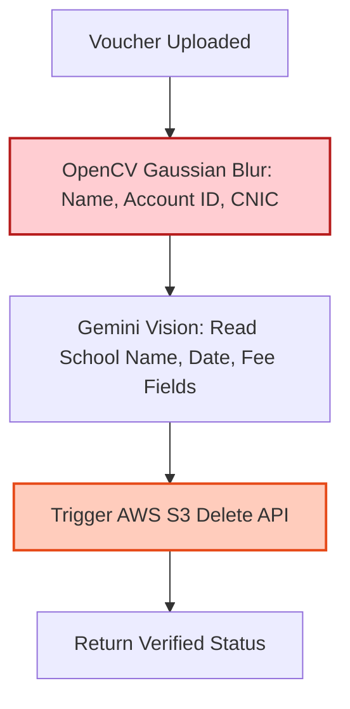

# Technical Details Document: SchoolCheck (اسکول چیک)

This document provides the technical specifications, database schemas, scraper pipelines, AI Roman-Urdu parsing engines, and client-server integration protocols for **SchoolCheck (اسکول چیک)**. The system is built using a **Next.js Web UI** inside an **Android WebView Wrapper** shell, backed by serverless **AWS Lambda** microservices, **PostgreSQL** (with **PostGIS**), **Elasticsearch**, and **Gemini Vision OCR**.

---

## 1. System Architecture & Processing Pipeline

SchoolCheck crawls social networks and maps raw data, calculates total school attendance pricing, and verifies parental status using invoice OCR.

```mermaid
graph TD
    %% Social Scraping
    subgraph Data Crawlers (AWS Lambda)
        FBCrawler[Facebook Parents Group Crawler] -->|Scrape Soul Sisters & Groups| RawSocialText[Raw Discussions]
        MapsCrawler[Google Maps Scraper] -->|Fetch Reviews by Location| RawReviewText[Raw Reviews]
    end

    %% AI Parsing Layer
    RawSocialText & RawReviewText --> NLPParser[AI Roman-Urdu Parser Lambda]
    NLPParser --> DBPostgres[(PostgreSQL DB<br/>PostGIS Spatial)]
    NLPParser --> IndexES[(Elasticsearch Index)]

    %% Verification Pipeline
    UserVoucher[User uploads School Fee Voucher] --> VoucherLambda[Voucher Verification Lambda]
    VoucherLambda --> OpenCV[OpenCV: Blur Student Name/ID]
    OpenCV --> TempS3[Save to Temporary S3]
    TempS3 --> GeminiOCR[Gemini Vision: Read school, date & fees]
    GeminiOCR --> MatchSchool{School Name & Date Match?}
    MatchSchool -->|Yes| SetVerified[Update Parent status: VERIFIED]
    MatchSchool -->|No| SetRejected[Flag Invalid upload]
    SetVerified & SetRejected --> DeleteS3[Delete Image S3]

    %% Client Services
    Client[Next.js Client App] <-->|Fetch Scorecard & Fee Details| APIGateway[AWS API Gateway]
    APIGateway <--> GatewayLambda[School Discovery Lambda]
    GatewayLambda --> DBPostgres
    GatewayLambda --> IndexES

    style NLPParser fill:#ffe0b2,stroke:#fb8c00,stroke-width:2px
    style VoucherLambda fill:#ffcdd2,stroke:#b71c1c,stroke-width:2px
    style DBPostgres fill:#ede7f6,stroke:#5e35b1,stroke-width:2px
    style IndexES fill:#e0f2f1,stroke:#00695c,stroke-width:2px
```

---

## 2. Database Schema & Data Models

### A. PostgreSQL Schema (Spatial Relational Store)
Tracks private schools, campus locations, crowdsourced review scores, verified fee structures, and van route registries.

```sql
-- Enable PostGIS extension for spatial queries
CREATE EXTENSION IF NOT EXISTS postgis;

-- School Networks (e.g. Beaconhouse, City School, Lahore Grammar School)
CREATE TABLE school_networks (
    network_id UUID PRIMARY KEY DEFAULT gen_random_uuid(),
    network_name VARCHAR(150) UNIQUE NOT NULL,
    logo_url VARCHAR(512),
    created_at TIMESTAMP WITH TIME ZONE DEFAULT CURRENT_TIMESTAMP
);

-- Physical Campuses
CREATE TABLE school_campuses (
    campus_id UUID PRIMARY KEY DEFAULT gen_random_uuid(),
    network_id UUID REFERENCES school_networks(network_id) ON DELETE CASCADE,
    campus_name VARCHAR(255) NOT NULL, -- e.g. 'DHA Phase 5 Campus', 'Canal Road Branch'
    address TEXT NOT NULL,
    city VARCHAR(100) NOT NULL, -- 'Karachi', 'Lahore', 'Islamabad'
    curriculum VARCHAR(100) NOT NULL, -- 'O/A-Levels', 'Matric/FSc', 'IB'
    fee_category VARCHAR(50) NOT NULL, -- 'low', 'medium', 'high', 'premium'
    gate_latitude NUMERIC(10, 8) NOT NULL,
    gate_longitude NUMERIC(11, 8) NOT NULL,
    geom GEOMETRY(Point, 4326), -- PostGIS Point geometry for school gate
    created_at TIMESTAMP WITH TIME ZONE DEFAULT CURRENT_TIMESTAMP
);

-- Annual Fee Ledger
CREATE TABLE school_fees (
    fee_id UUID PRIMARY KEY DEFAULT gen_random_uuid(),
    campus_id UUID REFERENCES school_campuses(campus_id) ON DELETE CASCADE,
    grade_level VARCHAR(50) NOT NULL, -- e.g., 'Toddler', 'Grade 5', 'O-Level Year 1'
    base_tuition_monthly NUMERIC(10, 2) NOT NULL,
    registration_fee_annual NUMERIC(10, 2) DEFAULT 0.00,
    resource_fee_annual NUMERIC(10, 2) DEFAULT 0.00,
    lab_fee_annual NUMERIC(10, 2) DEFAULT 0.00,
    exam_fee_estimate NUMERIC(10, 2) DEFAULT 0.00, -- British Council or Board registration fee
    last_verified DATE DEFAULT CURRENT_DATE
);

-- Parent Reviews & Ratings
CREATE TABLE school_reviews (
    review_id UUID PRIMARY KEY DEFAULT gen_random_uuid(),
    campus_id UUID REFERENCES school_campuses(campus_id) ON DELETE CASCADE,
    is_verified_parent BOOLEAN DEFAULT FALSE,
    hidden_fees_score INT CHECK (hidden_fees_score BETWEEN 1 AND 5),
    teacher_stability_score INT CHECK (teacher_stability_score BETWEEN 1 AND 5),
    bullying_management_score INT CHECK (bullying_management_score BETWEEN 1 AND 5),
    security_score INT CHECK (security_score BETWEEN 1 AND 5),
    traffic_score INT CHECK (traffic_score BETWEEN 1 AND 5),
    comment_en TEXT,
    comment_ur TEXT,
    created_at TIMESTAMP WITH TIME ZONE DEFAULT CURRENT_TIMESTAMP
);

-- Crowdsourced School Van Directory
CREATE TABLE school_vans (
    van_id UUID PRIMARY KEY DEFAULT gen_random_uuid(),
    driver_name VARCHAR(150) NOT NULL,
    driver_phone VARCHAR(50) NOT NULL,
    vehicle_type VARCHAR(100) NOT NULL, -- 'Suzuki Carry (Hi-Roof)', 'Toyota Hiace', etc.
    route_polyline GEOMETRY(LineString, 4326), -- Route sequence line geometry
    target_schools UUID[] NOT NULL, -- list of campus_ids serviced
    rating NUMERIC(3, 2) DEFAULT 0.00,
    created_at TIMESTAMP WITH TIME ZONE DEFAULT CURRENT_TIMESTAMP
);
```

---

## 3. Social Media Scraper & AI Roman-Urdu Review Summarizer

To gather reviews, Python scraper scripts crawl parenting groups, while a natural language processing lambda translates Roman-Urdu into structured points.

### A. AI Roman-Urdu Processing (NLP Prompt Design)
Most feedback in Pakistani Facebook parenting groups is written in Roman-Urdu (Urdu written using English characters, e.g., *"Is campus ki management achi hai but teachers bht jaldi change hotay hain"*). 

#### System Prompt Template:
```text
You are an expert educational data scientist. Analyze this review of a private school in Pakistan. It may contain English, Urdu (Nastaliq), or Roman-Urdu.

Review Text: {RAW_REVIEW}

RULES:
1. Translate Roman-Urdu and Urdu phrases to English.
2. Identify mentions of:
   - "teacher_turnover" (e.g. teachers changing mid-term, substitutes).
   - "hidden_fees" (e.g. unexpected resource charges, uniform monopolies).
   - "bullying" (e.g. fights, school safety, cyberbullying, class administration).
   - "traffic" (e.g. parking gridlocks, delays).
3. Generate a concise bilingual bullet summary in English and Urdu.
4. Output MUST conform to the JSON schema.

JSON Output Schema:
{
  "detected_topics": ["teacher_turnover | hidden_fees | bullying | traffic"],
  "sentiment": "positive | negative | neutral",
  "bullet_summary_en": "Consolidated translation summary in English.",
  "bullet_summary_ur": "Consolidated translation summary in Urdu."
}
```

---

## 4. Parent Voucher Verification Pipeline

To receive the "Verified Parent" checkmark, users upload their child's school fee voucher. The system extracts the values and then wipes the records for privacy.



### A. Python OpenCV Privacy Blur Filter
```python
import cv2
import numpy as np

def mask_voucher_details(image_bytes):
    # Decode image
    nparr = np.frombuffer(image_bytes, np.uint8)
    image = cv2.imdecode(nparr, cv2.IMREAD_COLOR)
    
    height, width, _ = image.shape
    
    # Standard Pakistani fee vouchers contain Student Name and Roll Number in top-left
    # Applying Gaussian blur box to mask student identifiers
    x1, y1 = 0, 0
    x2, y2 = int(width * 0.45), int(height * 0.25)
    
    sub_img = image[y1:y2, x1:x2]
    # Apply heavy blur
    blurred_sub_img = cv2.GaussianBlur(sub_img, (51, 51), 0)
    image[y1:y2, x1:x2] = blurred_sub_img
    
    # Save back to byte format
    _, encoded_img = cv2.imencode('.jpg', image)
    return encoded_img.tobytes()
```

---

## 5. Annual Attendance Cost Estimator Engine

Tuition fee structures in Pakistan are seasonal. To prevent surprises, the **Annual Attendance Cost Estimator** calculates full-year cash requirements including annual charges, vendor costs, and exam board fees.

### Cost Calculation Formulas
$$\text{Tuition Cost} = \text{Base Monthly Tuition} \times 12 \text{ Months}$$
$$\text{Exam Fees} = \text{O/A Level Exam Fee Per Subject} \times \text{No. of Subjects} \quad (\text{if Cambridge Curriculum})$$
$$\text{Total Annual Cost} = \text{Tuition Cost} + \text{Registration Fee} + \text{Resource Fee} + \text{Uniform/Books} + \text{Exam Fees} + \text{Transport}$$

### Calculator Implementation (Next.js / TypeScript)
```typescript
interface FeeBreakdown {
  tuitionYearly: number;
  totalAnnualFixed: number;
  examRegistrationEstimate: number;
  booksAndUniforms: number;
  grandTotalYearly: number;
}

export class AnnualFeeCalculator {
  public static calculate(
    baseMonthlyTuition: number,
    annualRegistration: number = 0,
    annualResourceCharge: number = 0,
    curriculum: 'O/A-Levels' | 'Matric/FSc' | 'IB',
    examSubjectsCount: number = 3 // Standard O/A level subjects per cycle
  ): FeeBreakdown {
    
    const tuitionYearly = baseMonthlyTuition * 12;
    const totalAnnualFixed = annualRegistration + annualResourceCharge;
    
    // Estimates based on British Council Pakistan fee structures (approx 28,000 PKR per Cambridge exam)
    let examRegistrationEstimate = 0;
    if (curriculum === 'O/A-Levels') {
      examRegistrationEstimate = examSubjectsCount * 28000;
    } else if (curriculum === 'IB') {
      examRegistrationEstimate = 120000; // IB standard registration
    } else {
      examRegistrationEstimate = 8000; // Local board registration (Matric/FSc)
    }

    // Standard uniform/books vendor monopoly cost estimate
    const booksAndUniforms = baseMonthlyTuition * 1.5; 

    const grandTotalYearly = tuitionYearly + totalAnnualFixed + examRegistrationEstimate + booksAndUniforms;

    return {
      tuitionYearly,
      totalAnnualFixed,
      examRegistrationEstimate,
      booksAndUniforms,
      grandTotalYearly
    };
  }
}
```

---

## 6. Geospatial Queries: School Van Route Matching

SchoolCheck matches a student's home locality to active school van routes using PostGIS line-string intersections.

```sql
-- Find van routes passing within 1km of user home coordinate and targeting target school
SELECT 
    v.driver_name,
    v.driver_phone,
    v.vehicle_type,
    v.rating,
    ST_Distance(v.route_polyline::geography, u.geom::geography) AS distance_meters
FROM school_vans v
CROSS JOIN (
    SELECT ST_SetSRID(ST_MakePoint(74.3587, 31.5204), 4326) AS geom -- user home coordinate (Lahore)
) u
WHERE 
    ST_DWithin(v.route_polyline::geography, u.geom::geography, 1000) -- Route passes within 1km of home
    AND :target_school_id = ANY(v.target_schools) -- Van services the target school campus
ORDER BY v.rating DESC;
```

---

## 7. API Reference Specification

### A. Fetch School Scorecard
`GET /api/schools/scorecard`

#### Query Parameters:
*   `campus_id`: Unique identifier (e.g. `d3b07384-d113-4464-9b22-48a803e62061`)

#### Response Payload (200 OK):
```json
{
  "campus_id": "d3b07384-d113-4464-9b22-48a803e62061",
  "campus_name": "Lahore Grammar School - Canal Road Campus",
  "scorecard": {
    "hidden_fees": 2.3, -- low score indicates high hidden costs
    "teacher_stability": 4.1,
    "bullying_management": 3.8,
    "security": 4.5,
    "traffic_impact": 1.2 -- low score indicates severe traffic gridlocks
  },
  "annual_calculator_defaults": {
    "base_tuition_monthly": 32000.00,
    "registration_fee_annual": 45000.00,
    "resource_fee_annual": 15000.00,
    "curriculum": "O/A-Levels"
  },
  "pros_cons": {
    "pros": [
      "Experienced Cambridge faculty",
      "Robust playground safety protocols"
    ],
    "cons": [
      "Canal Road access causes 40-minute traffic gridlock during home-time",
      "Forces uniform purchases from a single partner vendor"
    ]
  }
}
```

### B. Verify Parent Voucher
`POST /api/parents/verify-voucher`

#### Request Payload:
```json
{
  "campus_id": "d3b07384-d113-4464-9b22-48a803e62061",
  "voucher_image_base64": "/9j/4AAQSkZJRgABAQE..."
}
```

#### Response Payload (200 OK):
```json
{
  "status": "processing",
  "message": "Voucher received. The image will be processed for masking and verified shortly. The uploaded file is queued for immediate deletion.",
  "submission_id": "sub_48a803e62061"
}
```
