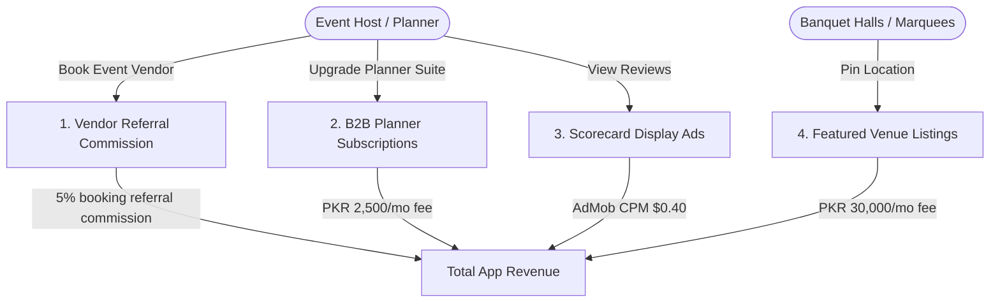

# ShadiVenue (شادی وینیو) — Expected Revenue Model & Projections

This document outlines the detailed expected revenue model, monetization vectors, financial assumptions, and projection scenarios for **ShadiVenue**, an independent wedding venue review aggregator, "Reality Check Scorecard" lookup, and vendor lead booking commission application designed for hosts in **Pakistan**.

---

## 1. Target Market & Demographics

The wedding industry in Pakistan is a multi-billion rupee sector with immense cultural priority:

*   **Primary Target**: Hosts (families planning weddings), corporate event managers, and professional wedding coordinators in major urban hubs (Lahore, Karachi, Islamabad/Rawalpindi).
*   **Market Environment**: High-spend retail market. The average cost of a wedding venue booking in Pakistan ranges from 300,000 PKR (local halls) to over 3,000,000 PKR (luxury marquees/hotel ballrooms).
*   **Unique Pain Point**: Venue owners frequently hide operational defects (e.g., poor summer air-conditioning cooling, generator pricing markups, decorator monopoly fines) which cause huge frustration during live events.
*   **Value Proposition**: ShadiVenue crawls public logs and crowdsources verified host invoice details to present honest sub-ratings (AC Cooling, Generator policy, Curfew violations) before users book.

---

## 2. Monetization Vectors

ShadiVenue operates on a transaction commission and B2B SaaS model, focusing on vendor lead fees, featured venue slots, and event planner software.

### A. Event Vendor Booking Commissions (Primary Stream)
*   **Format**: The app lists allied event vendors (catering networks, photographers, stages, decorators, makeup artists, DJs). Users select and book these verified partners directly.
*   **Monetization Mechanism**: ShadiVenue collects an affiliate commission on the final vendor booking contract.
*   **Metrics & Assumptions**:
    *   **Commission Rate**: 5% of the total vendor contract value.
    *   **Average Vendor Contract Value**: 150,000 PKR (reflecting standard photography or decorator bookings).
    *   **Booking Conversion Rate**: Projected at 0.25% of Monthly Active Users (MAU) per month.

### B. Event Planner Premium Suite (B2B SaaS)
*   **Format**: A premium SaaS subscription designed for professional wedding planners and event management coordinators.
*   **Planner Features**:
    *   **Client Budgeting Portal**: Lock-in venue quotes and generate live cost estimates.
    *   **PDF Cost Summary Generator**: Instantly export side-by-side venue price comparisons for clients.
    *   **Bulk Price Requests**: Send RFP requests to multiple marquees simultaneously.
*   **Pricing**: 2,500 PKR / month (approx. $8.99 USD) or 20,000 PKR / year.
*   **Conversion Rate**: Projected at 1.5% of Monthly Active Users (MAU).

### C. Featured Venue Partnerships
*   **Format**: Banquet halls, farmhouses, and marquees pay to be highlighted at the top of locality filters or pinned as "Reality Verified".
*   **Monetization Mechanism**: Flat monthly advertising fee per featured branch location.
*   **Metrics & Assumptions**:
    *   **Monthly Featured Fee**: 30,000 PKR / month.
    *   **Target Partners**: 20 active venue sponsors in Year 1.

### D. Ad-Supported Model (Free Tier)
*   **Format**: Standard display banners shown on scorecard details. B2B planners do not see ads.
*   **Metrics & Assumptions**:
    *   **Pakistan Average CPM**: $0.40 USD (approx. 111 PKR at 278 PKR/USD).
    *   **User Sessions**: Average of 4 sessions/month per free user (concentrated around event planning stages), viewing 5 pages per session = 20 ad impressions per free user/month.

---

## 3. Financial Projections (Year 1)

These projections are based on three scenarios of **Monthly Active Users (MAU)** reached by Month 12.
*(Exchange rate used: 1 USD = 278 PKR)*

### Scenario Comparison Table

| Metric | Conservative (Low Growth) | Base Case (Target Growth) | Optimistic (High Growth) |
| :--- | :--- | :--- | :--- |
| **Year 1 Target MAU** | 5,000 | 20,000 | 60,000 |
| **B2B Planner Subscribers (1.0% - 2.0%)**| 50 (1.0%) | 300 (1.5%) | 1,200 (2.0%) |
| **Monthly Vendor Bookings (0.20% - 0.30%)**| 10 (0.20%) | 50 (0.25%) | 180 (0.30%) |
| **Featured Venue Partners** | 5 | 20 | 50 |
| **Monthly Ad Revenue** | $39.60 (11,009 PKR) | $157.60 (43,813 PKR) | $588.00 (163,464 PKR) |
| **Monthly B2B Planner SaaS Rev** | $449.64 (125,000 PKR) | $2,697.84 (750,000 PKR) | $10,791.37 (3,000,000 PKR) |
| **Monthly Vendor Commissions** | $269.78 (75,000 PKR) | $1,348.92 (375,000 PKR) | $4,856.12 (1,350,000 PKR) |
| **Monthly Featured Venue Revenue**| $539.57 (150,000 PKR) | $2,158.27 (600,000 PKR) | $5,395.68 (1,500,000 PKR) |
| **Total Expected MRR (PKR)** | **361,009 PKR** | **1,768,813 PKR** | **6,013,464 PKR** |
| **Total Expected MRR (USD equivalent)** | **$1,298.59** | **$6,362.63** | **$21,631.17** |
| **Total Projected ARR (PKR)** | **4,332,108 PKR** | **21,225,756 PKR** | **72,161,568 PKR** |
| **Total Projected ARR (USD equivalent)** | **$15,583.08** | **$76,351.56** | **$259,574.04** |

---

## 4. Key Financial Formulas

$$\text{Total Monthly Revenue (PKR)} = R_{ad} + R_{planner} + R_{vendor} + R_{featured}$$

Where:

1.  **Free Ad Revenue ($R_{ad}$)**:
    $$R_{ad} = \left( \text{MAU} \times (1 - \text{PlannerConv}) \times \frac{\text{ImpressionsPerUser}}{1000} \right) \times \text{CPM}_{USD} \times \text{Rate}_{PKR/USD}$$
2.  **B2B Planner SaaS Revenue ($R_{planner}$)**:
    $$R_{planner} = \text{MAU} \times \text{PlannerConv} \times \text{Price}_{PKR}$$
3.  **Vendor Booking Referral Commission ($R_{vendor}$)**:
    $$R_{vendor} = \text{MAU} \times \text{BookingRate} \times \text{AverageBasket}_{PKR} \times \text{CommissionRate}$$
4.  **Featured Venue Revenue ($R_{featured}$)**:
    $$R_{featured} = \text{SponsorCount} \times \text{MonthlyFee}_{PKR}$$

---

## 5. Dynamic Revenue Calculator

To modify these variables, run custom scenarios, or perform real-time sensitivity analysis, open the interactive browser-based dashboard calculator:

👉 **[revenue_calculator.html](file:///c:/Essentials/SmartFarms/AndroidApps/Revenue/revenue_calculator.html)**

*Open the file in any web browser to adjust parameters (e.g. MAU size, vendor commission rates, planner tool subscription prices) and view updated revenue breakdowns instantly.*
