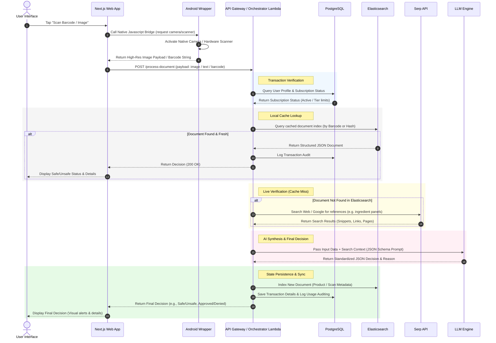
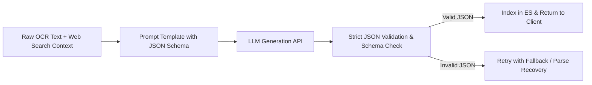

# Technical Architecture Document: Document Processing, AI Decision Making, & Hybrid Data Storage (Next.js & Android Wrapper Edition)

This document outlines the technical architecture for the suite of applications. The system employs a hybrid client architecture, featuring a premium web-based UI developed using **Next.js** running inside a lightweight native **Android WebView Wrapper** shell. The backend employs a hybrid storage model utilizing **Elasticsearch** for full-text/semantic document caching and **PostgreSQL** for relational, transactional data. Core processing is handled serverlessly via **AWS Lambda**, leveraging **Serp API** for real-time web searches and **Large Language Models (LLMs)** for structured data extraction and final decision intelligence.

---

## 1. System Architecture Overview

The system follows a modern, decoupled pattern separating UI presentation, native wrapping, serverless compute, and dual-layer data storage.

```mermaid
graph TD
    %% Client Tier
    subgraph Client Tier (Hybrid Mobile App)
        AndroidWrapper[Android Native Wrapper<br/>Kotlin WebView Shell / Capacitor] <-->|JavaScript Bridge| NextJS[Next.js Web UI App<br/>HTML5 / JS / CSS]
    end

    %% API Gateway
    NextJS <-->|HTTPS / JSON| APIGateway[AWS API Gateway]

    %% Compute Layer (AWS Lambda)
    subgraph Compute Layer (Serverless Backend)
        APIGateway <--> GatewayLambda[Gateway / Orchestrator Lambda]
        GatewayLambda <--> OCRLambda[OCR & Image Parser Lambda]
        GatewayLambda <--> SearchLambda[Search & Scraping Lambda]
        GatewayLambda <--> DecisionLambda[LLM Decision Engine Lambda]
    end

    %% Data Layer
    subgraph Data & Storage Layer
        Postgres[(PostgreSQL DB<br/>Transactional)] <--> GatewayLambda
        ElasticSearch[(Elasticsearch Cluster<br/>Document Store)] <--> GatewayLambda
    end

    %% External APIs
    subgraph External Intelligence & Web
        SerpAPI[Serp API<br/>Google / Web Search] <--> SearchLambda
        LLM[LLM API<br/>Gemini Pro / Flash] <--> DecisionLambda
    end

    %% Styling
    style AndroidWrapper fill:#e1f5fe,stroke:#0288d1,stroke-width:2px
    style NextJS fill:#d4ebf2,stroke:#0d5c75,stroke-width:2px
    style APIGateway fill:#ffe0b2,stroke:#fb8c00,stroke-width:2px
    style GatewayLambda fill:#e8f5e9,stroke:#4caf50,stroke-width:2px
    style OCRLambda fill:#e8f5e9,stroke:#4caf50,stroke-width:1px
    style SearchLambda fill:#e8f5e9,stroke:#4caf50,stroke-width:1px
    style DecisionLambda fill:#e8f5e9,stroke:#4caf50,stroke-width:1px
    style Postgres fill:#ede7f6,stroke:#5e35b1,stroke-width:2px
    style ElasticSearch fill:#e0f2f1,stroke:#00695c,stroke-width:2px
    style SerpAPI fill:#eceff1,stroke:#37474f,stroke-width:2px
    style LLM fill:#fce4ec,stroke:#c2185b,stroke-width:2px
```

### Key Architectural Decisions
1. **Next.js & WebView Wrapper**: To optimize UI development and ensure cross-platform feasibility, Next.js handles the front-end layout, visual states, and API calls. The Android app acts purely as a shell wrapper containing a WebKit WebView with custom hooks into native device sensors (such as the camera or barcode scanner).
2. **Serverless Backend Orchestration**: AWS Lambda handles compute workloads to eliminate idle-server costs. Because mobile apps exhibit bursty traffic patterns, Lambda provides instant scaling.
3. **Hybrid Storage Topology**: 
   - **PostgreSQL**: Serves as the single source of truth for transactional state (users, payments, subscription validation, logs, and billing).
   - **Elasticsearch**: Functions as the document store, managing unstructured/semi-structured data (scraped product ingredient profiles, tenders, indexable web pages) and supporting rapid full-text, fuzzy, and vector searches.
4. **Decoupled Processing**: Complex workloads, such as image pre-processing (OCR) and deep web queries (Serp API), are isolated into dedicated Lambda functions to prevent blocking the main Gateway orchestrator and to optimize execution timeouts.

---

## 2. Sequence Flow: Document Scan & Decision Process

Below is the end-to-end execution flow when a user scans a document (e.g., an ingredient label, tender, or barcode) or performs a search that requires real-time AI decision-making.



---

## 3. Client Tier: Next.js & Native Android Wrapper Architecture

The client application separates UI composition (Next.js) from the hardware/operating system integration (Android Wrapper).

### A. Next.js Web Application
The UI is built using Next.js to provide a fast, responsive, and responsive interface using modern design components.

*   **Responsive Styling**: Managed using vanilla CSS to enable premium layouts (glassmorphism cards, interactive progress meters, dark-mode themes, and hardware-accelerated animations).
*   **Routing**: Utilizes client-side routing (`next/router` or App Router pages) to ensure instant page transitions within the WebView without full-page reloads.
*   **State Management**: Standard hooks (e.g., React Context or Zustand) store active scan states, scanned history caching (for offline reads), user profiles, and active allergen filters.
*   **Camera Fallback UI**: If native integration isn't available (e.g., testing in a web browser), Next.js includes a responsive HTML5 camera stream input (`navigator.mediaDevices.getUserMedia`) or file upload inputs.

### B. Android WebView Wrapper
The Android wrapper is a thin native shell that hosts the Next.js application using a WebKit WebView.

*   **WebView Configuration**:
    *   `setJavaScriptEnabled(true)` to run the Next.js application logic.
    *   `setDomStorageEnabled(true)` to support LocalStorage caching inside the app.
    *   `setMediaPlaybackRequiresUserGesture(false)` to enable camera streams without visual prompts.
*   **Native Permissions Handler**: Intercepts camera, geolocation, and local storage access requests from the WebUI and prompts native Android permission dialogs (`android.permission.CAMERA`, etc.).
*   **JavaScript Interface Bridge**: Integrates Kotlin code with the Next.js client-side runtime to speed up scanning:
    ```kotlin
    // Android Custom JavaScript Interface
    class WebAppInterface(private val mContext: Context, private val webView: WebView) {
        
        @JavascriptInterface
        fun startBarcodeScanner() {
            // Trigger native camera barcode scanner (e.g., ML Kit Barcode Scanning)
            val intent = Intent(mContext, NativeScannerActivity::class.java)
            (mContext as Activity).startActivityForResult(intent, BARCODE_REQUEST_CODE)
        }

        // Return barcode result back to Next.js
        fun sendResultToWeb(barcode: String) {
            webView.post {
                webView.evaluateJavascript("window.onBarcodeScanned('$barcode');", null)
            }
        }
    }
    ```

### C. Deployment & Hosting Options
The Next.js web bundle is integrated into the native wrapper using one of two models:

1.  **Cloud-Hosted URL (Recommended for Rapid Updates)**:
    *   The Next.js app is deployed to Vercel, AWS Amplify, or S3/CloudFront.
    *   The Android WebView points directly to the public SSL URL (e.g., `https://app.allergyguard.com`).
    *   **Pros**: Instant deployments and bug fixes bypass the Google Play Store review cycle.
    *   **Cons**: Requires internet connectivity for initial loads; mitigated using Service Worker caches.
2.  **Locally-Bundled Single Page App (Recommended for Offline-First)**:
    *   The Next.js app is statically exported using `next export` / `output: 'export'`.
    *   The build artifacts (HTML, CSS, JS) are packaged directly into the Android app's `assets/` directory using **Capacitor** or **Cordova**.
    *   The WebView loads the app locally via `file:///android_asset/` or a local HTTP server container.
    *   **Pros**: Works instantly offline, near-zero load times.
    *   **Cons**: UI changes require a complete APK compilation and app store update.

---

## 4. Data & Storage Tier

### A. PostgreSQL (Transactional Data)
PostgreSQL handles standard relational, ACID-compliant operations. The schema design focuses on user accounts, API rate limits, subscriptions, and transaction histories.

```sql
-- User Profiles
CREATE TABLE users (
    user_id UUID PRIMARY KEY DEFAULT gen_random_uuid(),
    email VARCHAR(255) UNIQUE NOT NULL,
    password_hash VARCHAR(255) NOT NULL,
    subscription_tier VARCHAR(50) DEFAULT 'free', -- 'free', 'pro_monthly', 'pro_annual'
    created_at TIMESTAMP WITH TIME ZONE DEFAULT CURRENT_TIMESTAMP,
    updated_at TIMESTAMP WITH TIME ZONE DEFAULT CURRENT_TIMESTAMP
);

-- Transaction logs for audit and monetization counting
CREATE TABLE transactions (
    transaction_id UUID PRIMARY KEY DEFAULT gen_random_uuid(),
    user_id UUID REFERENCES users(user_id) ON DELETE CASCADE,
    app_id VARCHAR(100) NOT NULL, -- e.g., 'allergen_verifier', 'halal_check'
    action_type VARCHAR(100) NOT NULL, -- e.g., 'scan_ocr', 'barcode_lookup'
    tokens_consumed INTEGER DEFAULT 0,
    cost_incurred NUMERIC(8, 5) DEFAULT 0.00000,
    status VARCHAR(50) NOT NULL, -- 'success', 'failed'
    created_at TIMESTAMP WITH TIME ZONE DEFAULT CURRENT_TIMESTAMP
);

-- Saved local settings (e.g., user-defined allergens or categories)
CREATE TABLE user_profiles (
    profile_id UUID PRIMARY KEY DEFAULT gen_random_uuid(),
    user_id UUID REFERENCES users(user_id) ON DELETE CASCADE,
    allergen_settings JSONB NOT NULL, -- e.g., {"milk": "severe", "soy": "minor"}
    updated_at TIMESTAMP WITH TIME ZONE DEFAULT CURRENT_TIMESTAMP
);
```

### B. Elasticsearch (Document & Cache Index)
Elasticsearch acts as the primary query store. It caches OCR results, web scrapes, and tender index files. Document structures use mapping features optimized for full-text search, semantic search, and autocomplete lookup.

#### 1. Example Index Mapping: `allergen_products`
```json
{
  "mappings": {
    "properties": {
      "barcode": { "type": "keyword" },
      "brand": { "type": "text", "fields": { "keyword": { "type": "keyword" } } },
      "product_name": { "type": "text", "fields": { "keyword": { "type": "keyword" } } },
      "ingredients_raw": { "type": "text" },
      "ingredients_parsed": { "type": "keyword" },
      "allergens_detected": { "type": "keyword" },
      "safety_status": { "type": "keyword" }, -- safe, caution, unsafe, unknown
      "embedding_vector": { "type": "dense_vector", "dims": 768 }, -- Vector representation for semantic search
      "source_url": { "type": "keyword" },
      "last_updated": { "type": "date" }
    }
  }
}
```

#### 2. Example Index Mapping: `ppra_tenders`
```json
{
  "mappings": {
    "properties": {
      "tender_id": { "type": "keyword" },
      "title": { "type": "text" },
      "organization": { "type": "keyword" },
      "closing_date": { "type": "date" },
      "description_raw": { "type": "text" },
      "parsed_requirements": {
        "properties": {
          "pec_category": { "type": "keyword" },
          "min_budget": { "type": "double" },
          "location": { "type": "text" }
        }
      },
      "last_scraped": { "type": "date" }
    }
  }
}
```

---

## 5. Compute Tier: AWS Lambda Architecture

All operations are grouped into modular Lambda functions. This ensures separation of concerns and reduces execution times for simpler requests.

| Lambda Function | Responsibilities | Runtime | Memory | Timeout |
|---|---|---|---|---|
| **Gateway / Orchestrator** | - Authenticates requests using JWT<br/>- Checks PostgreSQL for subscription tiers<br/>- Dispatches payloads to other Lambdas<br/>- Reads/Writes to PostgreSQL and Elasticsearch | Node.js / Python | 512 MB | 15 sec |
| **OCR & Image Parser** | - Performs image pre-processing (contrast/denoise)<br/>- Passes images to Gemini Vision API / local OCR engines<br/>- Normalizes raw text into lines | Python (OpenCV/Pillow) | 1536 MB | 30 sec |
| **Search & Scraping** | - Receives search query vectors / keywords<br/>- Connects to Serp API to retrieve Google Search/Shopping results<br/>- Scrapes target HTML pages and sanitizes output | Node.js (Puppeteer Lite) | 1024 MB | 60 sec |
| **LLM Decision Engine** | - Generates prompts with strict output rules<br/>- Communicates with Gemini / Claude API<br/>- Evaluates confidence scores and returns JSON structures | Python | 512 MB | 30 sec |

### Serverless Optimization Tactics:
* **Provisioned Concurrency**: Configured on the **Gateway Lambda** to keep a pool of warm instances ready, keeping cold start times under 300ms for active users.
* **VPC Networking**: Lambda functions communicating with PostgreSQL run inside a private VPC subnet. Connection limits are managed through **AWS RDS Proxy** to prevent database starvation during traffic spikes.
* **Elasticsearch Connection**: Access to the Elasticsearch cluster (hosted via AWS OpenSearch or Elastic.co) is established via HTTPS with IAM credentials or VPC endpoints, bypassing public internet routes.

---

## 6. Web Search & Scraping (Serp API)

When local databases do not contain the target product or document, the system queries the web to gather context for the LLM.

### Integration Strategy:
1. **Query Formatting**: The Search Lambda parses barcodes or title strings into clean query parameters (e.g., `site:openfoodfacts.org 896101412039` or `"organization name" tender closing date`).
2. **Serp API Request**:
   ```python
   import requests
   import json

   def fetch_web_context(query):
       url = "https://serpapi.com/search"
       params = {
           "q": query,
           "engine": "google",
           "api_key": "SERP_API_SECURE_KEY",
           "num": 5
       }
       response = requests.get(url, params=params)
       data = response.json()
       
       # Extract snippets and organic links
       search_results = []
       for result in data.get("organic_results", []):
           search_results.append({
               "title": result.get("title"),
               "link": result.get("link"),
               "snippet": result.get("snippet")
           })
       return search_results
   ```
3. **Caching**: Results are indexed in Elasticsearch. Any subsequent scan of the same query within a 7-day TTL bypasses Serp API entirely to save costs and reduce latency.

---

## 7. AI Decision Tier (LLM Integration)

The LLM (e.g., Gemini Pro or GPT-4) acts as the final decision maker. It reviews OCR raw text and Serp API snippets, resolving ambiguities to generate structured JSON responses.

### LLM Pipeline and Prompt Structure:



### Prompt Engineering Spec (Allergen Verification Example)
To ensure the LLM returns accurate decisions without hallucinating, the prompt uses strict formatting constraints and structured schemas.

#### System Prompt Template:
```text
You are an expert food safety auditor. Your task is to analyze raw OCR text and web search context of a food product packaging to determine if any target allergens are present.

User Profile Allergens: {USER_ALLERGENS}
Raw OCR Text: {RAW_OCR}
Web Context: {WEB_CONTEXT}

RULES:
1. Identify all direct ingredients and cross-reference them with target allergens.
2. Search for hidden derivative ingredients (e.g., whey, casein, or lactose must flag "Milk").
3. Categorize safety into:
   - "SAFE": No allergens or facility trace warnings are present.
   - "CAUTION": No direct allergens, but facility trace alerts are mentioned.
   - "UNSAFE": Directly contains target allergens.
   - "UNKNOWN": OCR text is illegible or key facts are missing.
4. Output MUST conform strictly to the JSON schema below. Do not include markdown code block backticks (`json or `) in your final reply.

JSON Output Schema:
{
  "product_name": "String",
  "detected_allergens": ["String"],
  "safety_classification": "SAFE | CAUTION | UNSAFE | UNKNOWN",
  "reasoning_en": "Detailed explanation of findings in English.",
  "reasoning_ur": "Detailed explanation of findings in Urdu.",
  "confidence_score": 0.0 to 1.0
}
```

#### JSON Output Verification
Before returning the payload, the **LLM Decision Engine Lambda** validates the schema:
* If validation succeeds: The payload is indexed in Elasticsearch and returned to the client.
* If validation fails: The Lambda executes a lightweight fallback parser, or runs a secondary fast-inference API call to repair the formatting.

---

## 8. Security, Scaling, & Cost Control

### A. API Security
* **Authentication**: App authentication uses secure, rotating JWTs issued by an Auth Lambda, integrated with Firebase Auth or AWS Cognito.
* **Rate Limiting**: Throttles are configured in AWS API Gateway (e.g., maximum 60 requests per minute per IP for free tiers) to prevent abuse and block scraping bots.
* **Network Isolation**: All AWS Lambda functions, RDS Postgres databases, and Elasticsearch clusters operate inside private subnets. Communication is restricted using Security Groups and VPC endpoints.

### B. High-Volume Cost Control
* **Caching Layer**: Elasticsearch caches 90%+ of queries. In typical usage patterns, users scan identical popular products (e.g., standard snacks or sodas). Caching barcode search results reduces LLM API and Serp API invocation costs to near zero for repeat lookups.
* **Token Pruning**: Raw web scraping texts are pre-filtered to remove HTML tags, script segments, and styling, and are summarized into small snippet blocks before being sent to the LLM to minimize token consumption.
* **Async Processing**: Long-running background activities (e.g., scraping complete PPRA websites or parsing long tender PDFs) are queued using **AWS SQS** and executed asynchronously. This decouples the primary client response from backend execution limits.
