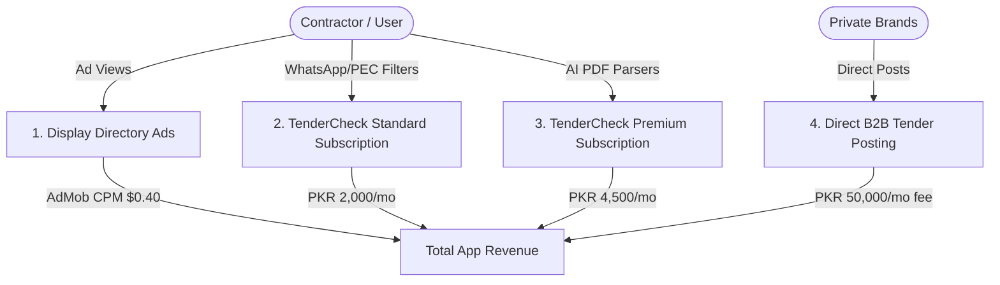

# TenderCheck (ٹینڈر چیک) — Expected Revenue Model & Projections

This document outlines the detailed expected revenue model, monetization vectors, financial assumptions, and projection scenarios for **TenderCheck**, a B2B SaaS public procurement aggregator, profile eligibility matcher, and AI bid parser application for contractors in **Pakistan**.

---

## 1. Target Market & Demographics

Public sector procurement is a multi-billion dollar industry in Pakistan, representing a large share of construction, infrastructure, IT, and medical equipment services:

*   **Primary Target**: Engineering firms, general builders, technology suppliers, and specialized contractors registered with the **Pakistan Engineering Council (PEC)** or listed on FBR/provincial taxpayers registries.
*   **Market Size**: There are over 100,000 active contractors registered under PEC category tiers (ranging from C6 up to CA). Additionally, thousands of retail/general suppliers participate in municipal municipal bidding.
*   **Urgent Pain Point**: Government bids are scattered across dozens of slow, federal/provincial PPRA databases. Missing a bid due to search errors results in lost business, while manual PDF reading is slow and prone to compliance errors.
*   **Willingness to Pay**: Contractors routinely spend millions on bidding documents and earnest money. A low-cost monthly subscription that guarantees they never miss a bid and summarizes RFPs instantly is an easy business decision.

---

## 2. Monetization Vectors

TenderCheck operates on an ad-supported freemium model. Free users generate display ads impressions, with standard and premium tiers available to remove ads and unlock advanced bidding tools.

### A. Ad-Supported Model (Free Tier)
*   **Format**: Minimal display ads visible to non-subscribing users. Subscribers (Standard and Premium) are excluded from the ad pool.
*   **Metrics & Assumptions**:
    *   **Pakistan Average CPM**: $0.40 USD (approx. 111 PKR at 278 PKR/USD).
    *   **User Sessions**: Contractors are highly active, checking listings daily (approx. 25 days/month). Average of 8 page views per trip checking details = 200 ad impressions per user/month.

### B. TenderCheck Standard (B2B SaaS)
*   **Format**: Monthly or annual membership unlocking priority access and custom search matching.
*   **Standard Features**:
    *   Instant **WhatsApp alerts** matching specific keyword triggers (e.g. "bridge repair", "laptop supply").
    *   Filters for PEC contractor categories (e.g. C5 eligibility matching) and specialized codes.
    *   No ads.
*   **Pricing**: 2,000 PKR / month (approx. $7.19 USD) or 20,000 PKR / year.
*   **Conversion Rate**: Projected at 2.0% of Monthly Active Users (MAU).

### C. TenderCheck Premium (B2B SaaS + AI)
*   **Format**: Elite subscription tier targeting large construction companies and bidding teams.
*   **Premium Features**:
    *   **AI Bidding RFP Parser**: Built-in Gemini parser that reads downloaded PPRA bidding PDFs, instantly extracting required experience, turnover ratios, and compliance rules as clear summaries.
    *   **Earnest Money (CDR) Calculator**: Dynamic estimation of required bank call deposit rates.
    *   **Bid Prep Checklist Planner**: Checklist calendar with countdown milestones to submission.
*   **Pricing**: 4,500 PKR / month (approx. $16.19 USD) or 45,000 PKR / year.
*   **Conversion Rate**: Projected at 0.5% of Monthly Active Users (MAU).

### D. Direct B2B Tender Posting
*   **Format**: Large private corporations, NGOs, or autonomous municipal departments pay a monthly listing fee to post their tenders directly to reach verified contractors (bypassing slow newspaper printing).
*   **Pricing**: 50,000 PKR / month flat rate for unlimited postings.
*   **Target Clients**: 5 active corporate poster accounts in Year 1.

---

## 3. Financial Projections (Year 1)

These projections are based on three scenarios of **Monthly Active Users (MAU)** reached by Month 12.
*(Exchange rate used: 1 USD = 278 PKR)*

### Scenario Comparison Table

| Metric | Conservative (Low Growth) | Base Case (Target Growth) | Optimistic (High Growth) |
| :--- | :--- | :--- | :--- |
| **Year 1 Target MAU** | 5,000 | 20,000 | 50,000 |
| **Standard Subscribers (1.5% - 2.5%)**| 75 (1.5%) | 400 (2.0%) | 1,250 (2.5%) |
| **Premium Subscribers (0.3% - 0.8%)** | 15 (0.3%) | 100 (0.5%) | 400 (0.8%) |
| **Active Direct B2B Advertisers** | 2 | 5 | 15 |
| **Monthly Ad Revenue** | $392.80 (109,198 PKR) | $1,560.00 (433,680 PKR) | $4,835.00 (1,344,130 PKR) |
| **Monthly Standard Subscription Rev** | $539.57 (150,000 PKR) | $2,877.70 (800,000 PKR) | $8,992.81 (2,500,000 PKR) |
| **Monthly Premium Subscription Rev** | $242.81 (67,500 PKR) | $1,618.71 (450,000 PKR) | $6,474.82 (1,800,000 PKR) |
| **Monthly Direct Posting Revenue** | $359.71 (100,000 PKR) | $899.28 (250,000 PKR) | $2,697.84 (750,000 PKR) |
| **Total Expected MRR (PKR)** | **426,698 PKR** | **1,933,680 PKR** | **6,394,130 PKR** |
| **Total Expected MRR (USD equivalent)** | **$1,534.89** | **$6,955.68** | **$23,000.47** |
| **Total Projected ARR (PKR)** | **5,120,376 PKR** | **23,204,160 PKR** | **76,729,560 PKR** |
| **Total Projected ARR (USD equivalent)** | **$18,418.62** | **$83,468.20** | **$276,005.61** |

---

## 4. Key Financial Formulas

$$\text{Total Monthly Revenue (PKR)} = R_{ad} + R_{std} + R_{prem} + R_{direct}$$

Where:

1.  **Free Ad Revenue ($R_{ad}$)**:
    $$R_{ad} = \left( \text{MAU} \times (1 - \text{StdConv} - \text{PremConv}) \times \frac{\text{ImpressionsPerUser}}{1000} \right) \times \text{CPM}_{USD} \times \text{Rate}_{PKR/USD}$$
2.  **Standard Subscription Revenue ($R_{std}$)**:
    $$R_{std} = \text{MAU} \times \text{StdConv} \times \text{StdPrice}_{PKR}$$
3.  **Premium Subscription Revenue ($R_{prem}$)**:
    $$R_{prem} = \text{MAU} \times \text{PremConv} \times \text{PremPrice}_{PKR}$$
4.  **Direct B2B Posting Revenue ($R_{direct}$)**:
    $$R_{direct} = \text{B2BClients} \times \text{MonthlyDirectFee}_{PKR}$$

---

## 5. Dynamic Revenue Calculator

To modify these variables, run custom scenarios, or perform real-time sensitivity analysis, open the interactive browser-based dashboard calculator:

👉 **[revenue_calculator.html](file:///c:/Essentials/SmartFarms/AndroidApps/Revenue/revenue_calculator.html)**

*Open the file in any web browser to adjust parameters (e.g. MAU size, subscription rates, B2B posting clients) and view updated revenue breakdowns instantly.*
