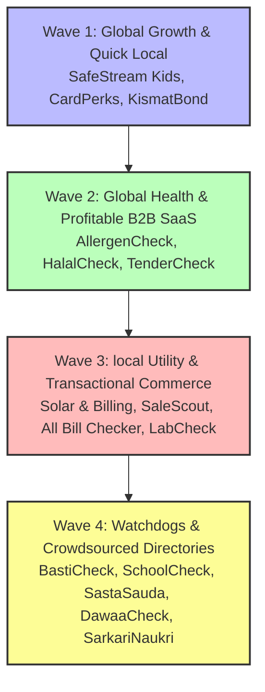

# Strategic Prioritization Report: Android Apps with Global & Pakistan Targets

This report analyzes the proposed Android app concepts under [AndroidApps](file:///c:/Essentials/SmartFarms/AndroidApps) to identify the highest priority applications for development. In line with optimization directives, **applications that can easily serve a global audience are targeted globally** to leverage high-value digital economies (e.g., US/EU/UK markets with premium AdMob CPMs, credit card payments, and USD subscriptions). Local concepts remain focused on solving critical domestic infrastructure, inflation, and transparency issues in Pakistan.

---

## 📊 Prioritization Matrix (Top 15 Apps)

The following table scores the top concepts on a scale of 1 to 10 (10 being highest/easiest):

| Rank | App Name | Target Market | Target Spec File | Revenue Potential (1-10) | User Impact (1-10) | Technical Feasibility (1-10) | Composite Score | Primary Monetization Strategy |
|---|---|---|---|---|---|---|---|---|
| **1** | **SafeStream Kids** | **Global** | [SafeStreamKids/feature_specification.md](file:///c:/Essentials/SmartFarms/androidapps_docs/SafeStreamKids/feature_specification.md) | **10.0** | **9.5** | **8.0** | **9.17** | Safe sandbox, premium ad-free whitelist play ($2.99/mo), bedtime block settings. |
| **2** | **AllergenCheck** | **Global** | [AllergenCheck/feature_specification.md](file:///c:/Essentials/SmartFarms/androidapps_docs/AllergenCheck/feature_specification.md) | **9.5** | **9.5** | **8.0** | **9.00** | Pro subs ($1.99/mo) to unlock cosmetic/pharma scans, custom allergen alert filters, ads. |
| **3** | **CardPerks** | Pakistan | [CreditCardPerks/feature_specification.md](file:///c:/Essentials/SmartFarms/androidapps_docs/CreditCardPerks/feature_specification.md) | **9.5** | **9.0** | **8.5** | **9.00** | Bank Lead Generation (Credit Card referrals) & retail ad placements. |
| **4** | **HalalCheck** | **Global** | [HalalCheck/feature_specification.md](file:///c:/Essentials/SmartFarms/androidapps_docs/HalalCheck/feature_specification.md) | **10.0** | **9.0** | **7.5** | **8.83** | High-value Western AdMob CPMs, Pro subscriptions, and alternative brand referrals CPC. |
| **5** | **SaleScout** | Pakistan | [SaleScout/feature_specification.md](file:///c:/Essentials/SmartFarms/androidapps_docs/SaleScout/feature_specification.md) | **8.5** | **9.0** | **8.0** | **8.50** | Brand affiliate referral commissions, in-mall retailer sponsorships, card discount conversions. |
| **6** | **TenderCheck** | Pakistan | [TenderCheck/feature_specification.md](file:///c:/Essentials/SmartFarms/androidapps_docs/TenderCheck/feature_specification.md) | **9.5** | **8.0** | **7.5** | **8.33** | B2B SaaS Subscriptions for contractors (WhatsApp alerts & bidding aids). |
| **7** | **Solar & Billing Suite** | Pakistan | [GreenMeterCheck/solar_installation_spec.md](file:///c:/Essentials/SmartFarms/androidapps_docs/GreenMeterCheck/solar_installation_spec.md) & [GreenMeterCheck/billing_auditor_spec.md](file:///c:/Essentials/SmartFarms/androidapps_docs/GreenMeterCheck/billing_auditor_spec.md) | **9.0** | **9.0** | **7.0** | **8.33** | Installer Lead Gen, hardware verification fees, and GreenMeter Pro inverter sync subs. |
| **8** | **BastiCheck** | Pakistan | [BastiCheck/feature_specification.md](file:///c:/Essentials/SmartFarms/androidapps_docs/BastiCheck/feature_specification.md) | **9.0** | **9.0** | **7.0** | **8.33** | Real estate agent leads, home inspections, security product ads, water tanker referrals. |
| **9** | **SchoolCheck** | Pakistan | [SchoolCheck/feature_specification.md](file:///c:/Essentials/SmartFarms/androidapps_docs/SchoolCheck/feature_specification.md) | **8.5** | **9.0** | **7.5** | **8.33** | Daycare/school admissions referrals, premium comparisons, private tutor match fee. |
| **10** | **LabCheck** | Pakistan | [LabCheck/feature_specification.md](file:///c:/Essentials/SmartFarms/androidapps_docs/LabCheck/feature_specification.md) | **8.5** | **9.0** | **7.5** | **8.33** | Booking Commissions (10-15% per lab test booked via app) & sponsored labs. |
| **11** | **KismatBond** | Pakistan | [KismatBond/feature_specification.md](file:///c:/Essentials/SmartFarms/androidapps_docs/KismatBond/feature_specification.md) | **7.5** | **9.5** | **8.0** | **8.33** | Premium portfolio tools for dealers, mutual fund referral ads. |
| **12** | **DawaaCheck** | Pakistan | [DawaaCheck/feature_specification.md](file:///c:/Essentials/SmartFarms/androidapps_docs/DawaaCheck/feature_specification.md) | **7.5** | **9.5** | **7.5** | **8.17** | Online Pharmacy Affiliate integrations & search-based ad placements. |
| **13** | **All Bill Checker** | Pakistan | [AllBillChecker/feature_specification.md](file:///c:/Essentials/SmartFarms/androidapps_docs/AllBillChecker/feature_specification.md) | **6.5** | **9.5** | **8.5** | **8.17** | High-volume display ads, solar lead gen, bill financing referrals. |
| **14** | **SastaSauda** | Pakistan | [SastaSauda/feature_specification.md](file:///c:/Essentials/SmartFarms/androidapps_docs/SastaSauda/feature_specification.md) | **7.0** | **9.5** | **7.5** | **8.00** | Ad revenue, card discount optimization referrals, retailer/brand sponsorships. |
| **15** | **SarkariNaukri** | Pakistan | [SarkariNaukri/feature_specification.md](file:///c:/Essentials/SmartFarms/androidapps_docs/SarkariNaukri/feature_specification.md) | **7.0** | **9.0** | **8.0** | **8.00** | Premium application printing & mailing service fee, test prep material. |

---

## 🏆 Deep-Dive: The Top 7 App Recommendations

### 1. SafeStream Kids (Global Child YouTube Sandbox Wrapper)
* **Spec Link**: [SafeStreamKids/feature_specification.md](file:///c:/Essentials/SmartFarms/androidapps_docs/SafeStreamKids/feature_specification.md)
* **Why it ranks high**: Safe video consumption is a universal parental pain point. Standard platforms serve inappropriate ads and rabbit-hole auto-plays. By providing a clean Whitelist-only environment that strips ads and runs entirely client-side, the app is language-agnostic, requires no regional scrapers, and scales globally.
* **Monetization (Expected Revenue)**:
  * **Global Premium Subscriptions**: $2.99 USD/month (or $19.99 USD/year) Family Plan to unlock bedtime lock schedules, custom parent whitelist queues, and multi-child profile hubs.
  * **COPPA-Compliant Ads**: Safe, child-friendly native banner placements for educational tools.
* **Technical Complexity**: **Low-Moderate**. Uses standard YouTube iframe player wrapping APIs, local Room database whitelists, and local screen-time device permissions.

### 2. AllergenCheck (Global Allergen Scanner & Warning Index)
* **Spec Link**: [AllergenCheck/feature_specification.md](file:///c:/Essentials/SmartFarms/androidapps_docs/AllergenCheck/feature_specification.md) *(Original Spec; easily pivoted globally)*
* **Why it ranks high**: Food allergies and gluten intolerances (celiac disease) affect over 250 million people worldwide. In Western markets (US, UK, EU), consumers are highly safety-conscious, checking labels daily. Shifting this from Pakistan-only to a global scanner leverages high-ARPU Western markets.
* **Monetization (Expected Revenue)**:
  * **Pro Subscription**: $1.99 USD/month to unlock advanced cosmetic, personal care, and pharmaceutical allergen audits, alongside custom text alerts (e.g. sulfites).
  * **High-CPM Western Ads**: Yields $3.50+ USD CPM on free scanning tiers.
* **Technical Complexity**: **Moderate**. Integrates Open Food Facts global barcode API and a high-speed Gemini Vision OCR parser for reading ingredients lists off product packaging.

### 3. CardPerks (Pakistan Credit Card Discounts)
* **Spec Link**: [CreditCardPerks/feature_specification.md](file:///c:/Essentials/SmartFarms/androidapps_docs/CreditCardPerks/feature_specification.md)
* **Why it ranks high**: High local inflation in Pakistan drives intense interest in dining and retail credit card discounts (often 20-50% off). Users check the app actively at checkout points, generating high DAU numbers.
* **Monetization (Expected Revenue)**:
  * **Bank Lead Referrals**: Bounties paid by major local banks (HBL, Alfalah, Meezan) for verified credit card signups (approx. 2,000 to 5,000 PKR per conversion).
  * **Retail Placements**: Sponsored discount alerts pinned by restaurants and apparel outlets.
* **Technical Complexity**: **Low-Moderate**. Requires stable local python scrapers to crawl discount pages and geofence locations.

### 4. HalalCheck (Global Halal/Haram Verifier)
* **Spec Link**: [HalalCheck/feature_specification.md](file:///c:/Essentials/SmartFarms/androidapps_docs/HalalCheck/feature_specification.md)
* **Why it ranks high**: Target market is the high-purchasing-power global Muslim diaspora in non-Muslim-majority societies (US, EU, UK). Ingredient checks for animal derivatives and emulsifiers represent a high-stress daily challenge.
* **Monetization (Expected Revenue)**:
  * **Pro Subscription**: $1.99 USD/month to bypass ads, unlock offline barcode dictionary updates, and access cosmetic/pharma verifications.
  * **Affiliate Substitutions CPC**: $0.15 USD CPC from local Halal-certified brands suggested as alternatives when Haram items are scanned.
* **Technical Complexity**: **Moderate**. Dual-mode OCR scanner (using Gemini API for Urdu/English/multilingual packaging translation) matched to an E-number additive classification catalog.

### 5. SaleScout (Pakistan Sale Discovery Engine)
* **Spec Link**: [SaleScout/feature_specification.md](file:///c:/Essentials/SmartFarms/androidapps_docs/SaleScout/feature_specification.md)
* **Why it ranks high**: Replaces annoying SMS marketing text blasts with a custom, user-followed brand alert. High local viral interest during payday, Eid, and Blessed Friday sales seasons.
* **Monetization (Expected Revenue)**:
  * **Affiliate E-commerce Commission**: 3-10% commissions on online purchases routed via referral links (e.g. Sapphire, Khaadi, Daraz).
  * **Retailer Placements**: Malls and retail outlets pay to highlight flash clearances.
* **Technical Complexity**: **Low-Moderate**. Relies on social media scrapers, brand feed monitoring, and geofencing of major shopping malls (Emporium, Packages, Lucky One).

### 6. TenderCheck (Pakistan PPRA Tender Scraper & Alerts)
* **Spec Link**: [TenderCheck/feature_specification.md](file:///c:/Essentials/SmartFarms/androidapps_docs/TenderCheck/feature_specification.md)
* **Why it ranks high**: Massive B2B pain point for local building contractors. Public procurement databases (PPRA) are notoriously slow and hard to search, making instant alerts highly valuable.
* **Monetization (Expected Revenue)**:
  * **B2B SaaS Subscriptions**: 2,000 to 4,000 PKR/month for contractors to receive targeted WhatsApp tender alerts matched to their specific PEC licensing profile.
* **Technical Complexity**: **Moderate**. Requires building resilient scraping tools to parse federal and provincial government PPRA databases.

### 7. Solar & Billing Suite (SolarCheck + GreenMeterCheck)
* **Spec Link**: [GreenMeterCheck/solar_installation_spec.md](file:///c:/Essentials/SmartFarms/androidapps_docs/GreenMeterCheck/solar_installation_spec.md) & [GreenMeterCheck/billing_auditor_spec.md](file:///c:/Essentials/SmartFarms/androidapps_docs/GreenMeterCheck/billing_auditor_spec.md)
* **Why it ranks high**: Rising grid electricity tariffs drive residential solar expansion. Homeowners are anxious about hardware counterfeiting and utility net-metering inaccuracies.
* **Monetization (Expected Revenue)**:
  * **Solar Installer Lead Generation**: Flat referral payouts (approx. 3,000 PKR) for verified installation quotes.
  * **Inverter Cloud API Sync**: 250 PKR/month (approx. $0.90 USD) for GreenMeter Pro syncing Growatt, Solis, and Huawei logs.
* **Technical Complexity**: **Moderate**. Requires inverter portal integrations, PDF billing extraction, and AEDB barcode verification APIs.

---

## ⚡ Execution Roadmap & Wave Planning

By prioritizing global apps early, developers can tap into high-margin USD revenue streams, generating the capital needed to build and scale regional directory services:

### Wave 1: Global Growth & Quick Local Launch (Months 1–3)
* **Apps**: **SafeStream Kids** (Global), **CardPerks** (Pakistan), & **KismatBond** (Pakistan).
* **Rationale**: SafeStream Kids is a completely self-contained wrapper app requiring no regional databases or scrapers, making it ideal for a quick global launch. CardPerks and KismatBond rely on simple scanning/scraping rules and have instant, viral mass-market appeal locally.

### Wave 2: Global Health & Profitable B2B SaaS (Months 4–6)
* **Apps**: **AllergenCheck** (Global), **HalalCheck** (Global), & **TenderCheck** (Pakistan).
* **Rationale**: AllergenCheck and HalalCheck capture high-margin USD subscription revenue from Western markets using barcode lookup and Gemini ingredient OCR. TenderCheck introduces highly profitable local B2B SaaS recurring subscriptions for construction firms.

### Wave 3: Local Utility Suites & Transactional Commerce (Months 7–9)
* **Apps**: **Solar & Billing Suite**, **SaleScout**, **All Bill Checker**, & **LabCheck**.
* **Rationale**: These applications require setting up complex API integrations (inverter cloud syncs), commercial brand partnerships (fashion store affiliates, diagnostic lab bookings), and local utility payment check gateways.

### Wave 4: Watchdogs & Crowdsourced Directories (Months 10–12)
* **Apps**: **BastiCheck**, **SchoolCheck**, **SastaSauda**, **DawaaCheck**, & **SarkariNaukri**.
* **Rationale**: These watchdogs depend heavily on mature community contribution networks, Geo-fenced PostGIS map layers, and verification of uploads (utility bills, private school fee vouchers, supermarket grocery receipts).
